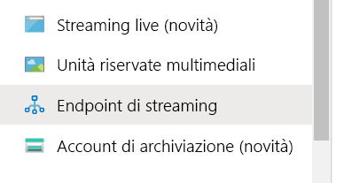
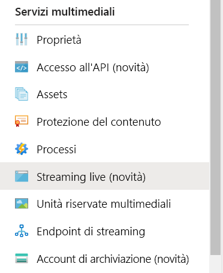
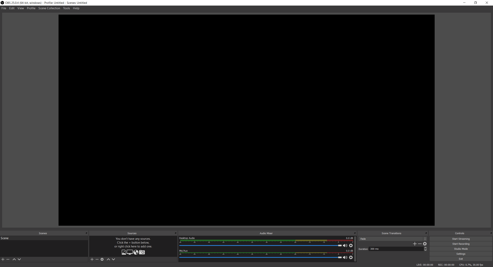

# Creare un evento di streaming live di Servizi multimediali di Azure con OBS

[!INCLUDE [media services api v3 logo](./includes/v3-hr.md)]

Questa Guida introduttiva consente di creare un evento live di servizi multimediali usando il portale di Azure e la trasmissione tramite Open Broadcasting Studio (OBS). Si presuppone che si abbia una sottoscrizione di Azure e che sia stato creato un account di Servizi multimediali di Azure.

In questo argomento di avvio rapido verrà illustrato come:

- Configurare un codificatore locale con OBS.
- Configurare un evento di streaming live.
- Configurare gli output dell'evento di streaming live.
- Eseguire un endpoint di streaming predefinito.
- Usare Azure Media Player per visualizzare l'evento di streaming live e l'output su richiesta.

## Prerequisiti

Se non si ha una sottoscrizione di Azure, creare un [account gratuito](https://azure.microsoft.com/free/) prima di iniziare.

## Accedere al portale di Azure

Aprire il Web browser e passare al [portale di Microsoft Azure](https://portal.azure.com/). Immettere le credenziali per accedere al portale. La visualizzazione predefinita è il dashboard del servizio.

## Configurare un codificatore locale con OBS

1. Scaricare e installare OBS per il sistema operativo in uso dal [sito Web Open Broadcast Software](https://obsproject.com/).
1. Avviare l'applicazione e tenerla aperta.

## Eseguire l'endpoint di streaming predefinito

1. Selezionare **Endpoint di streaming** nell'elenco Servizi multimediali.

   
1. Se lo stato dell'endpoint di streaming predefinito è arrestato, selezionarlo. Verrà visualizzata la pagina relativa a questo endpoint.
1. Selezionare **Start**.

   

## Configurare un evento di streaming live di Servizi multimediali di Azure

1. Passare all'account di Servizi multimediali di Azure all'interno del portale, quindi selezionare **Streaming live** nell'elenco **Servizi multimediali**.

   
1. Selezionare **Aggiungi evento live** per creare un nuovo evento di streaming live.

   
1. Immettere un nome per il nuovo evento, ad esempio *TestLiveEvent*, nella casella **Nome evento live**.

   
1. Immettere una descrizione facoltativa dell'evento nella casella **Descrizione**.
1. Selezionare l'opzione **Pass-through - nessuna codifica cloud**.

   
1. Selezionare l'opzione **RTMP**.
1. Assicurarsi che per **Avvia evento live** sia selezionata l'opzione **No**, per evitare di ricevere addebiti per l'evento live prima che sia pronto. La fatturazione inizierà dopo l'avvio dell'evento live.

   
1. Selezionare il pulsante **Rivedi e crea** per rivedere le impostazioni.
1. Selezionare il pulsante **Crea** per creare l'evento live. Verrà visualizzato di nuovo l'elenco di eventi live.
1. Selezionare il collegamento all'evento Live creato. Si noti che l'evento è stato arrestato.
1. Lasciare aperta questa pagina nel browser. Verrà usato più tardi.

## Configurare un evento di streaming live con OBS Studio

OBS inizia con una scena predefinita, ma senza input selezionati.

   

### Aggiungere un'origine video

1. Nel pannello **origini** selezionare l'icona **Aggiungi** per selezionare un nuovo dispositivo di origine. Si aprirà il menu **Sources** (Origini).

1. Scegliere **Video Capture Device** (Dispositivo di acquisizione video) dal menu dei dispositivi di origine. Si aprirà il menu **Create/Select Source** (Crea/Seleziona origine).

   

1. Selezionare il pulsante di opzione **Aggiungi esistente** , quindi fare clic su **OK**. Si aprirà il menu **Properties for Video Device** (Proprietà del dispositivo video).

   

1. Nell'elenco a discesa **Device** (Dispositivo) selezionare l'input video da usare per la trasmissione. Lasciare le altre impostazioni da solo per il momento e selezionare **OK**. L'origine di input verrà aggiunta al pannello **Sources** (Origini) e nell'area **Preview** (Anteprima) verranno visualizzati gli input video.

   

### Aggiungere un'origine audio

1. Nel pannello **origini** selezionare l'icona **Aggiungi** per selezionare un nuovo dispositivo di origine. Si aprirà il menu Source Device (Dispositivo di origine).

1. Scegliere **Audio Capture Device** (Dispositivo di acquisizione audio) dal menu dei dispositivi di origine. Si aprirà il menu **Create/Select Source** (Crea/Seleziona origine).

   

1. Selezionare il pulsante di opzione **Aggiungi esistente** , quindi fare clic su **OK**. Si aprirà il menu **Properties for Audio Input Capture** (Proprietà dell'acquisizione di input audio).

   

1. Nell'elenco a discesa **Device** (Dispositivo) selezionare il dispositivo di acquisizione audio da usare per la trasmissione. Lasciare le altre impostazioni da solo per il momento e selezionare OK. Il dispositivo di acquisizione audio verrà aggiunto al pannello Mixer audio.

   

### Configurare le impostazioni di streaming e codifica avanzata in OBS

Nella procedura successiva si tornerà in Servizi multimediali di Azure nel browser per copiare l'URL di input da immettere nelle impostazioni di output:

1. Nella pagina Servizi multimediali di Azure del portale selezionare **Avvia** per avviare l'evento di streaming live. La fatturazione inizia in questo momento.

   
1. Impostare l'interruttore **RTMP** su **RTMPS**.
1. Copiare l'URL della casella **URL di input** negli Appunti.

   

1. Passare all'applicazione OBS.

1. Selezionare il pulsante **Impostazioni** nel pannello **controlli** . Verranno visualizzate le opzioni di Settings (Impostazioni).

   

1. Scegliere **Stream** (Streaming) dal menu **Settings** (Impostazioni).

1. Nell'elenco a discesa **Service** (Servizio) selezionare Show all (Mostra tutto), quindi **Custom** (Personalizza).

1. Nel campo **Server** incollare l'URL RTMPS copiato negli Appunti.

1. Immettere un valore nel campo **Stream key** (Chiave di streaming).  Non importa quale, ma è necessario immettere un valore.

    

1. Scegliere **Output** dal menu **Settings** (Impostazioni).

1. Selezionare l'elenco a discesa **modalità di output** nella parte superiore della pagina e scegliere **Avanzate** per accedere a tutte le impostazioni del codificatore disponibili.

1. Selezionare la scheda **streaming** per configurare il codificatore.

1. Selezionare il codificatore appropriato per il sistema.  Se l'hardware supporta l'accelerazione GPU, scegliere da NVIDIA **NVENC** h. 264 o Intel **QuickSync** h. 264. Se il sistema non dispone di una GPU supportata, selezionare l'opzione **x264** Software Encoder.

#### Impostazioni del codificatore x264

1. Se è stata selezionata l'opzione di codifica **x264** , selezionare la casella **Ridimensiona output** . Selezionare 1920x1080 se si sta usando un evento Live Premium in servizi multimediali o 1280x720 se si usa un evento live standard (720P).  Se si usa un evento Live pass-through, è possibile scegliere eventuali soluzioni disponibili.

1. Impostare la **velocità in bit** su un punto qualsiasi compreso tra 1500 e 4000 kbps. Si consiglia 2500 kbps se si usa un evento live di codifica standard a 720P. Se si usa un evento Live Premium 1080P, si consiglia 4000 kbps. È possibile modificare la velocità in bit in base alle capacità di CPU e alla larghezza di banda disponibili sulla rete per ottenere l'impostazione di qualità desiderata.

1. Immettere *2* nel campo **Keyframe interval** (Intervallo tra fotogrammi chiave). Il valore imposta l'intervallo del fotogramma chiave su 2 secondi, che controlla la dimensione finale dei frammenti recapitati tramite HLS o DASH da servizi multimediali. Non impostare mai l'intervallo del fotogramma chiave su un valore maggiore di 4 secondi.  Se si verifica una latenza elevata durante la trasmissione, è sempre necessario controllare o informare gli utenti dell'applicazione di impostare sempre questo valore su 2 secondi. Quando si tenta di ottenere un recapito Live con latenza più bassa, è possibile scegliere di impostare questo valore su un valore minimo di 1 secondo.

1. FACOLTATIVO: impostare il set di impostazioni di utilizzo della CPU su **veryfast** ed eseguire alcuni esperimenti per verificare se la CPU locale può gestire la combinazione di bitrate e set di impostazioni con un sovraccarico sufficiente. Provare a evitare le impostazioni che comporterebbero una CPU media superiore al 80% per evitare problemi durante lo streaming live. Per migliorare la qualità, è possibile eseguire il test con impostazioni preimpostate **più veloci** **e veloci fino** a raggiungere le limitazioni della CPU.

   

1. Lasciare invariate le altre impostazioni e selezionare **OK**.

#### Impostazioni del codificatore NVIDIA NVENC

1. Se è stata selezionata l'opzione di codifica GPU **NVENC** , selezionare la casella **Ridimensiona output** e selezionare 1920x1080 se si usa un evento Live Premium in servizi multimediali o 1280x720 se si usa un evento live standard (720p). Se si usa un evento Live pass-through, è possibile scegliere eventuali soluzioni disponibili.

1. Impostare il **controllo della frequenza** su CBR per il controllo della velocità in bit costante.

1. Impostare la **velocità in bit** in un punto qualsiasi tra 1500 kbps e 4000 kbps. Si consiglia 2500 kbps se si usa un evento live di codifica standard a 720P. Se si usa un evento Live Premium 1080P, si consiglia 4000 kbps. È possibile scegliere di modificare questa impostazione in base alle capacità di CPU e alla larghezza di banda disponibili sulla rete per ottenere l'impostazione di qualità desiderata.

1. Impostare l' **intervallo del fotogramma chiave** su 2 secondi come indicato in precedenza sotto le opzioni x264. Non superare i 4 secondi, perché ciò può influire significativamente sulla latenza della trasmissione live.

1. Impostare il set di **Impostazioni** su bassa latenza, prestazioni Low-Latency o qualità Low-Latency a seconda della velocità della CPU nel computer locale. Sperimentare queste impostazioni per ottenere il migliore equilibrio tra la qualità e l'utilizzo della CPU nell'hardware.

1. Se si usa una configurazione hardware più potente, impostare il **profilo** su "Main" o "High".

1. Lasciare deselezionata l'opzione **look-ahead** . Se si dispone di un computer molto potente, è possibile verificarlo.

1. Lasciare deselezionata l' **ottimizzazione di Psycho Visual** . Se si dispone di un computer molto potente, è possibile verificarlo.

1. Impostare **GPU** su 0 per decidere automaticamente quali GPU allocare. Se lo si desidera, è possibile limitare l'utilizzo della GPU.

1. Imposta il **numero massimo di fotogrammi B** su 2

   

#### Impostazioni del codificatore Intel QuickSync

1. Se è stata selezionata l'opzione di codifica GPU Intel **QuickSync** , selezionare la casella **Ridimensiona output** e selezionare 1920x1080 se si usa un evento Live Premium in servizi multimediali o 1280x720 se si usa un evento live standard (720p). Se si usa un evento Live pass-through, è possibile scegliere eventuali soluzioni disponibili.

1. Impostare l' **utilizzo di destinazione** su "bilanciato" o modificare in base alle esigenze in base al carico combinato CPU e GPU. Modificare le esigenze e sperimentare per ottenere un utilizzo massimo della CPU del 80% in media con la qualità che l'hardware è in grado di produrre. Se si dispone di un hardware più vincolato, testare con "Fast" o rilasciarlo "molto veloce" Se si verificano problemi di prestazioni.

1. Se si usa una configurazione hardware più potente, impostare il **profilo** su "Main" o "High".

1. Impostare l' **intervallo del fotogramma chiave** su 2 secondi come indicato in precedenza sotto le opzioni x264. Non superare i 4 secondi, perché ciò può influire significativamente sulla latenza della trasmissione live.

1. Impostare il **controllo della frequenza** su CBR per il controllo della velocità in bit costante.

1. Impostare la **velocità in bit** in un punto qualsiasi tra 1500 e 4000 kbps.  Si consiglia 2500 kbps se si usa un evento live di codifica standard a 720P. Se si usa un evento Live Premium 1080P, si consiglia 4000 kbps. È possibile scegliere di modificare questa impostazione in base alle capacità di CPU e alla larghezza di banda disponibili sulla rete per ottenere l'impostazione di qualità desiderata.

1. Impostare la **latenza** su "low".

1. Impostare i **fotogrammi B** su 2.

1. Lasciare deselezionati i miglioramenti apportati ai **video soggettivi** .

   

### Imposta impostazioni audio

Nella procedura successiva si modificheranno le impostazioni di codifica audio.

1. Selezionare la scheda output->audio in impostazioni.

1. Imposta la velocità in **bit audio** della traccia 1 su 128 kbps.

   

1. Selezionare la scheda audio in impostazioni.

1. Impostare la **frequenza di campionamento** su 44,1 kHz.

   

### Avviare lo streaming

1. Nel pannello **Controls** (Controlli) fare clic su **Start Streaming** (Avvia lo streaming).

    

2. Passare alla schermata degli eventi live di Servizi multimediali di Azure nel browser e fare clic sul collegamento **Ricarica lettore**. A questo punto, si dovrebbe vedere lo streaming nel lettore di anteprima.

## Configurare gli output

In questa parte verranno configurati gli output e sarà possibile salvare una registrazione dell'evento di streaming live.  

> [!NOTE]
> Per trasmettere in streaming questo output, è necessario che l'endpoint di streaming sia in esecuzione. Vedere la sezione [Eseguire l'endpoint di streaming predefinito](#run-the-default-streaming-endpoint) più avanti.

1. Selezionare il collegamento **Create outputs** (Crea output) sotto il visualizzatore di video **output**.
1. Se si desidera, modificare il nome dell'output nella casella **Name** (Nome) specificandone uno più intuitivo e facile da trovare in seguito.

   
1. Lasciare invariate tutte le restanti caselle per il momento.
1. Selezionare **Avanti** per aggiungere un localizzatore di streaming.
1. Cambiare il nome del localizzatore specificandone uno più intuitivo, se si desidera.

   
1. Lasciare invariati tutti gli altri campi della schermata per il momento.
1. Selezionare **Crea**.

## Riprodurre l'output trasmesso con Azure Media Player

1. Copiare l'URL di streaming sotto il lettore video **Output**.
1. In un Web browser aprire la [demo di Azure Media Player](https://ampdemo.azureedge.net/azuremediaplayer.html).
1. Incollare l'URL di streaming nella casella **URL** di Azure Media Player.
1. Selezionare il pulsante **Update Player** (Aggiorna lettore).
1. Selezionare l'icona **Riproduci** sul video per visualizzare lo streaming live.

## Arrestare la trasmissione

Quando si ritiene di avere trasmesso un contenuto sufficiente, arrestare la trasmissione.

1. Nel portale selezionare **Arresta**.

1. In OBS selezionare il pulsante **Stop Streaming** (Interrompi streaming) nel pannello **Controls** (Controlli). La trasmissione di OBS verrà arrestata.

## Riprodurre l'output su richiesta con Azure Media Player

L'output creato è ora disponibile per lo streaming su richiesta, purché l'endpoint di streaming sia in esecuzione.

1. Passare all'elenco Servizi multimediali e selezionare **Asset**.
1. Trovare l'output dell'evento creato in precedenza e selezionare il collegamento all'asset. Viene visualizzata la pagina di output dell'asset.
1. Copiare l'URL di streaming sotto il lettore video per l'asset.
1. Tornare in Azure Media Player nel browser e incollare l'URL di streaming nella casella URL.
1. Selezionare **Update Player** (Aggiorna il lettore).
1. Selezionare l'icona **Riproduci** nel video per visualizzare l'asset su richiesta.

## Pulire le risorse

> [!IMPORTANT]
> Arrestare i servizi. Una volta completati i passaggi di questo argomento di avvio rapido, assicurarsi di arrestare l'evento live e l'endpoint di streaming, altrimenti si riceveranno addebiti per il tempo in cui rimangono in esecuzione. Per arrestare l'evento live, vedere i passaggi 2 e 3 della procedura [Arrestare la trasmissione](#stop-the-broadcast).

Per arrestare l'endpoint di streaming:

1. Nell'elenco Servizi multimediali selezionare **Endpoint di streaming**.
2. Selezionare l'endpoint di streaming predefinito avviato in precedenza. Verrà visualizzata la pagina dell'endpoint.
3. Selezionare **Arresta**.

> [!TIP]
> Se non si vogliono mantenere gli asset di questo evento, assicurarsi di eliminarli per evitare di ricevere addebiti per l'archiviazione.

## Passaggi successivi

> [!div class="nextstepaction"]
> [Eventi live e output live in Servizi multimediali](./live-events-outputs-concept.md)
