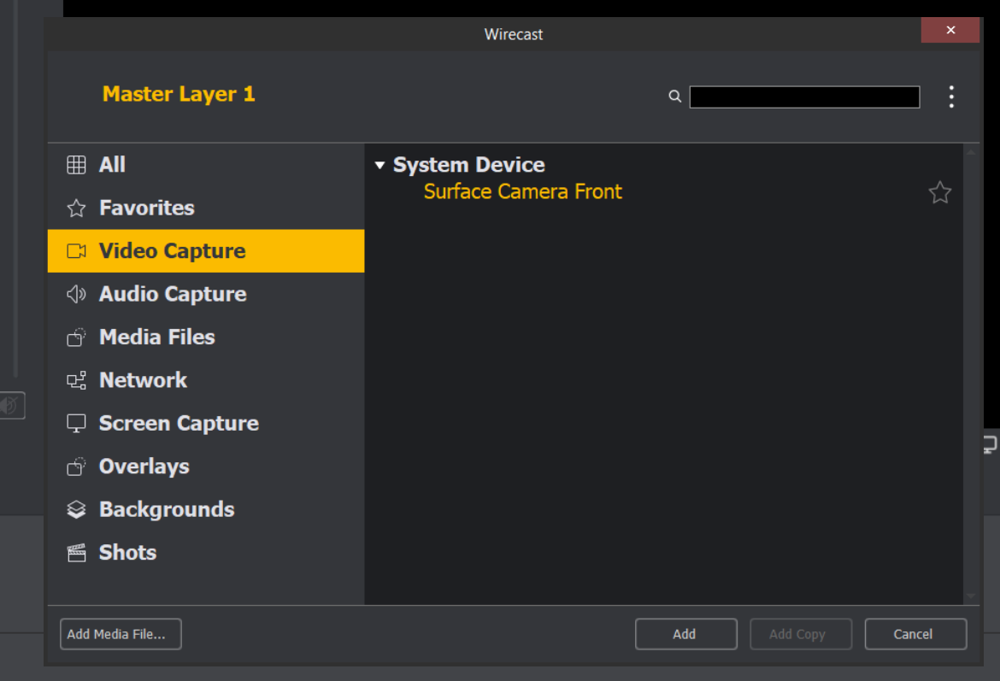
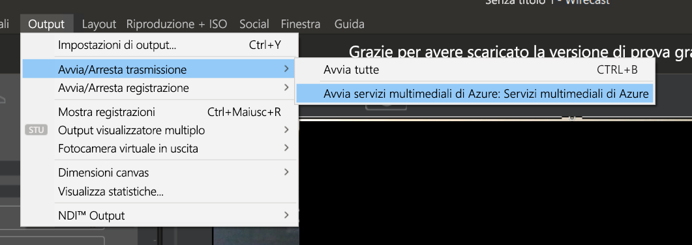
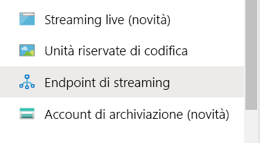

# Creare un evento di streaming live di Servizi multimediali di Azure con il portale e Wirecast

Questa guida introduttiva presuppone che si abbia una sottoscrizione di Azure e che sia stato creato un account di Servizi multimediali di Azure.

Se non si ha una sottoscrizione di Azure, creare un account [gratuito](https://azure.microsoft.com/free/) prima di iniziare.

## Accedere al Portale di Azure

Aprire il Web browser e passare al [portale di Microsoft Azure](https://portal.azure.com/). Immettere le credenziali per accedere al portale. La visualizzazione predefinita è il dashboard del servizio.

In questo argomento di avvio rapido verrà illustrato come:

- Configurare un codificatore locale con una versione di valutazione gratuita di Telestream Wirecast
- Configurare un evento di streaming live
- Configurare gli output dell'evento di streaming live
- Eseguire un endpoint di streaming predefinito
- Usare Azure Media Player per visualizzare l'evento di streaming live e l'output su richiesta

Per semplicità, si useranno un set di impostazioni di codifica per Servizi multimediali di Azure in Wirecast, la codifica cloud pass-through e RTMP.

## Configurare un codificatore locale con Wirecast

1. Scaricare e installare Wirecast per il sistema operativo in uso all'indirizzo https://www.telestream.net
1. Avviare l'applicazione e usare l'indirizzo di posta elettronica preferito per registrare il prodotto.  Tenere aperta l'applicazione.
1. Si riceverà un messaggio di posta elettronica in cui si chiede di verificare l'indirizzo, quindi verrà avviata la versione di valutazione gratuita dell'applicazione.
1. CONSIGLIATO: guardare l'esercitazione video nella schermata di apertura dell'applicazione.

## Configurare un evento di streaming live di Servizi multimediali di Azure

1. Dopo essere passati all'account di Servizi multimediali di Azure all'interno del portale, selezionare **Streaming live** nell'elenco Servizi multimediali. 
 
1. Fare clic su **Aggiungi evento live** per creare un nuovo evento di streaming live. 
 
1. Immettere un nome per il nuovo evento, ad esempio *TestLiveEvent*, nel campo **Nome** dell'evento live. 
 
1. Immettere una descrizione facoltativa dell'evento nel campo **Descrizione**.
1. Selezionare il pulsante di opzione **Pass-through - nessuna codifica cloud**. 

1. Selezionare il pulsante di opzione **RTMP**.
1. Assicurarsi che per Avvia evento live sia selezionato il pulsante di opzione **No**, per evitare di ricevere addebiti per l'evento live prima che sia pronto.  La fatturazione inizierà dopo l'avvio dell'evento live.  
1. Fare clic sul pulsante **Rivedi e crea** per rivedere le impostazioni.
1. Fare clic sul pulsante **Crea** per creare l'evento live. Verrà quindi visualizzato di nuovo l'elenco di eventi live.
1. Fare clic sul **collegamento all'evento live** appena creato. Si noti che l'evento è stato arrestato.
1. Lasciare aperta questa pagina nel browser.  Verrà usata più tardi.

## Configurare un evento di streaming live con Wirecast Studio

1. Supponendo che l'applicazione Wirecast sia ancora aperta, scegliere **Create Empty Documento** (Crea documento vuoto) dal menu principale, quindi fare clic su **Continua**.

1. Passare il puntatore del mouse sul primo livello nell'area di livelli Wirecast.  Fare clic sull'icona **Aggiungi** visualizzata e selezionare l'input video da trasmettere in streaming.  Viene visualizzata la finestra di dialogo Master Layer 1 (Livello master 1). 

1. Scegliere **Video capture** (Acquisizione video) dal menu e quindi selezionare la fotocamera da usare. Se si seleziona una fotocamera, nell'area di anteprima verrà mostrata la vista della fotocamera.

1. Passare il puntatore del mouse sul secondo livello nell'area di livelli Wirecast. Fare clic sull'icona **Aggiungi** visualizzata e selezionare l'input audio da trasmettere in streaming.  Viene visualizzata la finestra di dialogo Master Layer 2 (Livello master 2).
1. Scegliere **Audio capture** (Acquisizione audio) dal menu e quindi selezionare l'input audio da usare.

1. Scegliere **Output settings** (Impostazioni output) dal menu principale.  Verrà visualizzata la finestra di dialogo Output.
1. Scegliere **Servizi multimediali di Azure** dal menu a discesa Output.  Per Servizi multimediali di Azure verranno popolate automaticamente la *maggior parte* delle impostazioni di output. 

1. Nella sezione successiva si tornerà in Servizi multimediali di Azure nel browser per copiare l'*URL di input* da immettere nelle impostazioni di output.

### Copiare e incollare l'URL di input

1. Di nuovo nella pagina Servizi multimediali di Azure del portale fare clic su **Avvia** per avviare l'evento di streaming live. La fatturazione inizia in questo momento. 

2. Fare clic sull'interruttore **Sicuro/Non sicuro** per impostarlo su **Non sicuro**.  In questo modo il protocollo verrà impostato su RTMP invece che su RTMPS.
3. Copiare l'**URL di input** negli Appunti.

4. Passare all'applicazione Wirecast e incollare l'**URL di input** nel campo **Address** (Indirizzo) delle impostazioni di output. 

5. Fare clic su **OK**.

## Configurare gli output

In questa parte verranno configurati gli output e sarà possibile salvare una registrazione dell'evento di streaming live.  

> [!NOTE]
> Per trasmettere in streaming questo output, è necessario che l'endpoint di streaming sia in esecuzione.  Vedere la sezione Eseguire l'endpoint di streaming predefinito di seguito.

1. Fare clic sul collegamento **Create outputs** (Crea output) sotto il visualizzatore di video di output.
1. Se si desidera, modificare il nome dell'output nel campo **Name** (Nome) specificandone uno più intuitivo e facile da trovare in seguito.

1. Lasciare invariati tutti i restanti campi per il momento.
1. Fare clic su **Avanti** per aggiungere il localizzatore di streaming.
1. Cambiare il nome del localizzatore specificandone uno più intuitivo, se si desidera.

1. Lasciare invariati tutti gli altri campi della schermata per il momento.
1. Fare clic su **Crea**.

## Avviare la trasmissione

1. In Wirecast, scegliere **Output > Start / Stop broadcasting > Start Azure Media Services (Output > Avvia/Arresta trasmissione > Avvia Servizi multimediali di Azure): Servizi multimediali di Azure** dal menu principale.  Una volta inviato lo streaming all'evento live, nel lettore video dell'evento live nella pagina corrispondente di Servizi multimediali di Azure verrà visualizzata la finestra Live di Wirecast.

   

1. Fare clic sul pulsante **Go** (Vai) sotto la finestra di anteprima per avviare la trasmissione del video e dell'audio selezionati per i livelli di Wirecast.

   

   > [!TIP]
   > Se si verifica un errore, provare a ricaricare il lettore facendo clic sull'apposito collegamento nella parte superiore.

## Eseguire l'endpoint di streaming predefinito

1. Assicurarsi che l'endpoint di streaming sia in esecuzione selezionando **Endpoint di streaming** nell'elenco di servizi multimediali. Verrà visualizzata la pagina Endpoint di streaming. 

1. Se lo stato dell'endpoint di streaming predefinito è arrestato, fare clic sull'endpoint di streaming **predefinito**. Verrà visualizzata la pagina relativa a questo endpoint.
1. Fare clic su **Avvia**.  L'endpoint di streaming verrà avviato. 

## Riprodurre l'output trasmesso con Azure Media Player

1. Copiare l'**URL di streaming** sotto il lettore video di output.
1. In un Web browser aprire la demo di Azure Media Player https://ampdemo.azureedge.net/azuremediaplayer.html
1. Incollare l'**URL di streaming** nel campo URL di Azure Media Player.
1. Fare clic sul pulsante **Update Player** (Aggiorna lettore).
1. Fare clic sull'icona **Riproduci** sul video per visualizzare lo streaming live.

## Arrestare la trasmissione

Quando si ritiene di avere trasmesso un contenuto sufficiente, arrestare la trasmissione.

1. In Wirecast fare clic sul pulsante **broadcast** (trasmissione).  La trasmissione verrà arrestata da Wirecast.
1. Nel portale fare clic su **Arresta**. Verrà visualizzato un messaggio di avviso che indica che lo streaming live verrà arrestato, ma che l'output diventerà ora un asset su richiesta.
1. Fare clic su **Arresta** nel messaggio di avviso. Azure Media Player ora visualizzerà anche un errore perché lo streaming live non è più disponibile.

## Riprodurre l'output su richiesta con Azure Media Player

L'output creato è ora disponibile per lo streaming su richiesta, purché l'endpoint di streaming sia in esecuzione.

1. Passare all'elenco Servizi multimediali e selezionare **Asset**.
1. Trovare l'output dell'evento creato in precedenza e fare clic sul **collegamento all'asset**. Verrà visualizzata la pagina di output dell'asset.
1. Copiare l'**URL di streaming** sotto il lettore video per l'asset.
1. Tornare in Azure Media Player nel browser e incollare l'**URL di streaming** nel campo URL.
1. Fare clic su **Update Player** (Aggiorna il lettore).
1. Fare clic sull'icona **Riproduci** nel video per visualizzare l'asset su richiesta.

## Pulire le risorse

> [!IMPORTANT]
> Arrestare i servizi. Una volta completati i passaggi di questo argomento di avvio rapido, assicurarsi di arrestare l'evento live e l'endpoint di streaming, altrimenti si continueranno a ricevere addebiti per il tempo in cui rimangono in esecuzione. Per arrestare l'evento live, vedere i passaggi 2 e 3 precedenti in Arrestare la trasmissione.

### Arrestare l'endpoint di streaming

1. Nell'elenco Servizi multimediali selezionare **Endpoint di streaming**.
2. Fare clic sull'endpoint di streaming **predefinito** avviato in precedenza. Verrà visualizzata la pagina dell'endpoint.
3. Fare clic su **Arresta**.  L'endpoint di streaming verrà arrestato.

> [!TIP]
> Se non si vogliono mantenere gli asset di questo evento, assicurarsi di eliminarli per evitare di ricevere addebiti per l'archiviazione.

## Passaggi successivi
> [!div class="nextstepaction"]
> [Qual è l'articolo successivo nella sequenza](./live-events-outputs-concept.md)
