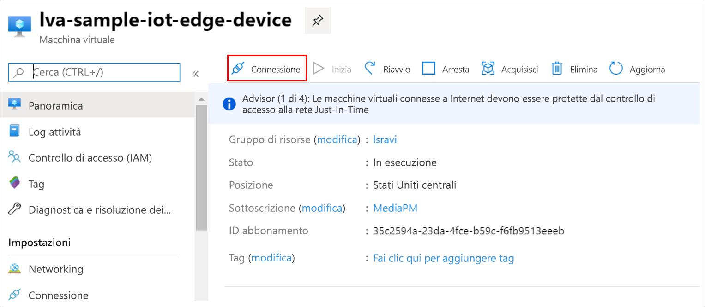

I file MP4 vengono scritti in una directory sul dispositivo perimetrale configurato nel file con *estensione ENV* usando la chiave VIDEO_OUTPUT_FOLDER_ON_DEVICE. Se è stato usato il valore predefinito, i risultati dovrebbero essere nella cartella */var/media/* .

Per riprodurre il clip MP4:

1. Passare al gruppo di risorse, individuare la macchina virtuale e connettersi usando Azure Bastion.

    
    
    
1. Accedere usando le credenziali generate al momento della [configurazione delle risorse di Azure](../../../detect-motion-emit-events-quickstart.md#set-up-azure-resources). 
1. Al prompt dei comandi passare alla directory pertinente. Il percorso predefinito è */var/media*. Si vedranno i file MP4 nella directory.

     

1. Usare il comando [SCP (copia sicura)](../../../../../virtual-machines/linux/copy-files-to-linux-vm-using-scp.md) per copiare i file nel computer locale. 
1. Riprodurre i file usando il [lettore multimediale VLC](https://www.videolan.org/vlc/) o un qualsiasi altro lettore MP4.
