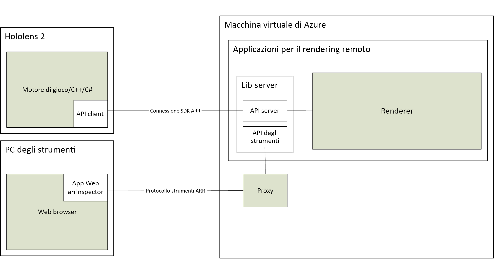

# Informazioni su Rendering remoto di Azure

*Rendering remoto di Azure* è un servizio che consente di eseguire il rendering di contenuti 3D interattivi di alta qualità nel cloud e di trasmetterli in streaming in tempo reale ai dispositivi come HoloLens 2.

I dispositivi non collegati hanno una potenza di calcolo limitata per il rendering di modelli complessi. Per molte applicazioni sarebbe però inaccettabile ridurre in qualche modo la fedeltà visiva. Lo screenshot seguente mette a confronto il modello in dettaglio con un modello che è stato decimato con un comune strumento di creazione di contenuti:

Il modello ridotto è costituito da circa 200.000 triangoli (incluse le parti interne dettagliate), rispetto a oltre 18 milioni di triangoli nel modello originale.

*Rendering remoto* risolve questo problema spostando il carico di lavoro del rendering in GPU di fascia alta nel cloud. Un motore di grafica ospitato nel cloud esegue il rendering dell'immagine, la codifica come flusso video e la trasmette al dispositivo di destinazione.

## Rendering ibrido

Nella maggior parte delle applicazioni, non è sufficiente solo eseguire il rendering di un modello complesso. È necessaria anche un'interfaccia utente personalizzata per fornire funzionalità all'utente. Rendering remoto di Azure non impone l'uso di un framework dell'interfaccia utente dedicato, ma supporta il *rendering ibrido*. Ciò significa che è possibile eseguire il rendering degli elementi sul dispositivo usando il metodo preferito, ad esempio [MRTK](https://microsoft.github.io/MixedRealityToolkit-Unity/Documentation/GettingStartedWithTheMRTK.html).

Alla fine di un fotogramma, Rendering remoto di Azure combina automaticamente il contenuto di cui è stato eseguito il rendering in locale con l'immagine remota. Questa operazione può essere eseguita anche con un'occlusione corretta.

## Rendering con più GPU

Alcuni modelli sono troppo complessi per il rendering con frequenze di fotogrammi interattive, anche per una GPU di fascia alta. Soprattutto nella visualizzazione industriale questo è un problema comune. Per spingere ulteriormente i limiti, Rendering remoto di Azure può distribuire il carico di lavoro su più GPU. I risultati vengono uniti in un'unica immagine, rendendo il processo completamente trasparente per l'utente.

## Architettura di alto livello

Questo diagramma illustra l'architettura di rendering remoto:

Un ciclo completo per la generazione di immagini prevede i passaggi seguenti:

1. Lato client: configurazione fotogrammi
    1. Codice utente: l'input dell'utente viene elaborato, il grafico della scena viene aggiornato
    1. Codice Rendering remoto di Azure: gli aggiornamenti del grafico della scena e la posizione della testa prevista vengono inviati al server
1. Lato server: rendering remoto
    1. Il motore di rendering distribuisce il rendering tra le GPU disponibili
    1. L'output di più GPU viene composto in un'unica immagine
    1. L'immagine viene codificata come flusso video, restituita al client
1. Lato client: finalizzazione
    1. Codice utente: viene eseguito il rendering del contenuto locale facoltativo (interfaccia utente, marcatori,...)
    1. Codice Rendering remoto di Azure: in 'present' il contenuto di cui è stato eseguito il rendering in locale viene unito automaticamente al flusso video

La latenza di rete è il problema principale. Il tempo di risposta tra l'invio di una richiesta e la ricezione del risultato è in genere troppo lungo per le frequenze di fotogrammi interattive. Per questo motivo, è possibile che più di un fotogramma sia in esecuzione in qualsiasi momento.

## Passaggi successivi

* [Requisiti di sistema](system-requirements.md)
* [Avvio rapido: Eseguire il rendering di un modello con Unity](../quickstarts/render-model.md)
