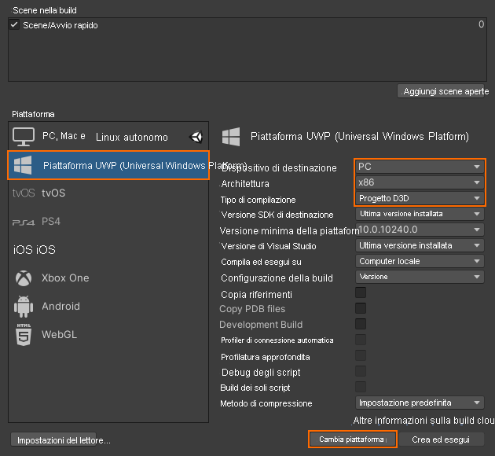

# Avvio rapido: Distribuire un esempio di Unity sul desktop

Questo argomento di avvio rapido illustra come distribuire ed eseguire l'app di esempio dell'avvio rapido per Unity in un computer desktop.

In questo argomento di avvio rapido si apprenderà come:

> [!div class="checklist"]
>
>* Compilare l'app di esempio dell'avvio rapido per desktop
>* Distribuire l'esempio in un computer
>* Eseguire l'esempio in un computer

## Prerequisiti

In questo argomento di avvio rapido verrà distribuito il progetto di esempio creato nell'argomento [Avvio rapido: Eseguire il rendering di un modello con Unity](render-model.md).

Assicurarsi che le credenziali vengano salvate correttamente con la scena e che sia possibile connettersi a una sessione dall'editor di Unity.

## Disabilitare il supporto della realtà virtuale

Sul desktop sono attualmente supportate solo le app desktop flat, quindi è necessario disabilitare il supporto della realtà virtuale.

1. Aprire *Edit > Project Settings...* (Modifica > Impostazioni progetto...)
1. Selezionare **Player** (Lettore) a sinistra.
1. Selezionare la scheda **Universal Windows Platform settings** (Impostazioni di Universal Windows Platform).
1. Espandere **XR Settings** (Impostazioni XR).
1. Disabilitare **Virtual Reality Supported** (Realtà virtuale supportata).\
    
1. Sopra *XR Settings* (Impostazioni XR) espandere **Publishing Settings** (Impostazioni di pubblicazione).
1. In **Supported Device Families** (Famiglie di dispositivi supportate) assicurarsi che sia selezionato **Desktop**.

## Compilare il progetto di esempio

1. Aprire *File -> Build Settings* (File -> Impostazioni compilazione).
1. Impostare *Piattaforma* su **Piattaforma UWP** (anche **PC autonomo** è supportato ma non viene usato qui, vedere [Limitazioni della piattaforma](../reference/limits.md#platform-limitations)).
1. Impostare *Target Device* (Dispositivo di destinazione) su **PC** (Computer).
1. Impostare *Architecture* (Architettura) su **x86**.
1. Impostare *Build Type* (Tipo di compilazione) su **D3D Project**.\
  
1. Selezionare **Switch to Platform** (Passa alla piattaforma).
1. Quando si preme **Build** (Compila) o 'Build And Run' (Compila ed esegui), verrà richiesto di selezionare una cartella in cui archiviare la soluzione.
1. Aprire il file **Quickstart.sln** generato con Visual Studio.
1. Impostare la configurazione su **Release** e **x86**.
1. Impostare la modalità del debugger su **Local Machine** (Computer locale).\
  
1. Compilare la soluzione.

## Avviare il progetto di esempio

Avviare il debugger in Visual Studio (F5). L'app verrà distribuita automaticamente nel computer.

L'app di esempio dovrebbe avviarsi e quindi avviare una nuova sessione. Dopo qualche istante la sessione sarà pronta e il modello di cui è stato eseguito il rendering in remoto verrà visualizzato in primo piano.
Se si vuole avviare l'esempio una seconda volta in seguito, è possibile trovarlo anche nel menu Start.

## Passaggi successivi

Nell'argomento di avvio rapido successivo si esaminerà la conversione di un modello personalizzato.

> [!div class="nextstepaction"]
> [Avvio rapido: Convertire un modello per il rendering](convert-model.md)
