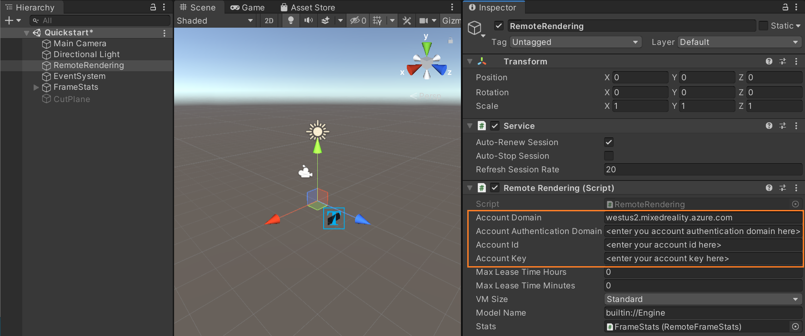

# <a name="quickstart-render-a-model-with-unity"></a>Avvio rapido: Eseguire il rendering di un modello con Unity

Questo argomento di avvio rapido illustra come eseguire un esempio di Unity che esegue il rendering di un modello predefinito in modalità remota usando il servizio Rendering remoto di Azure.

Non verranno esaminati in dettaglio l'API stessa del servizio Rendering remoto di Azure o il modo in cui configurare un nuovo progetto Unity. Questi argomenti sono trattati nell'[Esercitazione: Visualizzazione di un modello di cui è stato eseguito il rendering in remoto](../tutorials/unity/view-remote-models/view-remote-models.md).

In questo argomento di avvio rapido si apprenderà come:
> [!div class="checklist"]
>
>* Configurare un ambiente di sviluppo locale
>* Ottenere e compilare l'app di esempio dell'avvio rapido del servizio Rendering remoto di Azure per Unity
>* Eseguire il rendering di un modello nell'app di esempio dell'avvio rapido del servizio Rendering remoto di Azure

## <a name="prerequisites"></a>Prerequisiti

Per ottenere l'accesso al servizio Rendering remoto di Azure, è prima di tutto necessario [creare un account](../how-tos/create-an-account.md).

È necessario installare il software seguente:

* Windows SDK 10.0.18362.0 [(download)](https://developer.microsoft.com/windows/downloads/windows-10-sdk)
* L'ultima versione di Visual Studio 2019 [(download)](https://visualstudio.microsoft.com/vs/older-downloads/)
* [Visual Studio Tools per Realtà mista](/windows/mixed-reality/install-the-tools). In particolare, le installazioni del *carico di lavoro* seguente sono obbligatorie:
  * **Sviluppo per desktop con C++**
  * **Sviluppo per la piattaforma UWP (Universal Windows Platform)**
* GIT [(download)](https://git-scm.com/downloads)
* Unity 2019.3.1 [(download)](https://unity3d.com/get-unity/download)
  * Installare questi moduli in Unity:
    * **UWP** - Supporto per la compilazione della piattaforma UWP (Universal Windows Platform)
    * **IL2CPP** - Supporto per la compilazione di Windows (IL2CPP)

## <a name="clone-the-sample-app"></a>Clonare l'app di esempio

Aprire un prompt dei comandi (digitare `cmd` nel menu Start di Windows) e passare a una directory in cui si vuole archiviare il progetto di esempio di Rendering remoto di Azure.

Eseguire i comandi seguenti:

```cmd
mkdir ARR
cd ARR
git clone https://github.com/Azure/azure-remote-rendering
```

L'ultimo comando crea una sottodirectory nella directory ARR contenente i vari progetti di esempio per Rendering remoto di Azure.

L'app di esempio dell'avvio rapido per Unity si trova nella sottodirectory *Unity/QuickStart*.

## <a name="rendering-a-model-with-the-unity-sample-project"></a>Rendering di un modello con il progetto di esempio Unity

Aprire Unity Hub e aggiungere il progetto di esempio, ovvero la cartella *ARR\azure-remote-rendering\Unity\Quickstart*.
Aprire il progetto. Se necessario, consentire a Unity di aggiornare il progetto alla versione installata.

Il modello predefinito di cui viene eseguito il rendering è un [modello di esempio predefinito](../samples/sample-model.md). Verrà illustrato come convertire un modello personalizzato usando il servizio di conversione Rendering remoto di Azure nell'argomento di [avvio rapido successivo](convert-model.md).

### <a name="enter-your-account-info"></a>Immettere le informazioni dell'account

1. Nel browser di asset Unity passare alla cartella *Scenes* e aprire la scena **Avvio rapido**.
1. Nella *Gerarchia* selezionare l'oggetto gioco **RemoteRendering**.
1. In *Inspector* immettere le [credenziali dell'account](../how-tos/create-an-account.md). Se non si dispone ancora di un account, [crearne uno](../how-tos/create-an-account.md).



> [!IMPORTANT]
> Impostare **AccountDomain** su `<region>.mixedreality.azure.com`, dove `<region>` è [una delle aree disponibili nelle vicinanze](../reference/regions.md).\
> Impostare **AccountAuthenticationDomain** sul [dominio dell'account](../how-tos/create-an-account.md#retrieve-the-account-information) come visualizzato nel portale di Azure.

In seguito si vuole distribuire il progetto in un HoloLens e connettersi al servizio Rendering remoto da tale dispositivo. Poiché non è disponibile un modo semplice per immettere le credenziali nel dispositivo, l'esempio dell'avvio rapido **salverà le credenziali nella scena Unity**.

> [!WARNING]
> Assicurarsi di non controllare il progetto con le proprie credenziali salvate in un repository dove potrebbero trapelare informazioni di accesso segrete.

### <a name="create-a-session-and-view-the-default-model"></a>Creare una sessione e visualizzare il modello predefinito

Premere il pulsante **Play** di Unity per avviare la sessione. Verrà visualizzata una sovrimpressione con il testo di stato nella parte inferiore del riquadro di visualizzazione nel pannello *Game*. La sessione viene sottoposta a una serie di transizioni di stato. Nello stato di **avvio** il server viene avviato, operazione che richiede diversi minuti. Al termine dell'operazione, viene eseguito il passaggio allo stato **pronto**. A questo punto la sessione passa allo stato di **connessione**, in cui prova a raggiungere il runtime di rendering in tale server. In caso di esito positivo, l'esempio passa allo stato **connesso**. A questo punto, inizierà a scaricare il modello per il rendering. A causa delle dimensioni del modello, il download può richiedere alcuni minuti. Viene quindi visualizzato il modello di cui è stato eseguito il rendering in remoto.


Congratulazioni! Si sta ora visualizzando un modello di cui è stato eseguito il rendering in remoto.

## <a name="inspecting-the-scene"></a>Controllo della scena

Una volta eseguita la connessione per il rendering remoto, il pannello Inspector viene aggiornato con informazioni aggiuntive sullo stato: 

È ora possibile esplorare il grafico della scena selezionando il nuovo nodo e facendo clic su **Show children** (Mostra elementi figlio) nella finestra Inspector.


Nella scena è presente un oggetto [piano di taglio](../overview/features/cut-planes.md). Provare ad abilitarlo nelle relative proprietà e a spostarlo:


Per sincronizzare le trasformazioni, fare clic su **Sync now** (Sincronizza ora) o selezionare l'opzione **Sync every frame** (Sincronizza ogni frame). Per le proprietà dei componenti, è sufficiente modificarle.

## <a name="next-steps"></a>Passaggi successivi

Nell'argomento di avvio rapido successivo verrà distribuito l'esempio in un HoloLens per visualizzare il modello di cui è stato eseguito il rendering in remoto nelle dimensioni originali.

> [!div class="nextstepaction"]
> [Avvio rapido: Distribuire un esempio di Unity in HoloLens](deploy-to-hololens.md)

In alternativa, l'esempio può essere distribuito anche in un computer desktop.

> [!div class="nextstepaction"]
> [Avvio rapido: Distribuire un esempio di Unity sul desktop](deploy-to-desktop.md)