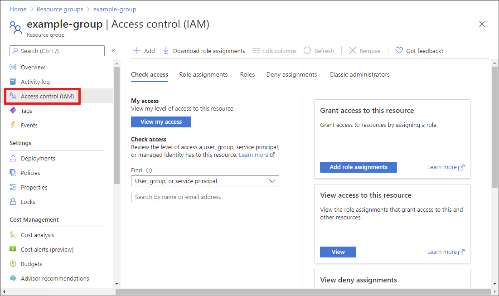

# Aggiungere o rimuovere assegnazioni di ruolo di Azure usando il portale di Azure

[!INCLUDE [Azure RBAC definition grant access](../../includes/role-based-access-control/definition-grant.md)] Questo articolo descrive come assegnare i ruoli usando il portale di Azure.

Se è necessario assegnare ruoli di amministratore in Azure Active Directory, vedere [visualizzare e assegnare ruoli di amministratore in Azure Active Directory](../active-directory/roles/manage-roles-portal.md).

## Prerequisiti

[!INCLUDE [Azure role assignment prerequisites](../../includes/role-based-access-control/prerequisites-role-assignments.md)]

## Aggiungi un'assegnazione di ruolo

In controllo degli accessi in base al ruolo di Azure per concedere l'accesso a una risorsa di Azure è necessario aggiungere un'assegnazione di ruolo Per assegnare un ruolo, seguire questa procedura. Per una panoramica di alto livello dei passaggi, vedere [la procedura per aggiungere un'assegnazione di ruolo](role-assignments-steps.md).

### Passaggio 1: identificare l'ambito necessario

[!INCLUDE [Scope for Azure RBAC introduction](../../includes/role-based-access-control/scope-intro.md)]

[!INCLUDE [Scope for Azure RBAC least privilege](../../includes/role-based-access-control/scope-least.md)] Per ulteriori informazioni sull'ambito, vedere [comprendere l'ambito](scope-overview.md).

1. Accedere al [portale di Azure](https://portal.azure.com).

1. Nella casella di ricerca nella parte superiore cercare l'ambito a cui si vuole concedere l'accesso. Ad esempio, cercare **gruppi di gestione**, **sottoscrizioni**, **gruppi di risorse** o una risorsa specifica.

    

1. Fare clic sulla risorsa specifica per tale ambito.

    L'immagine seguente mostra un gruppo di risorse di esempio.

    

### Passaggio 2: aprire il riquadro Aggiungi assegnazione ruolo

Il **controllo di accesso (IAM)** è la pagina che in genere si usa per assegnare i ruoli per concedere l'accesso alle risorse di Azure. È noto anche come gestione delle identità e degli accessi e viene visualizzato in diverse posizioni nel portale di Azure.

1. Fare clic su **Controllo di accesso (IAM)**.

    L'immagine seguente mostra un esempio della pagina Controllo di accesso (IAM) per un gruppo di risorse.

    

1. Fare clic sulla scheda **assegnazioni di ruolo** per visualizzare le assegnazioni di ruolo in questo ambito.

1. Fare clic su **Aggiungi**  >  **Aggiungi assegnazione ruolo**.
   Se non si dispone delle autorizzazioni per assegnare ruoli, l'opzione Aggiungi assegnazione di ruolo verrà disabilitata.

   

    Viene visualizzato il riquadro Aggiungi assegnazione di ruolo.

   

### Passaggio 3: selezionare il ruolo appropriato

1. Nell'elenco **ruolo** cercare o scorrere per trovare il ruolo che si desidera assegnare.

    Per determinare il ruolo appropriato, è possibile passare il mouse sull'icona info per visualizzare una descrizione del ruolo. Per altre informazioni, vedere l'articolo [ruoli predefiniti di Azure](built-in-roles.md) .

   

1. Fare clic per selezionare il ruolo.

### Passaggio 4: selezionare chi necessita di accesso

1. Nell'elenco **assegna accesso a** selezionare il tipo di entità di sicurezza a cui assegnare l'accesso.

    | Type | Descrizione |
    | --- | --- |
    | **Utente, gruppo o entità servizio** | Se si desidera assegnare il ruolo a un utente, a un gruppo o a un'entità servizio (applicazione), selezionare questo tipo. |
    | **Identità gestita assegnata dall'utente** | Se si desidera assegnare il ruolo a un' [identità gestita assegnata dall'utente](../active-directory/managed-identities-azure-resources/overview.md), selezionare questo tipo. |
    | *Identità gestita assegnata dal sistema* | Se si vuole assegnare il ruolo a un' [identità gestita assegnata dal sistema](../active-directory/managed-identities-azure-resources/overview.md), selezionare l'istanza del servizio di Azure in cui si trova l'identità gestita. |

   

1. Se è stata selezionata un'identità gestita assegnata dall'utente o un'identità gestita assegnata dal sistema, selezionare la **sottoscrizione** in cui si trova l'identità gestita.

1. Nella sezione **Seleziona** cercare l'entità di sicurezza immettendo una stringa o scorrendo l'elenco.

   

1. Dopo aver trovato l'entità di sicurezza, fare clic per selezionarla.

### Passaggio 5: assegnare un ruolo

1. Per assegnare il ruolo, fare clic su **Salva**.

   Dopo qualche istante, all'entità di sicurezza verrà assegnato il ruolo per l'ambito selezionato.

1. Nella scheda **assegnazioni di ruolo** verificare che nell'elenco sia visualizzata l'assegnazione di ruolo.

    

## Rimuovere un'assegnazione di ruolo

In controllo degli accessi in base al ruolo di Azure è possibile rimuovere un'assegnazione di ruolo. Per rimuovere un'assegnazione di ruolo, attenersi alla seguente procedura.

1. Aprire **Controllo di accesso (IAM)** sull'ambito, come gruppo di gestione, sottoscrizione, gruppo di risorse o risorsa, in cui si intende rimuovere l'accesso.

1. Fare clic sulla scheda **Assegnazioni di ruolo** per visualizzare tutte le assegnazioni di ruolo in questo ambito.

1. Nell'elenco delle assegnazioni di ruolo aggiungere un segno di spunta accanto all'entità di sicurezza con l'assegnazione di ruolo che si vuole rimuovere.

   

1. Scegliere **Rimuovi**.

   

1. Nella finestra con il messaggio di rimozione dell'assegnazione di ruolo fare clic su **Sì**.

    Se viene visualizzato un messaggio in cui non è possibile rimuovere le assegnazioni di ruolo ereditate, si sta tentando di rimuovere un'assegnazione di ruolo in un ambito figlio. È necessario aprire il controllo di accesso (IAM) nell'ambito in cui è stato assegnato il ruolo e riprovare. Un modo rapido per aprire il controllo di accesso (IAM) nell'ambito corretto consiste nell'esaminare la colonna **ambito** e fare clic sul collegamento accanto a **(ereditato)**.

   

## Passaggi successivi

- [Assegnare un utente come amministratore di una sottoscrizione di Azure](role-assignments-portal-subscription-admin.md)
- [Aggiungere un'assegnazione di ruolo per un'identità gestita](role-assignments-portal-managed-identity.md)
- [Risolvere i problemi relativi a RBAC di Azure](troubleshooting.md)
