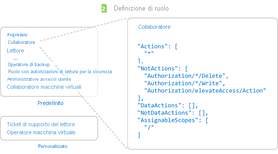

# Procedura per aggiungere un'assegnazione di ruolo

[!INCLUDE [Azure RBAC definition grant access](../../includes/role-based-access-control-definition-grant.md)] Questo articolo descrive i passaggi di alto livello per aggiungere un'assegnazione di ruolo usando il [portale di Azure](role-assignments-portal.md), [Azure PowerShell](role-assignments-powershell.md), l'interfaccia della riga di comando di [Azure](role-assignments-cli.md)o l' [API REST](role-assignments-rest.md).

## Passaggio 1: determinare chi necessita dell'accesso

Per prima cosa è necessario determinare chi necessita di accesso. È possibile assegnare un ruolo a un utente, un gruppo, un'entità servizio o un'identità gestita. Questa operazione è detta anche *entità di sicurezza*.

- Utente: un soggetto che dispone di un profilo in Azure Active Directory. È anche possibile assegnare ruoli agli utenti in altri tenant. Per informazioni sugli utenti in altre organizzazioni, vedere [Azure Active Directory B2B](../active-directory/external-identities/what-is-b2b.md).
- Gruppo: un set di utenti creato in Azure Active Directory. Quando si assegna un ruolo a un gruppo, tutti gli utenti all'interno di tale gruppo dispongono del ruolo appropriato. 
- Entità servizio: un'identità di sicurezza utilizzata da applicazioni o servizi per accedere a specifiche risorse di Azure. È possibile pensare a questo elemento come a un'*identità utente* (nome utente e password o certificato) per un'applicazione.
- Identità gestita: un'identità in Azure Active Directory che viene gestita automaticamente da Azure. Le [identità gestite](../active-directory/managed-identities-azure-resources/overview.md) vengono in genere usate durante lo sviluppo di applicazioni cloud per gestire le credenziali per l'autenticazione ai servizi di Azure.

## Passaggio 2: trovare il ruolo appropriato

Le autorizzazioni vengono raggruppate in una *definizione di ruolo*. generalmente chiamata *ruolo*. È possibile scegliere da un elenco di diversi ruoli predefiniti. Se i ruoli predefiniti non soddisfano le esigenze specifiche dell'organizzazione, è possibile creare ruoli personalizzati.

Di seguito sono elencati quattro fondamentali ruoli predefiniti. I primi tre si applicano a tutti i tipi di risorse.

- [Proprietario](built-in-roles.md#owner): ha accesso completo a tutte le risorse, compreso il diritto di delegare l'accesso ad altri utenti.
- [Collaboratore](built-in-roles.md#contributor): può creare e gestire tutti i tipi di risorse di Azure, ma non può concedere l'accesso ad altri.
- [Lettore](built-in-roles.md#reader): può visualizzare le risorse di Azure esistenti.
- [Amministratore Accesso utenti](built-in-roles.md#user-access-administrator): consente di gestire l'accesso degli utenti alle risorse di Azure.

Gli altri ruoli predefiniti consentono la gestione di risorse di Azure specifiche. Ad esempio, il ruolo [Collaboratore Macchina virtuale](built-in-roles.md#virtual-machine-contributor) consente a un utente di creare e gestire macchine virtuali.

1. Iniziare con l'articolo completo [Ruoli predefiniti di Azure](built-in-roles.md). La tabella all'inizio dell'articolo è un indice dei dettagli descritti più avanti nell'articolo.

1. In questo articolo passare alla categoria del servizio (ad esempio calcolo, archiviazione e database) per la risorsa a cui si vogliono concedere le autorizzazioni. Il modo più semplice per trovare ciò che si sta cercando è in genere cercare nella pagina una parola chiave pertinente, ad esempio "blob", "macchina virtuale" e così via.

1. Esaminare i ruoli elencati per la categoria di servizio e identificare le operazioni specifiche necessarie. Ancora una volta, iniziare sempre con il ruolo più restrittivo.

    Se, ad esempio, un'entità di sicurezza deve leggere i BLOB in un account di archiviazione di Azure, ma non necessita dell'accesso in scrittura, scegliere [lettore dati BLOB di archiviazione](built-in-roles.md#storage-blob-data-reader) anziché [collaboratore dati BLOB di archiviazione](built-in-roles.md#storage-blob-data-contributor) (e senza dubbio il ruolo [proprietario dati BLOB di archiviazione](built-in-roles.md#storage-blob-data-owner) a livello di amministratore). È sempre possibile aggiornare le assegnazioni di ruolo in un secondo momento, se necessario.

1. Se non si trova un ruolo appropriato, è possibile creare un [ruolo personalizzato](custom-roles.md).

## Passaggio 3: identificare l'ambito necessario

*Ambito* è il set di risorse a cui si applica l'accesso. In Azure è possibile specificare un ambito a quattro livelli: [gruppo di gestione](../governance/management-groups/overview.md), sottoscrizione, [gruppo di risorse](../azure-resource-manager/management/overview.md#resource-groups)e risorsa. Gli ambiti sono strutturati in una relazione padre-figlio. Ogni livello di gerarchia rende più specifico l'ambito. È possibile assegnare i ruoli a qualsiasi livello dell'ambito. Il livello selezionato determina la frequenza con cui viene applicato il ruolo. I livelli inferiori ereditano le autorizzazioni dei ruoli dai livelli più alti. 

Quando si assegna un ruolo a un ambito padre, tali autorizzazioni vengono ereditate negli ambiti figlio. Ad esempio:

- Se si assegna il ruolo [lettore](built-in-roles.md#reader) a un utente nell'ambito del gruppo di gestione, tale utente potrà leggere tutti gli elementi in tutte le sottoscrizioni del gruppo di gestione.
- Se si assegna il ruolo [Lettura fatturazione](built-in-roles.md#billing-reader) a un gruppo nell'ambito della sottoscrizione, i membri del gruppo potranno leggere i dati di fatturazione per ogni gruppo di risorse e risorsa nella sottoscrizione.
- Se si assegna il ruolo [Collaboratore](built-in-roles.md#contributor) a un'applicazione nell'ambito del gruppo di risorse, è possibile gestire risorse di tutti i tipi in quel gruppo di risorse, ma non altri gruppi di risorse nella sottoscrizione.

 Per altre informazioni, vedere [comprendere l'ambito](scope-overview.md).

## Passaggio 4. Verificare i prerequisiti

Per assegnare ruoli, è necessario eseguire l'accesso con un utente a cui è assegnato un ruolo che dispone dell'autorizzazione di scrittura per le assegnazioni di ruolo, ad esempio [proprietario](built-in-roles.md#owner) o [amministratore accesso utenti](built-in-roles.md#user-access-administrator) nell'ambito a cui si sta provando ad assegnare il ruolo. Analogamente, per rimuovere un'assegnazione di ruolo, è necessario disporre dell'autorizzazione DELETE per le assegnazioni di ruolo.

- `Microsoft.Authorization/roleAssignments/write`
- `Microsoft.Authorization/roleAssignments/delete`

Se l'account utente non ha le autorizzazioni per assegnare un ruolo all'interno della sottoscrizione, verrà visualizzato un messaggio di errore che segnala che l'account non è autorizzato a eseguire l'azione 'Microsoft.Authorization/roleAssignments/write'. In questo caso, contattare gli amministratori della sottoscrizione in quanto possono assegnare le autorizzazioni per conto dell'utente.

## Passaggio 5. Aggiungi un'assegnazione di ruolo

Quando si conoscono l'entità di sicurezza, il ruolo e l'ambito, è possibile assegnare il ruolo. È possibile aggiungere assegnazioni di ruolo usando il portale di Azure, Azure PowerShell, l'interfaccia della riga di comando di Azure, Azure SDK o le API REST. È possibile avere fino a **2000** assegnazioni di ruolo in ogni sottoscrizione. Questo limite include le assegnazioni di ruolo negli ambiti di sottoscrizione, gruppo di risorse e risorsa. È possibile avere fino a **500** assegnazioni di ruolo in ogni sottoscrizione.

Per istruzioni dettagliate su come aggiungere assegnazioni di ruolo, vedere gli articoli seguenti.

- [Aggiungere o rimuovere assegnazioni di ruolo di Azure usando il portale di Azure](role-assignments-portal.md)
- [Aggiungere o rimuovere assegnazioni di ruolo di Azure con Azure PowerShell](role-assignments-powershell.md)
- [Aggiungere o rimuovere assegnazioni di ruolo di Azure tramite l'interfaccia della riga di comando di Azure](role-assignments-cli.md)
- [Aggiungere o rimuovere assegnazioni di ruolo di Azure tramite l'API REST](role-assignments-rest.md)

## Passaggi successivi

- [Esercitazione: Concedere l'accesso alle risorse di Azure a un utente usando il portale di Azure](quickstart-assign-role-user-portal.md)