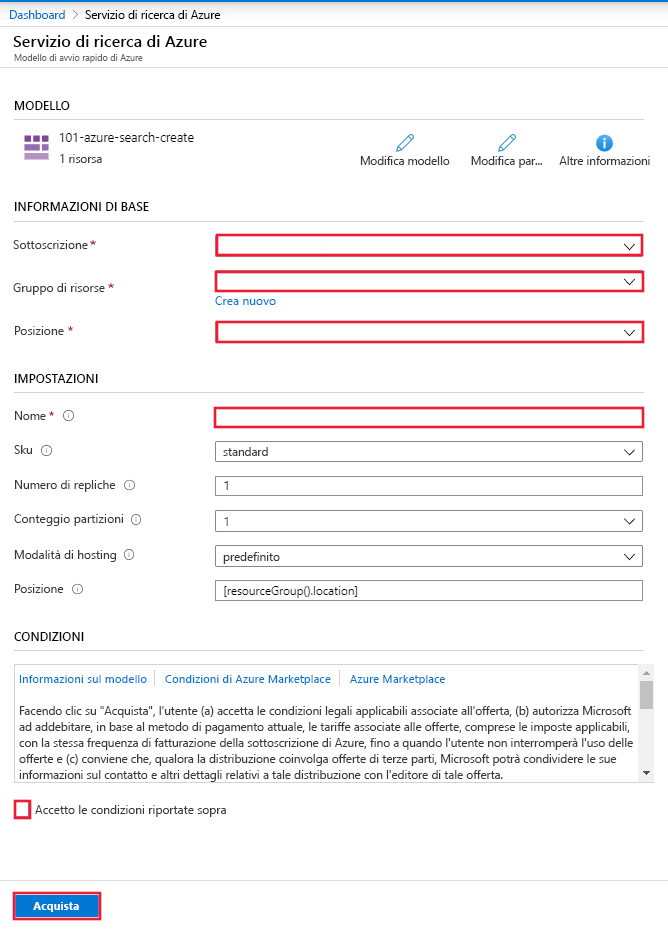

# Avvio rapido: Distribuire Ricerca cognitiva con un modello di Resource Manager

Questo articolo illustra la procedura per usare un modello di Azure Resource Manager per distribuire una risorsa di Ricerca cognitiva di Azure nel portale di Azure.

[!INCLUDE [About Azure Resource Manager](../../includes/resource-manager-quickstart-introduction.md)]

Se l'ambiente soddisfa i prerequisiti e si ha familiarità con l'uso dei modelli di Resource Manager, selezionare il pulsante **Distribuisci in Azure**. Il modello verrà aperto nel portale di Azure.

## Prerequisiti

Se non si ha una sottoscrizione di Azure, creare un [account gratuito](https://azure.microsoft.com/free/?WT.mc_id=A261C142F) prima di iniziare.

## Rivedere il modello

Il modello usato in questo avvio rapido proviene dai [modelli di avvio rapido di Azure](https://azure.microsoft.com/resources/templates/101-azure-search-create/).

:::code language="json"source="~/quickstart-templates/101-azure-search-create/azuredeploy.json":::

La risorsa di Azure definita in questo modello:

- [Microsoft.Search/searchServices](/azure/templates/Microsoft.Search/searchServices): creare un servizio Ricerca cognitiva di Azure

## Distribuire il modello

Selezionare l'immagine seguente per accedere ad Azure e aprire un modello. Il modello crea una risorsa di Ricerca cognitiva di Azure.

Il portale visualizza un modulo che consente di fornire facilmente i valori dei parametri. Alcuni parametri sono precompilati con i valori predefiniti del modello. Sarà necessario specificare la sottoscrizione, il gruppo di risorse, la posizione e il nome del servizio. Se si vuole usare Servizi cognitivi in una pipeline di [arricchimento tramite intelligenza artificiale](cognitive-search-concept-intro.md), ad esempio per analizzare file di immagine binari per verificare la presenza di testo, scegliere una posizione che offra sia Ricerca cognitiva che Servizi cognitivi. È necessario che entrambi i servizi si trovino nella stessa area per i carichi di lavoro di arricchimento tramite intelligenza artificiale. Una volta completato il modulo, sarà necessario accettare i termini e le condizioni, quindi selezionare il pulsante Acquista per completare la distribuzione.

> [!div class="mx-imgBorder"]
> 

## Esaminare le risorse distribuite

Al termine della distribuzione, è possibile accedere al nuovo gruppo di risorse e al nuovo servizio di ricerca nel portale.

## Pulire le risorse

Altre guide di avvio rapido ed esercitazioni di Ricerca cognitiva si basano su questa guida di avvio rapido. Se si prevede di usare le guide di avvio rapido e le esercitazioni successive, è consigliabile non cancellare la risorsa creata. Quando non è più necessario, è possibile eliminare il gruppo di risorse per eliminare il servizio Ricerca cognitiva e le risorse correlate.

## Passaggi successivi

In questo argomento di avvio rapido è stato creato un servizio Ricerca cognitiva usando un modello di Azure Resource Manager ed è stata convalidata la distribuzione. Per altre informazioni su Ricerca cognitiva e Azure Resource Manager, continuare con gli articoli seguenti.

- Leggere una [panoramica di Ricerca cognitiva di Azure](search-what-is-azure-search.md).
- [Creare un indice](search-get-started-portal.md) per il servizio di ricerca.
- [Creare un'app demo](search-create-app-portal.md) usando la procedura guidata del portale.
- [Creare un set di competenze](cognitive-search-quickstart-blob.md) per estrarre informazioni dai dati.
