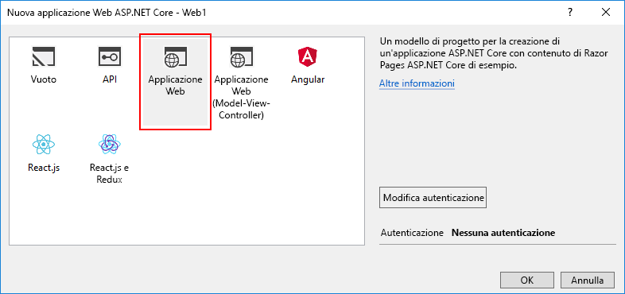
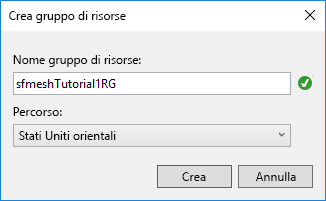

# <a name="quickstart-create-and-deploy-a-web-app-to-azure-service-fabric-mesh"></a>Guida introduttiva: Creare e distribuire un'app Web in Azure Service Fabric Mesh

> [!IMPORTANT]
> L'anteprima di Azure Service Fabric mesh è stata ritirata. Le nuove distribuzioni non saranno più consentite tramite l'API Service Fabric mesh. Il supporto per le distribuzioni esistenti continuerà fino al 28 aprile 2021.
> 
> Per informazioni dettagliate, vedere il [ritiro anteprima di Azure Service Fabric mesh](https://azure.microsoft.com/updates/azure-service-fabric-mesh-preview-retirement/).

Azure Service Fabric Mesh è un servizio completamente gestito che consente agli sviluppatori di distribuire applicazioni di microservizi senza dover gestire macchine virtuali, archiviazione o connettività di rete.

In questa guida introduttiva si creerà una nuova applicazione Service Fabric Mesh costituita da un'app Web ASP.NET Core, si eseguirà l'applicazione nel cluster di sviluppo locale e quindi si procederà alla pubblicazione per l'esecuzione in Azure.

È necessario avere una sottoscrizione di Azure. In alternativa, è possibile creare con facilità una sottoscrizione di Azure gratuita. [Creare un account gratuito](https://azure.microsoft.com/free/) prima di iniziare. È inoltre necessario [configurare l'ambiente di sviluppo](service-fabric-mesh-howto-setup-developer-environment-sdk.md).

[!INCLUDE [preview note](./includes/include-preview-note.md)]

## <a name="create-a-service-fabric-mesh-project"></a>Creare un progetto Service Fabric Mesh

Aprire Visual Studio e selezionare **File** > **Nuovo** > **Progetto**.

Nella finestra di dialogo **Nuovo progetto** digitare `mesh` nella casella di **ricerca** visualizzata nella parte superiore. Selezionare il modello **Service Fabric Mesh Application** (Applicazione Service Fabric Mesh). Se non viene visualizzato il modello, verificare di avere installato Service Fabric Mesh SDK e la versione di anteprima degli strumenti di Visual Studio, come descritto in [Configurare l'ambiente di sviluppo](service-fabric-mesh-howto-setup-developer-environment-sdk.md). 

Nella casella **Nome** digitare **ServiceFabricMesh1** e nella casella **Percorso** impostare il percorso della cartella in cui verranno archiviati i file per il progetto.

Assicurarsi che l'opzione **Crea directory per soluzione** sia selezionata e fare clic su **OK** per creare il progetto Service Fabric Mesh.


### <a name="create-a-service"></a>Creare un servizio

Dopo che si è fatto clic su **OK**, viene visualizzata la finestra di dialogo **Nuovo servizio Service Fabric**. Selezionare il tipo di progetto **ASP.NET Core**, assicurarsi che l'opzione **Container OS** (Sistema operativo contenitore) sia impostata su **Windows** e fare clic su **OK** per creare il progetto ASP.NET Core. 


Viene visualizzata la finestra di dialogo **Nuova applicazione Web ASP.NET Core**. Selezionare **Applicazione Web** e quindi fare clic su **OK**.



Visual Studio crea il progetto di applicazione Service Fabric Mesh e il progetto ASP.NET Core.

## <a name="build-and-publish-to-your-local-cluster"></a>Compilare e pubblicare nel cluster locale

Non appena viene caricato il progetto, viene compilata e pubblicata automaticamente un'immagine Docker nel cluster locale. Questo processo può richiedere del tempo. È possibile monitorare lo stato di avanzamento degli strumenti di Service Fabric nella finestra **Output** selezionando **Strumenti di Service Fabric** dal menu a discesa della finestra **Output**. Mentre è in corso la distribuzione dell'immagine Docker è possibile continuare a lavorare.

Dopo aver creato il progetto, premere **F5** per eseguire il debug del servizio in locale. Quando la distribuzione locale è completata e il progetto è in esecuzione in Visual Studio, viene aperta una finestra del browser con una pagina Web di esempio.

Dopo aver esaminato il servizio distribuito, arrestare il debug del progetto premendo **MAIUSC+F5** in Visual Studio.

## <a name="publish-to-azure"></a>Pubblicazione in Azure

Per pubblicare il progetto Service Fabric Mesh in Azure, fare clic con il pulsante destro del mouse sul **progetto Service Fabric Mesh** in Visual Studio e selezionare **Pubblica**.


Viene visualizzata la finestra di dialogo **Pubblica applicazione di Service Fabric**.


Selezionare l'account e la sottoscrizione di Azure. Scegliere una **Posizione**. In questo articolo viene usata l'area **Stati Uniti orientali**.

In **Gruppo di risorse** selezionare **\<Create New Resource Group...>** . Viene visualizzata la finestra di dialogo **Crea gruppo di risorse**. Impostare i campi **Nome gruppo di risorse** e **Località**.  In questa guida introduttiva viene usata l'area **Stati Uniti orientali** e viene assegnato il nome **sfmeshTutorial1RG** al gruppo di risorse. Se l'organizzazione include più persone che usano la stessa sottoscrizione, scegliere un nome univoco per il gruppo di risorse.  Fare clic su **Crea** per creare il gruppo di risorse e tornare alla finestra di dialogo per la pubblicazione.



Nella finestra di dialogo **Pubblica applicazione di Service Fabric** selezionare **\<Create New Container Registry...>** in **Registro Azure Container**. Nella finestra di dialogo **Crea registro contenitori** usare un nome univoco per **Nome del registro contenitori**. Impostare il campo **Località**. In questa guida introduttiva viene usata l'area **Stati Uniti orientali**. Nell'elenco a discesa selezionare il **gruppo di risorse** creato nel passaggio precedente, ad esempio **sfmeshTutorial1RG**. Impostare **SKU** su **Base** e quindi fare clic su **Crea** per tornare alla finestra di dialogo per la pubblicazione.


Nella finestra di dialogo per la pubblicazione fare clic sul pulsante **Pubblica** per distribuire l'applicazione Service Fabric Mesh in Azure.

Quando si pubblica in Azure per la prima volta, viene eseguito il push dell'immagine Docker per il Registro Azure Container. Questa operazione richiede tempo a seconda delle dimensioni dell'immagine. Le successive pubblicazioni dello stesso progetto saranno più rapide. È possibile monitorare lo stato di avanzamento del processo di distribuzione selezionando **Strumenti di Service Fabric** dal menu a discesa della finestra **Output**. Al termine della distribuzione, nell'output di **Strumenti di Service Fabric** verranno visualizzati l'indirizzo IP e la porta dell'applicazione sotto forma di URL.

```
Packaging Application...
Building Images...
Web1 -> C:\Code\ServiceFabricMesh1\Web1\bin\Any CPU\Release\netcoreapp2.0\Web1.dll
Uploading the images to Azure Container Registry...
Deploying application to remote endpoint...
The application was deployed successfully and it can be accessed at http://...
```

Aprire un Web browser e passare all'URL visualizzato per visitare il sito Web in esecuzione in Azure:


## <a name="clean-up-resources"></a>Pulire le risorse

Eliminare tutte le risorse create per questa guida introduttiva quando non sono più necessarie. Poiché è stato creato un nuovo gruppo di risorse per ospitare le risorse dell'ACR e del servizio Service Fabric Mesh, è possibile eliminare tranquillamente l'intero gruppo, in modo da eliminare con facilità tutte le risorse associate.

```azurecli
az group delete --resource-group sfmeshTutorial1RG
```

```powershell
Connect-AzureRmAccount
Remove-AzureRmResourceGroup -Name sfmeshTutorial1RG
```

In alternativa, è possibile eliminare il gruppo di risorse [dal portale di Azure](https://portal.azure.com).

## <a name="next-steps"></a>Passaggi successivi

Per informazioni sulla creazione e la distribuzione di applicazioni Service Fabric Mesh, proseguire con l'esercitazione.
> [!div class="nextstepaction"]
> [Creare, eseguire il debug e distribuire un'applicazione Web multiservizio in Service Fabric Mesh](service-fabric-mesh-tutorial-create-dotnetcore.md)
