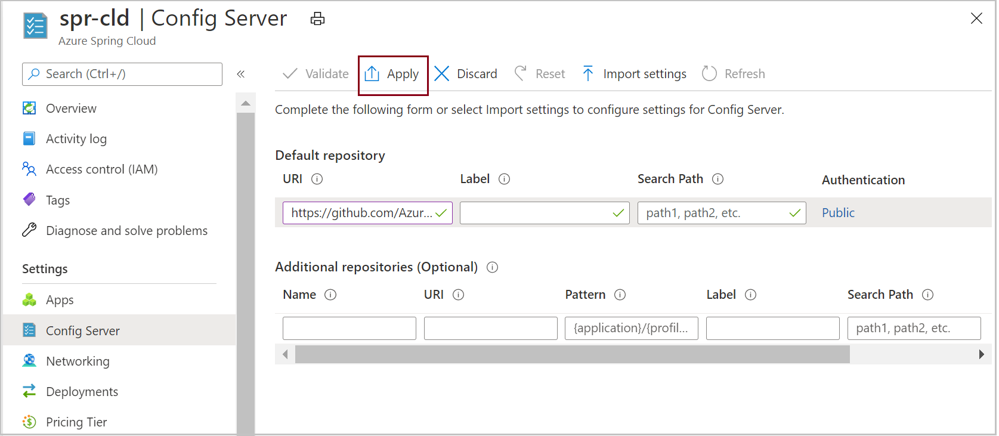
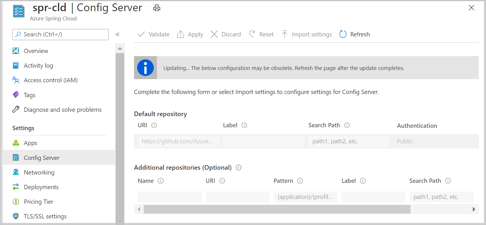

# <a name="quickstart-set-up-azure-spring-cloud-configuration-server"></a>Avvio rapido: Configurare il server di configurazione di Azure Spring Cloud

Azure Spring Cloud Config Server è un servizio di configurazione centralizzato per i sistemi distribuiti. Usa un livello di repository collegabile che attualmente supporta l'archiviazione locale, Git e Subversion. In questo argomento di avvio rapido viene configurato il server di configurazione per ottenere i dati da un repository Git.

::: zone pivot="programming-language-csharp"

## <a name="prerequisites"></a>Prerequisiti

* Completare l'argomento di avvio rapido precedente di questa serie: [Effettuare il provisioning del servizio Azure Spring Cloud](spring-cloud-quickstart-provision-service-instance.md).

## <a name="azure-spring-cloud-config-server-procedures"></a>Procedure del server di configurazione di Azure Spring Cloud

Configurare il server di configurazione con la posizione del repository Git per il progetto eseguendo il comando seguente. Sostituire `<service instance name>` con il nome del servizio creato in precedenza. Il valore predefinito del nome dell'istanza del servizio impostato nell'argomento di avvio rapido precedente non funziona con questo comando.

```azurecli
az spring-cloud config-server git set -n <service instance name> --uri https://github.com/Azure-Samples/Azure-Spring-Cloud-Samples --search-paths steeltoe-sample/config
```

Questo comando indica al server di configurazione di trovare i dati di configurazione nella cartella [steeltoe-sample/config](https://github.com/Azure-Samples/Azure-Spring-Cloud-Samples/tree/master/steeltoe-sample/config) del repository di app di esempio. Poiché il nome dell'app che otterrà i dati di configurazione è `planet-weather-provider`, il file che verrà usato è [planet-weather-provider.yml](https://github.com/Azure-Samples/Azure-Spring-Cloud-Samples/blob/master/steeltoe-sample/config/planet-weather-provider.yml).

::: zone-end

::: zone pivot="programming-language-java"
Azure Spring Cloud Config Server è un servizio di configurazione centralizzato per i sistemi distribuiti. Usa un livello di repository collegabile che attualmente supporta l'archiviazione locale, Git e Subversion.  Configurare il server di configurazione per distribuire app di microservizi in Azure Spring Cloud.

## <a name="prerequisites"></a>Prerequisiti

* [Installare JDK 8](/java/azure/jdk/)
* [Iscriversi per ottenere una sottoscrizione di Azure](https://azure.microsoft.com/free/)
* (Facoltativo) [Installare l'interfaccia della riga di comando di Azure versione 2.0.67 o successiva](/cli/azure/install-azure-cli) e installare l'estensione Azure Spring Cloud con il comando `az extension add --name spring-cloud`
* (Facoltativo) [Installare Azure Toolkit for IntelliJ](https://plugins.jetbrains.com/plugin/8053-azure-toolkit-for-intellij/) ed [eseguire l'accesso](/azure/developer/java/toolkit-for-intellij/create-hello-world-web-app#installation-and-sign-in)

## <a name="azure-spring-cloud-config-server-procedures"></a>Procedure del server di configurazione di Azure Spring Cloud

#### <a name="portal"></a>[Portale](#tab/Azure-portal)

La procedura seguente configura il server di configurazione usando il portale di Azure per distribuire l'[app di esempio Piggymetrics](spring-cloud-quickstart-sample-app-introduction.md).

1. Passare alla pagina **Panoramica** e selezionare **Config Server**.

2. Nella sezione **Repository predefinito** impostare **URI** su "https://github.com/Azure-Samples/piggymetrics-config".

3. Fare clic su **Convalida**.

    

4. Al termine della convalida, fare clic su **Applica** per salvare le modifiche.

    

5. L'aggiornamento della configurazione può richiedere alcuni minuti.
 
     

6. Al termine della configurazione si dovrebbe ricevere una notifica.

#### <a name="cli"></a>[CLI](#tab/Azure-CLI)

La procedura seguente usa l'interfaccia della riga di comando di Azure per configurare il server di configurazione per distribuire l'[app di esempio Piggymetrics](spring-cloud-quickstart-sample-app-introduction.md).

Configurare il server di configurazione con la posizione del repository Git per il progetto:

```azurecli
az spring-cloud config-server git set -n <service instance name> --uri https://github.com/Azure-Samples/piggymetrics-config
```
---
::: zone-end

> [!TIP]
> Se si usa un repository privato per il server di configurazione, vedere l'[esercitazione sulla configurazione dell'autenticazione](./spring-cloud-howto-config-server.md).

## <a name="troubleshooting-of-azure-spring-cloud-config-server"></a>Risoluzione dei problemi del componente Config Server di Azure Spring Cloud

La procedura seguente illustra come risolvere i problemi delle impostazioni del componente Config Server.

1. Nel portale di Azure passare alla pagina **Panoramica** del servizio e selezionare **Log**. 
1. Selezionare **Query** e **quindi l'opzione per visualizzare i log dell'applicazione che contengono i termini "errore" o "eccezione"** . 
1. Fare clic su **Esegui**. 
1. Se viene rilevato l'errore **java.lang.illegalStateException** nei log, significa che il servizio Spring Cloud non è in grado di trovare le proprietà del componente Config Server.

    [  ](media/spring-cloud-quickstart-setup-config-server/setup-config-server-query.png)

1. Passare alla pagina **Panoramica** del servizio.
1. Selezionare **Diagnostica e risoluzione dei problemi**. 
1. Selezionare il rilevatore **Config Server**.

    [  ](media/spring-cloud-quickstart-setup-config-server/setup-config-server-diagnose.png)

3. Fare clic su **Config Server Health Check** (Controllo integrità di Config Server).

    [  ](media/spring-cloud-quickstart-setup-config-server/setup-config-server-genie.png)

4. Per visualizzare altri dettagli del rilevatore, fare clic su **Config Server Status** (Stato di Config Server).

    [  ](media/spring-cloud-quickstart-setup-config-server/setup-config-server-health-status.png)

## <a name="next-steps"></a>Passaggi successivi

In questo argomento di avvio rapido sono state create risorse di Azure per cui continueranno a essere addebitati i costi se rimangono nella sottoscrizione. Se non si intende continuare con la guida di avvio rapido successiva, vedere [Pulire le risorse](spring-cloud-quickstart-logs-metrics-tracing.md#clean-up-resources). In caso contrario, passare alla guida di avvio rapido successiva:

> [!div class="nextstepaction"]
> [Compilare e distribuire app](spring-cloud-quickstart-deploy-apps.md)