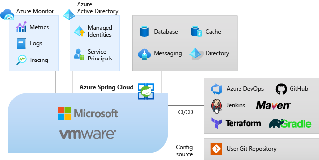

# Cos'è Azure Spring Cloud?

Azure Spring Cloud consente di distribuire facilmente applicazioni di microservizi Spring Boot in Azure senza modificare il codice.  Il servizio gestisce l'infrastruttura delle applicazioni Spring Cloud per consentire agli sviluppatori di concentrarsi sul codice.  Azure Spring Cloud fornisce la gestione del ciclo di vita tramite funzionalità complete di monitoraggio e diagnostica, gestione della configurazione, individuazione dei servizi, integrazione di CI/CD, distribuzioni blu/verde e altro ancora.

## Perché usare Azure Spring Cloud?

La distribuzione di applicazioni in Azure Spring cloud offre numerosi vantaggi.  È possibile:
* Eseguire in modo efficiente la migrazione delle app Spring esistenti e gestire la scalabilità cloud e i costi.
* Modernizzare le app con i modelli Spring Cloud per migliorare l'agilità e la velocità di distribuzione.
* Eseguire Java su scala cloud e favorirne un utilizzo più intensivo senza un'infrastruttura complessa.
* Velocizzare le attività di sviluppo e distribuzione senza dipendenze di containerizzazione.
* Monitorare i carichi di lavoro di produzione in modo efficiente e senza fatica.

Azure Spring Cloud supporta sia app [Spring Boot](https://spring.io/projects/spring-boot) per Java che [Steeltoe](https://steeltoe.io/) per ASP.NET Core. Il supporto di Steeltoe è attualmente disponibile come anteprima pubblica. Le offerte di anteprima pubblica consentono di sperimentare le nuove funzionalità prima del rilascio della versione ufficiale. I servizi e le funzionalità di anteprima pubblica non sono destinati all'uso in produzione. Per altre informazioni, vedere le [domande frequenti](https://azure.microsoft.com/support/faq/) o inviare una [richiesta di supporto](../azure-portal/supportability/how-to-create-azure-support-request.md).

## Panoramica del servizio

Facendo parte dell'ecosistema di Azure, Azure Spring Cloud si può associare facilmente ad altri servizi di Azure, come archiviazione, database, monitoraggio e così via.  

  

* Azure Spring Cloud è un servizio completamente gestito per le app Spring Boot che permette di concentrarsi sulla creazione e l'esecuzione di app senza dover gestire l'infrastruttura.

* Basta distribuire i file JAR o il codice e Azure Spring Cloud collegherà automaticamente le app con il runtime del servizio Spring e il ciclo di vita delle app integrato.

* Eseguire il monitoraggio è semplice. Dopo la distribuzione è possibile monitorare le prestazioni delle app, correggere gli errori e migliorare rapidamente le applicazioni. 

* Il servizio è completamente integrato con gli ecosistemi e i servizi di Azure.

* Azure Spring Cloud è una soluzione aziendale con infrastruttura completamente gestita, gestione del ciclo di vita integrata e facilità di monitoraggio.

## Panoramica della documentazione
Questa documentazione include sezioni che illustrano come iniziare a sfruttare al meglio i servizi di Azure Spring Cloud.

* Introduzione
    * [Avviare la prima app](spring-cloud-quickstart.md)
    * [Effettuare il provisioning di un servizio Azure Spring Cloud](spring-cloud-quickstart-provision-service-instance.md)
    * [Configurare il server di configurazione]()
    * [Compilare e distribuire app](spring-cloud-quickstart-deploy-apps.md)
    * [Usare log, metriche e traccia](spring-cloud-quickstart-logs-metrics-tracing.md)
* Procedure
    * [Sviluppo](spring-cloud-tutorial-prepare-app-deployment.md): preparare un'applicazione Java Spring esistente per la distribuzione in Azure Spring Cloud. Se correttamente configurato, Azure Spring Cloud offre servizi affidabili per il monitoraggio, il ridimensionamento e l'aggiornamento delle applicazioni Java Spring Cloud.
    * [Distribuzione](spring-cloud-howto-staging-environment.md): come configurare una distribuzione di staging usando il modello di distribuzione blu/verde in Azure Spring Cloud. La distribuzione di tipo blu-verde è un modello di recapito continuo Azure DevOps che si basa sul mantenimento di una versione esistente (blu) attiva mentre viene distribuita una versione nuova (verde).
    * [Configurazione delle app](spring-cloud-howto-start-stop-delete.md):  avviare, arrestare ed eliminare le applicazioni Azure Spring Cloud. Modificare lo stato di un'applicazione in Azure Spring Cloud usando il portale di Azure o l'interfaccia della riga di comando di Azure.
    * [Scalabilità](spring-cloud-tutorial-scale-manual.md): ridimensionare qualsiasi applicazione di microservizi usando il dashboard di Azure Spring Cloud nel portale di Azure o le impostazioni di scalabilità automatica. Gli indirizzi IP pubblici sono disponibili per comunicare con le risorse esterne, come database, risorse di archiviazione e insiemi di credenziali delle chiavi.
    * [Monitoraggio delle app](spring-cloud-tutorial-distributed-tracing.md): gli strumenti di traccia distribuita consentono di eseguire facilmente il debug e il monitoraggio di problemi complessi. Azure Spring Cloud integra Spring Cloud Sleuth con Application Insights di Azure. Questa integrazione fornisce funzionalità di traccia distribuita avanzate dal portale di Azure.
    * [Protezione delle app](spring-cloud-howto-enable-system-assigned-managed-identity.md): le risorse di Azure offrono un'identità gestita automaticamente in Azure Active Directory. È possibile usare questa identità per l'autenticazione a qualsiasi servizio che supporti l'autenticazione di Azure AD senza dover inserire le credenziali nel codice.
    * [Integrazione con altri servizi di Azure](spring-cloud-tutorial-bind-cosmos.md): anziché configurare manualmente le applicazioni Spring Boot, è possibile associare automaticamente determinati servizi di Azure alle applicazioni, ad esempio associare l'applicazione a un database di Azure Cosmos DB.
    * [Automazione](spring-cloud-howto-cicd.md): gli strumenti di integrazione continua e recapito continuo consentono di distribuire rapidamente aggiornamenti alle applicazioni esistenti con il minimo sforzo e rischio. Azure DevOps facilita l'organizzazione e il controllo di queste attività chiave. 
    * [Risolvere i problemi](spring-cloud-howto-self-diagnose-solve.md): gli strumenti di diagnostica di Azure Spring Cloud offrono un'esperienza interattiva per la risoluzione dei problemi delle app. Non è richiesta alcuna configurazione. Quando vengono individuati problemi, la diagnostica di Azure Spring Cloud li identifica e rimanda ad informazioni che consentono di risolverli.
    * [Migrazione](/azure/developer/java/migration/migrate-spring-boot-to-azure-spring-cloud): come eseguire la migrazione di un'applicazione Spring Cloud esistente o di un'applicazione Spring Boot da eseguire in Azure Spring Cloud.

## Passaggi successivi

Per iniziare, completare l'argomento di [avvio rapido su Spring Cloud](spring-cloud-quickstart.md)

Esempi sono disponibili in GitHub: [Esempi di Azure Spring Cloud](https://github.com/Azure-Samples/Azure-Spring-Cloud-Samples/tree/master/).