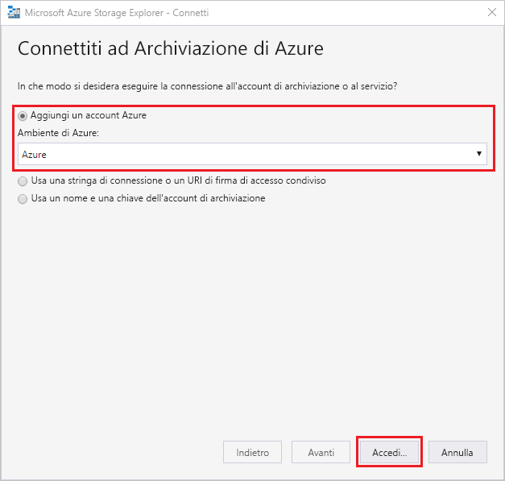

# Utilizzare Azure Storage Explorer per gestire gli ACL in Azure Data Lake Storage Gen2

Questo articolo illustra come usare [Azure Storage Explorer](https://azure.microsoft.com/features/storage-explorer/) per gestire gli elenchi di controllo di accesso (ACL) negli account di archiviazione in cui è abilitato lo spazio dei nomi gerarchico (HNS).

È possibile utilizzare Storage Explorer per visualizzare e quindi aggiornare gli ACL di directory e file. L'ereditarietà ACL è già disponibile per i nuovi elementi figlio creati in una directory padre. Tuttavia, è anche possibile applicare le impostazioni ACL in modo ricorsivo sugli elementi figlio esistenti di una directory padre senza dover apportare queste modifiche singolarmente per ogni elemento figlio. 

Questo articolo illustra come modificare l'ACL del file o della directory e come applicare le impostazioni ACL in modo ricorsivo alle directory figlio.

## Prerequisiti

- Una sottoscrizione di Azure. Vedere [Ottenere una versione di prova gratuita di Azure](https://azure.microsoft.com/pricing/free-trial/).

- Un account di archiviazione in cui è abilitato lo spazio dei nomi gerarchico. Per crearne uno, seguire [queste](../common/storage-account-create.md) istruzioni.

- Azure Storage Explorer installato nel computer locale. Per installare Azure Storage Explorer per Windows, Macintosh o Linux, vedere [Azure Storage Explorer](https://azure.microsoft.com/features/storage-explorer/).

> [!NOTE]
> Storage Explorer usa entrambi gli [endpoint](../common/storage-private-endpoints.md#private-endpoints-for-azure-storage) BLOB (blob) & data Lake storage Gen2 (DFS) quando si lavora con Azure Data Lake storage Gen2. Se l'accesso a Azure Data Lake Storage Gen2 viene configurato usando endpoint privati, verificare che siano stati creati due endpoint privati per l'account di archiviazione: uno con la risorsa secondaria di destinazione `blob` e l'altro con la sottorisorsa di destinazione `dfs` .

## Accedere a Storage Explorer

Al primo avvio di Storage Explorer, viene visualizzata la finestra **Microsoft Azure Storage Explorer - Connetti**. Sebbene Storage Explorer offra numerosi modi per connettersi agli account di archiviazione, per la gestione degli elenchi di controllo di accesso è attualmente supportata una sola modalità.

|Attività|Scopo|
|---|---|
|Aggiungere un account Azure | Consente il reindirizzamento alla pagina di accesso dell'organizzazione per l'autenticazione in Azure. Attualmente questo è l'unico metodo di autenticazione supportato per la gestione e l'impostazione degli elenchi di controllo di accesso.|
|Usare una stringa di connessione o un URI di firma di accesso condiviso | Consente di accedere direttamente a un contenitore o a un account di archiviazione con un token di firma di accesso condiviso o una stringa di connessione condivisa. |
|Usare un nome e una chiave dell'account di archiviazione| Consente di usare un nome e una chiave dell'account di archiviazione per la connessione ad Archiviazione di Azure.|

Selezionare **Add an Azure Account** (Aggiungi un account Azure) e fare clic su **Accedi**. Attenersi alle richiesta visualizzate per accedere all'account Azure.

Al termine della connessione, Azure Storage Explorer viene caricato con la scheda **Explorer** visualizzata. Questa visualizzazione include informazioni dettagliate per tutti gli account di archiviazione di Azure e per le risorse di archiviazione locali configurate tramite gli account dell'[emulatore di archiviazione Azurite](../common/storage-use-azurite.md?toc=%2fazure%2fstorage%2fblobs%2ftoc.json), [Cosmos DB](../../cosmos-db/storage-explorer.md?toc=%2fazure%2fstorage%2fblobs%2ftoc.json) o gli ambienti di [Azure Stack](/azure-stack/user/azure-stack-storage-connect-se?toc=%2fazure%2fstorage%2fblobs%2ftoc.json).

## Gestire un ACL

Fare clic con il pulsante destro del mouse sul contenitore, una directory o un file e quindi fare clic su **Gestisci elenchi di controllo di accesso**.  Lo screenshot seguente mostra il menu visualizzato quando si fa clic con il pulsante destro del mouse su una directory.

> [!div class="mx-imgBorder"]
> 

La finestra di dialogo **Gestisci accesso** consente di gestire le autorizzazioni per il proprietario e il gruppo Owners. Consente inoltre di aggiungere nuovi utenti e gruppi all'elenco di controllo di accesso per il quale è possibile quindi gestire le autorizzazioni.

> [!div class="mx-imgBorder"]
> 

Per aggiungere un nuovo utente o gruppo all'elenco di controllo di accesso, selezionare il pulsante **Aggiungi** . Immettere quindi la voce corrispondente Azure Active Directory (Azure AD) che si desidera aggiungere all'elenco e quindi selezionare **Aggiungi**.  L'utente o il gruppo verranno visualizzati nel campo **Utenti e gruppi:**, che consente di iniziare a gestire le relative autorizzazioni.

> [!NOTE]
> Si consiglia di creare un gruppo di sicurezza in Azure AD e di mantenere le autorizzazioni per il gruppo anziché per i singoli utenti. Per informazioni dettagliate su questa raccomandazione, oltre ad altre procedure consigliate, vedere il [modello di controllo di accesso in Azure Data Lake storage Gen2](data-lake-storage-explorer-acl.md).

Utilizzare i controlli casella di controllo per impostare gli ACL predefiniti e di accesso. Per ulteriori informazioni sulla differenza tra questi tipi di ACL, vedere [tipi di ACL](data-lake-storage-access-control.md#types-of-acls).

## Applicare gli ACL in modo ricorsivo

È possibile applicare le voci ACL in modo ricorsivo negli elementi figlio esistenti di una directory padre senza dover apportare queste modifiche singolarmente per ogni elemento figlio.

Per applicare le voci ACL in modo ricorsivo, fare clic con il pulsante destro del mouse sul contenitore o su una directory e quindi scegliere **propaga elenchi di controllo di accesso**.  Lo screenshot seguente mostra il menu visualizzato quando si fa clic con il pulsante destro del mouse su una directory.

> [!div class="mx-imgBorder"]
> 

## Passaggi successivi

Informazioni sul modello di autorizzazione Data Lake Storage Gen2.

> [!div class="nextstepaction"]
> [Modello di controllo di accesso in Azure Data Lake Storage Gen2](./data-lake-storage-access-control-model.md)
