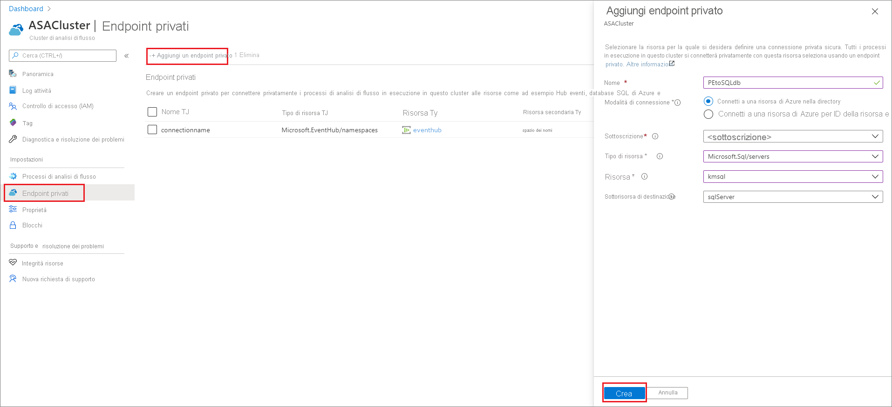

# Creare ed eliminare gli endpoint privati in un cluster di Analisi di flusso di Azure

È possibile connettere i processi di Analisi di flusso di Azure in esecuzione in un cluster alle risorse di input e output protette da un firewall o da una rete virtuale di Azure. In primo luogo, è necessario creare un endpoint privato per una risorsa, ad esempio Hub eventi di Azure o Database SQL di Azure, nel cluster di Analisi di flusso. Approvare quindi la connessione all'endpoint privato dall'input o dall'output.

Dopo l'approvazione della connessione, qualsiasi processo in esecuzione nel cluster di Analisi di flusso può accedere alla risorsa tramite l'endpoint privato. Questo articolo illustra come creare ed eliminare gli endpoint privati in un cluster di Analisi di flusso. È possibile creare endpoint privati per Database SQL di Azure, Archiviazione di Azure, Azure Data Lake Storage Gen2, hub eventi di Azure e bus di servizio di Azure. Gli endpoint privati per alti servizi verranno aggiunti prossimamente. 

## Creare un endpoint privato nel cluster di Analisi di flusso

Questa sezione illustra come creare un endpoint privato in un cluster di Analisi di flusso.

1. Nel portale di Azure individuare e selezionare il cluster di Analisi di flusso.

1. In **Impostazioni** selezionare **Endpoint privati**.

1. Selezionare **Aggiungi endpoint privato** e immettere le informazioni seguenti per scegliere la risorsa a cui si vuole accedere in modo sicuro tramite un endpoint privato.

   |Impostazione|Valore|
   |---|---|
   |Nome|Immettere un nome per l'endpoint privato. Se il nome è già usato, creare un nome univoco.|
   |Metodo di connessione|Selezionare **Connettersi a una risorsa di Azure nella directory**.  È possibile scegliere una delle risorse di cui si dispone per connettersi in modo sicuro usando l'endpoint privato oppure è possibile connettersi a una risorsa di un altro utente usando un ID risorsa o un alias condiviso con l'utente.|
   |Subscription|Selezionare la propria sottoscrizione.|
   |Tipo di risorsa|Scegliere il [tipo di risorsa corrispondente alla risorsa di cui si dispone](../private-link/private-endpoint-overview.md#private-link-resource).|
   |Risorsa|Selezionare la risorsa a cui si vuole connettersi usando un endpoint privato.|
   |Sottorisorsa di destinazione|Tipo di sottorisorsa per la risorsa selezionata sopra a cui l'endpoint privato potrà accedere.|

   

1. Approvare la connessione dalla risorsa di destinazione. Ad esempio, se è stato creato un endpoint privato per un'istanza di Database SQL di Azure nel passaggio precedente, è necessario passare a tale istanza di Database SQL e visualizzare una connessione in sospeso che deve essere approvata. Potrebbero trascorrere alcuni minuti prima della visualizzazione della richiesta di connessione.

    

1. È possibile tornare al cluster di Analisi di flusso per vedere il cambiamento di stato da **Approvazione cliente in sospeso** a **In attesa di configurazione DNS** e quindi a **Configurazione completata** nel giro di un paio di minuti.

## Eliminare un endpoint privato in un cluster di Analisi di flusso

1. Nel portale di Azure individuare e selezionare il cluster di Analisi di flusso.

1. In **Impostazioni** selezionare **Endpoint privati**.

1. Selezionare l'endpoint privato che si vuole eliminare e scegliere **Elimina**.

   

## Passaggi successivi

Si dispone ora di un'idea generale di come gestire gli endpoint privati in un cluster di Analisi di flusso di Azure. A questo punto, è possibile apprendere come ridimensionare i cluster ed eseguire processi nel cluster:

* [Ridimensionare un cluster di Analisi di flusso di Azure](scale-cluster.md)
* [Gestire i processi di Analisi di flusso in un cluster di Analisi di flusso](manage-jobs-cluster.md)
