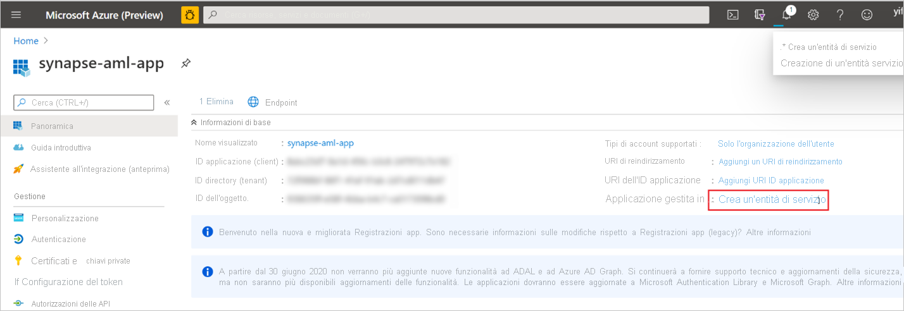

# Avvio rapido: Creare un nuovo servizio collegato di Azure Machine Learning in Synapse

In questo argomento di avvio rapido si collegherà un'area di lavoro di Azure Synapse Analytics a un'area di lavoro di Azure Machine Learning. Il collegamento di queste aree di lavoro consente di sfruttare Azure Machine Learning da diverse esperienze in Synapse.

Ad esempio, questo collegamento a un'area di lavoro di Azure Machine Learning consente le esperienze seguenti:

- Eseguire le pipeline di Azure Machine Learning come passaggio nelle pipeline di Synapse. Per altre informazioni, vedere [Eseguire pipeline di Azure Machine Learning](../../data-factory/transform-data-machine-learning-service.md).

- Arricchire i dati con le stime introducendo un modello di Machine Learning dal registro dei modelli di Azure Machine Learning e assegnando un punteggio al modello nei pool di Synapse SQL. Per altre informazioni dettagliate, vedere [Tutorial: Machine learning model scoring wizard for Synapse SQL pools](tutorial-sql-pool-model-scoring-wizard.md) (Esercitazione: Procedura guidata di assegnazione di punteggi al modello di Machine Learning per i pool di Synapse SQL).

## Prerequisiti

- Sottoscrizione di Azure: [creare un account gratuito](https://azure.microsoft.com/free/).
- [Area di lavoro di Synapse Analytics](../get-started-create-workspace.md) con un account di archiviazione di ADLS Gen2 configurato come archiviazione predefinita. È necessario essere il **collaboratore dei dati del BLOB di archiviazione** del file system di ADLS Gen2 che si vuole usare.
- [Area di lavoro di Azure Machine Learning](../../machine-learning/how-to-manage-workspace.md).
- Per creare un'entità servizio e un segreto utilizzabili per la creazione del servizio collegato, è necessario disporre delle autorizzazioni (o della richiesta di un utente che dispone delle autorizzazioni). Tenere presente che a questa entità servizio deve essere assegnato il ruolo di collaboratore nell'area di lavoro di Azure Machine Learning.

## Accedere al portale di Azure

Accedere al [portale di Azure](https://portal.azure.com/)

## Creare un'entità servizio

Questo passaggio crea una nuova entità servizio. Se si vuole usare un'entità servizio esistente, ignorare questo passaggio.
1. Aprire il portale di Azure. 

1. Passare a **Azure Active Directory** -> **Registrazioni per l'app**.

1. Fare clic su **Nuova registrazione**. Seguire quindi le istruzioni sull'interfaccia utente per registrare una nuova applicazione.

1. Dopo la registrazione dell'applicazione, generare un segreto per l'applicazione. Passare ad **Applicazione personale** -> **Certificati e segreti**. Fare clic su **Add client secret** (Aggiungi segreto client) per generare un segreto. Conservare il segreto perché verrà usato in un secondo momento.

   

1. Creare un'entità servizio per l'applicazione. Passare ad **Applicazione personale** -> **Panoramica** e quindi fare clic su **Crea entità servizio**. In alcuni casi, questa entità servizio viene creata automaticamente.

   

1. Aggiungere l'entità servizio come "collaboratore" dell'area di lavoro di Azure Machine Learning. Tenere presente che questa operazione richiede che l'utente sia proprietario del gruppo di risorse a cui appartiene l'area di lavoro di Azure Machine Learning.

   

## Creare un servizio collegato

1. Nell'area di lavoro di Synapse in cui si vuole creare il nuovo servizio collegato di Azure Machine Learning, passare a **Gestione** -> **Servizio collegato** e creare un nuovo servizio collegato con il tipo "Azure Machine Learning".

   

2. Compilare il modulo:

   - ID entità servizio: è l'**ID applicazione (client)** dell'applicazione.
  
     > [!NOTE]
     > NON è il nome dell'applicazione. È possibile trovare questo ID nella pagina Panoramica dell'applicazione. Deve essere una stringa lunga simile a questa "81707eac-AB38-406u-8f6c-10ce76a568d5".

   - Chiave entità servizio: il segreto generato nella sezione precedente.

3. Fare clic su **Test connessione** per verificare se la configurazione è corretta. Se il test di connessione viene superato, fare clic su **Salva**.

   Se il test della connessione ha esito negativo, assicurarsi che l'ID e il segreto dell'entità servizio siano corretti e riprovare.

## Passaggi successivi

- [Esercitazione: Procedura guidata di assegnazione di punteggi al modello di Machine Learning - pool SQL dedicato](tutorial-sql-pool-model-scoring-wizard.md)
- [Funzionalità di Machine Learning in Azure Synapse Analytics](what-is-machine-learning.md)