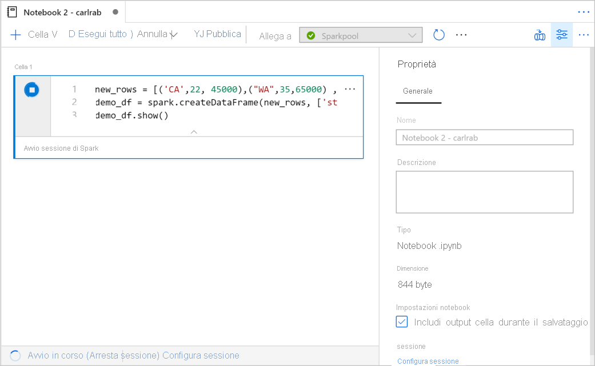
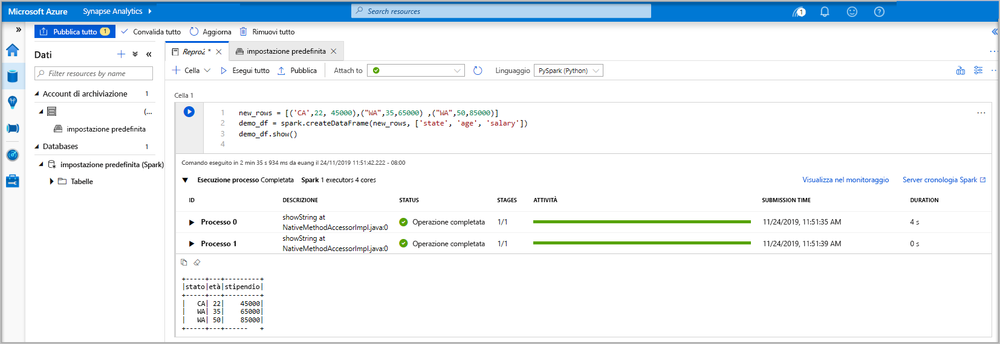

# <a name="quickstart-create-an-apache-spark-pool-preview-in-azure-synapse-analytics-using-web-tools"></a>Guida introduttiva: Creare un pool di Apache Spark (anteprima) in Azure Synapse Analytics con gli strumenti Web

In questa guida di avvio rapido si apprenderà come creare un pool di Apache Spark (anteprima) in Azure Synapse con gli strumenti Web. Verrà quindi illustrato come connettersi al pool di Apache Spark ed eseguire query Spark SQL su file e tabelle. Apache Spark consente cluster computing e analisi dei dati veloci grazie all'elaborazione in memoria. Per informazioni su Spark in Azure Synapse, vedere [Panoramica: Apache Spark in Azure Synapse](./spark/apache-spark-overview.md).

> [!IMPORTANT]
> La fatturazione delle istanze di Spark viene calcolata con ripartizione proporzionale al minuto, indipendentemente dal fatto che siano in uso o meno. Assicurarsi di arrestare l'istanza di Spark dopo averla usata oppure impostare un timeout breve. Per altre informazioni, vedere la sezione **Pulire le risorse** di questo articolo.

Se non si ha una sottoscrizione di Azure, creare un [account gratuito prima di iniziare](https://azure.microsoft.com/free/).

## <a name="prerequisites"></a>Prerequisiti

- Sottoscrizione di Azure: [creare un account gratuito](https://azure.microsoft.com/free/)
- [Area di lavoro di Synapse Analytics](quickstart-create-workspace.md)
- [Pool di Apache Spark](quickstart-create-apache-spark-pool-studio.md)

## <a name="sign-in-to-the-azure-portal"></a>Accedere al portale di Azure

Accedere al [portale di Azure](https://portal.azure.com/).

Se non si ha una sottoscrizione di Azure, [creare un account gratuito](https://azure.microsoft.com/free/) prima di iniziare.

## <a name="create-a-notebook"></a>Creare un notebook

Un notebook è un ambiente interattivo che supporta diversi linguaggi di programmazione. Il notebook consente di interagire con i dati, combinare codice con markdown e testo ed eseguire visualizzazioni semplici.

1. Nella visualizzazione del portale di Azure relativa all'area di lavoro di Azure Synapse che si vuole usare selezionare **Avvia Synapse Studio**.
2. Dopo l'avvio di Synapse Studio, selezionare **Sviluppo**. Passare quindi il puntatore del mouse sulla voce **Notebook**. Selezionare i puntini di sospensione ( **...** ).
3. Selezionare **Nuovo notebook**. Viene creato, e quindi aperto, un nuovo notebook con un nome generato automaticamente.
  

4. Nella finestra **Proprietà** specificare un nome per il notebook.
5. Fare clic su **Pubblica** sulla barra degli strumenti.
6. Se nell'area di lavoro è presente un solo pool di Apache Spark, viene selezionato per impostazione predefinita. Se non è selezionato alcun pool, usare l'elenco a discesa per selezionare il pool di Apache Spark corretto.
7. Fare clic su **Aggiungi codice**. Il linguaggio predefinito è `Pyspark`. Si userà una combinazione di Pyspark e Spark SQL, quindi l'impostazione predefinita è adeguata.
8. Creare quindi un semplice oggetto DataFrame Spark da modificare. In questo caso lo si crea dal codice. Sono presenti tre righe e tre colonne:

   ```python
   new_rows = [('CA',22, 45000),("WA",35,65000) ,("WA",50,85000)]
   demo_df = spark.createDataFrame(new_rows, ['state', 'age', 'salary'])
   demo_df.show()
   ```

9. Eseguire la cella usando uno dei metodi seguenti:

   - Premere **MAIUSC + INVIO**.
   - Selezionare l'icona di riproduzione blu a sinistra della cella.
   - Selezionare il pulsante **Run all** (Esegui tutto) sulla barra degli strumenti.

   

10. Se l'istanza del pool di Apache Spark non è già in esecuzione, viene avviata automaticamente. È possibile visualizzare lo stato dell'istanza del pool di Apache Spark sotto la cella in esecuzione e anche nel pannello di stato nella parte inferiore del notebook. A seconda delle dimensioni del pool, l'avvio dovrebbe richiedere dai 2 ai 5 minuti. Al termine dell'esecuzione del codice, sotto la cella vengono visualizzate le informazioni sul tempo impiegato per l'esecuzione e sull'esecuzione stessa. Nella cella di output viene visualizzato l'output.

    

11. I dati sono ora disponibili in un oggetto DataFrame dove possono essere usati in molti modi diversi. Saranno necessari in formati diversi per la parte restante di questa guida di avvio rapido.
12. Immettere il codice seguente in un'altra cella ed eseguirlo. Verranno creati una tabella Spark, un file CSV e un file Parquet, tutti con copie dei dati:

    ```python
     demo_df.createOrReplaceTempView('demo_df')
     demo_df.write.csv('demo_df', mode='overwrite')
     demo_df.write.parquet('abfss://<<TheNameOfAStorageAccountFileSystem>>@<<TheNameOfAStorageAccount>>.dfs.core.windows.net/demodata/demo_df', mode='overwrite')
    ```

    Se si usa lo strumento di esplorazione dell'archiviazione, è possibile vedere l'effetto delle due diverse modalità di scrittura di un file usate in precedenza. Quando non viene specificato un file system viene usato quello predefinito, in questo caso `default>user>trusted-service-user>demo_df`. I dati vengono salvati nel percorso del file system specificato.

    Si noti che nelle operazioni di scrittura nei formati "csv" e "parquet" viene creata una directory con molti file partizionati.

    

    

## <a name="run-spark-sql-statements"></a>Eseguire le istruzioni Spark SQL

SQL (Structured Query Language) è il linguaggio più diffuso e più usato per l'esecuzione di query e la definizione dei dati. Spark SQL funziona come estensione di Apache Spark per l'elaborazione dei dati strutturati, usando la nota sintassi SQL.

1. Incollare il codice seguente in una cella vuota e quindi eseguirlo. Il comando elenca le tabelle nel pool.

   ```sql
   %%sql
   SHOW TABLES
   ```

   Quando si usa un notebook con il pool di Apache Spark di Azure Synapse, si ottiene un set di impostazioni `sqlContext` che può essere usato per eseguire query con Spark SQL. `%%sql` indica al notebook di usare l'elemento `sqlContext` preimpostato per eseguire la query. La query recupera le prime 10 righe da una tabella di sistema fornita con tutti i pool di Apache Spark di Azure Synapse per impostazione predefinita.

2. Eseguire un'altra query per visualizzare i dati in `demo_df`.

    ```sql
    %%sql
    SELECT * FROM demo_df
    ```

    Il codice produce due celle di output, una che contiene i risultati dei dati e l'altra che mostra la vista processi.

    Per impostazione predefinita, la visualizzazione dei risultati mostra una griglia, ma sotto la griglia è presente un gruppo di opzioni che consente di passare dalla visualizzazione griglia alla visualizzazione grafico e viceversa.

    

3. Nella selezione **Visualizzazione** selezionare **Grafico**.
4. Selezionare l'icona **Opzioni di visualizzazione** all'estrema destra.
5. Nel campo **Tipo di grafico** selezionare "grafico a barre".
6. Nel campo Colonna asse X selezionare "state".
7. Nel campo Colonna asse Y selezionare "salary".
8. Nel campo **Aggregazione** selezionare "AVG".
9. Selezionare **Applica**.

   

10. È possibile ottenere la stessa esperienza di esecuzione di SQL senza cambiare linguaggio. Basta sostituire la cella SQL riportata sopra con questa cella PySpark. L'esperienza di output è la stessa perché viene usato il comando **display**:

    ```python
    display(spark.sql('SELECT * FROM demo_df'))
    ```

11. Ognuna delle celle eseguite in precedenza conteneva i collegamenti per passare al **server cronologia** e a **Monitoraggio**. Facendo clic sui collegamenti si accede a parti diverse dell'esperienza utente.

## <a name="clean-up-resources"></a>Pulire le risorse

Azure Synapse salva i dati in Azure Data Lake Storage. È possibile lasciare che un'istanza di Spark venga arrestata in tutta sicurezza quando non è in uso. I costi relativi a un pool di Apache Spark in Azure Synapse vengono addebitati per tutto il tempo in cui rimane in esecuzione, anche se non viene usato. 

Poiché i costi per il pool sono decisamente superiori a quelli per l'archiviazione, dal punto di vista economico è opportuno arrestare le istanze di Spark quando non vengono usate.

Per assicurarsi che l'istanza di Spark venga arrestata, terminare tutte le sessioni connesse (notebook). Il pool si arresta quando viene raggiunto il **tempo di inattività** specificato nel pool di Apache Spark. Si può anche selezionare **Termina sessione** sulla barra di stato nella parte inferiore del notebook.

## <a name="next-steps"></a>Passaggi successivi

In questa guida di avvio rapido si è appreso come creare un pool di Apache Spark in Azure Synapse ed eseguire una query Spark SQL di base.

- [Azure Synapse Analytics](overview-what-is.md)
- [Documentazione di .NET per Apache Spark](/dotnet/spark?toc=/azure/synapse-analytics/toc.json&bc=/azure/synapse-analytics/breadcrumb/toc.json)
- [Documentazione ufficiale di Apache Spark](https://spark.apache.org/docs/latest/)

>[!NOTE]
> Parte della documentazione ufficiale di Apache Spark si basa sull'uso della console Spark, che non è disponibile in Spark di Azure Synapse. Usare al suo posto un [notebook](quickstart-apache-spark-notebook.md) o [IntelliJ](./spark/intellij-tool-synapse.md).
