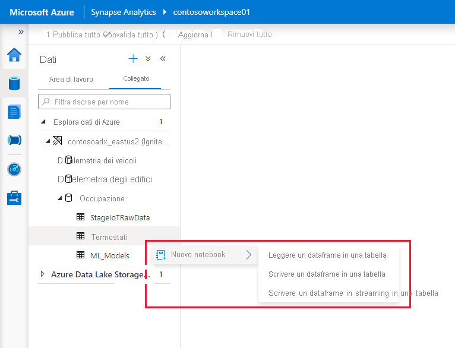
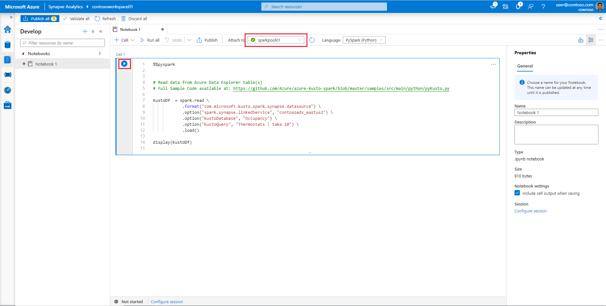

# Connettersi a Esplora dati di Azure con Apache Spark per Azure Synapse Analytics

Questo articolo descrive come accedere a un database di Esplora dati di Azure da Synapse Studio con Apache Spark per Azure Synapse Analytics.

## Prerequisiti

* [Creare un database e un cluster di Esplora dati di Azure](/azure/data-explorer/create-cluster-database-portal).
* Avere un'area di lavoro di Azure Synapse Analytics o crearne una nuova seguendo i passaggi indicati in [Avvio rapido: Creare un'area di lavoro di Azure Synapse](./quickstart-create-workspace.md).
* Avere un pool di Apache Spark o crearne uno nuovo seguendo i passaggi indicati in [Avvio rapido: Creare un pool di Apache Spark con il portale di Azure](./quickstart-create-apache-spark-pool-portal.md).
* [Creare l'app Azure Active Directory (Azure AD) effettuando il provisioning di un'applicazione Azure AD.](/azure/data-explorer/kusto/management/access-control/how-to-provision-aad-app)
* Consentire all'app Azure AD l'accesso al database seguendo i passaggi indicati in [Gestire le autorizzazioni per database di Esplora dati di Azure](/azure/data-explorer/manage-database-permissions).

## Passare a Synapse Studio

In un'area di lavoro di Azure Synapse selezionare **Avvia Synapse Studio**. Nella home page di Synapse Studio selezionare **Data** (Dati) per aprire **Data Object Explorer** (Esplora oggetti dati).

## Connettere un database di Esplora dati di Azure a un'area di lavoro di Azure Synapse

Per la connessione di un database di Esplora dati di Azure a un'area di lavoro si usa un servizio collegato. Con un servizio collegato di Esplora dati di Azure è possibile cercare ed esplorare dati, leggere e scrivere da Apache Spark per Azure Synapse. È anche possibile eseguire i processi di integrazione in una pipeline.

In Data Object Explorer (Esplora oggetti dati) seguire questa procedura per connettere direttamente un cluster di Esplora dati di Azure:

1. Selezionare l'icona **+** accanto a **Data** (Dati).
1. Selezionare **Connect** (Connetti) per connettersi a dati esterni.
1. Selezionare **Esplora dati di Azure (Kusto)** .
1. Selezionare **Continua**.
1. Assegnare un nome descrittivo al servizio collegato. Il nome verrà visualizzato in Data Object Explorer (Esplora oggetti dati) e verrà usato dai runtime di Azure Synapse per connettersi al database.
1. Selezionare il cluster di Esplora dati di Azure dalla sottoscrizione o immettere l'URI.
1. Immettere l'**ID** e la **chiave dell'entità servizio**. Assicurarsi che questa entità servizio abbia accesso in visualizzazione al database per le operazioni di lettura e accesso in inserimento per l'inserimento dei dati.
1. Immettere il nome del database di Esplora dati di Azure.
1. Selezionare **Test connessione** per assicurarsi che le autorizzazioni siano corrette.
1. Selezionare **Create** (Crea).

    

    > [!NOTE]
    > (Facoltativo) **Test connessione** non convalida l'accesso in scrittura. Assicurarsi che l'ID entità servizio abbia accesso in scrittura al database di Esplora dati di Azure.

1. I cluster e i database di Esplora dati di Azure sono visibili nella scheda **Collegati** nella sezione **Esplora dati di Azure**.

    

    > [!NOTE]
    > Nella versione corrente gli oggetti di database vengono popolati in base alle autorizzazioni dell'account Azure AD per i database di Esplora dati di Azure. Quando si eseguono processi di integrazione o notebook di Apache Spark, verranno usate le credenziali indicate nel servizio di collegamento, ad esempio l'entità servizio.

## Interagire rapidamente con le azioni generate dal codice

Quando si fa clic con il pulsante destro del mouse su un database o su una tabella, viene visualizzato un elenco di notebook di Spark di esempio. Selezionare un'opzione per la lettura, la scrittura o lo streaming di dati in Esplora dati di Azure.

Ecco un esempio di lettura dei dati. Collegare il notebook al pool di Spark ed eseguire la cella.

   > [!NOTE]
   > La prima esecuzione dell'avvio della sessione di Spark può richiedere più di tre minuti. Le esecuzioni successive saranno notevolmente più rapide.

## Limitazioni

Il connettore Esplora dati di Azure non è attualmente supportato con le reti virtuali gestite di Azure Synapse.

## Passaggi successivi

* [Codice di esempio con opzioni avanzate](https://github.com/Azure/azure-kusto-spark/blob/master/samples/src/main/python/SynapseSample.py)
* [Connettore Spark per Esplora dati di Azure (Kusto)](https://github.com/Azure/azure-kusto-spark)