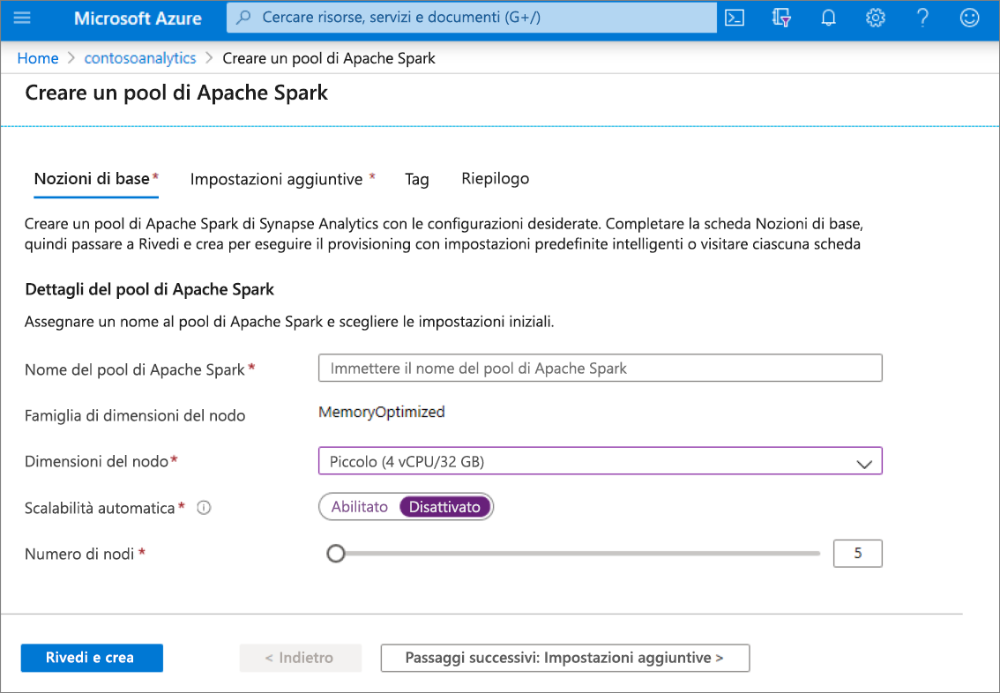
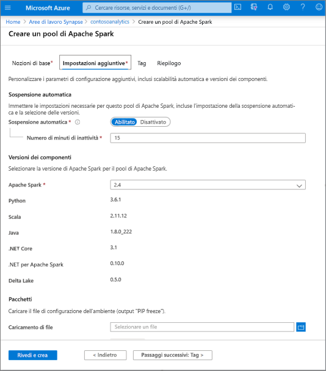
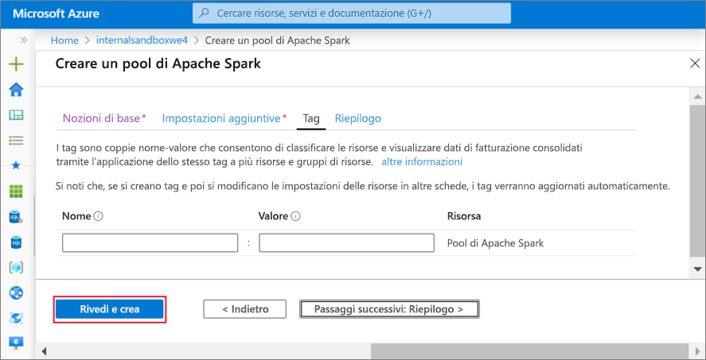
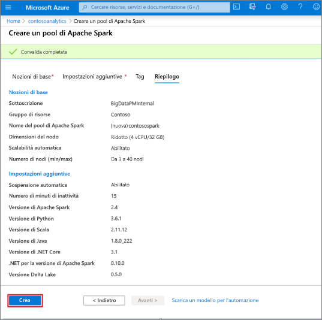
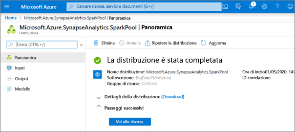
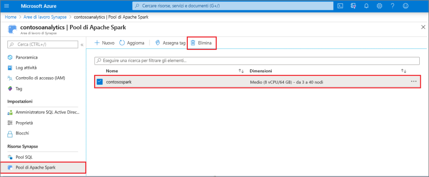
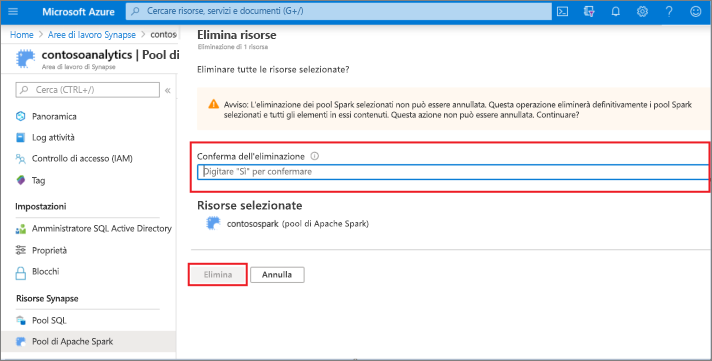

# Avvio rapido: Creare un nuovo pool di Apache Spark serverless usando il portale di Azure

Azure Synapse Analytics offre vari motori di analisi che consentono di inserire, trasformare, modellare, analizzare e distribuire i dati. Un pool di Apache Spark offre funzionalità di calcolo open source per i Big Data. Dopo aver creato un pool Apache Spark nell'area di lavoro di Synapse, è possibile caricare, modellare, elaborare e distribuire i dati per ottenere dati analitici in modo più rapido.

Questo argomento di avvio rapido illustra come usare il portale di Azure per creare un pool di Apache Spark in un'area di lavoro Synapse.

> [!IMPORTANT]
> La fatturazione delle istanze di Spark viene calcolata con ripartizione proporzionale al minuto, indipendentemente dal fatto che siano in uso o meno. Assicurarsi di arrestare l'istanza di Spark dopo averla usata oppure impostare un timeout breve. Per altre informazioni, vedere la sezione **Pulire le risorse** di questo articolo.

Se non si ha una sottoscrizione di Azure, creare un [account gratuito prima di iniziare](https://azure.microsoft.com/free/).

## Prerequisiti

- Sottoscrizione di Azure: [creare un account gratuito](https://azure.microsoft.com/free/)
- [Area di lavoro di Synapse Analytics](quickstart-create-workspace.md)

## Accedere al portale di Azure

Accedere al [portale di Azure](https://portal.azure.com/)

## Accedere all'area di lavoro di Synapse 
1. Passare all'area di lavoro di Synapse in cui verrà creato il pool di Apache Spark digitando il nome del servizio (o direttamente il nome della risorsa) nella barra di ricerca.

1. Nell'elenco delle aree di lavoro digitare il nome (o parte del nome) dell'area di lavoro da aprire. Per questo esempio verrà usata un'area di lavoro denominata **contosoanalytics**.

## Creare un nuovo pool di Apache Spark

1. Nell'area di lavoro Synapse in cui creare il pool di Apache Spark selezionare **Nuovo pool di Apache Spark**.
    
2. Immettere i dettagli seguenti nella scheda **Informazioni di base**:

    |Impostazione | Valore consigliato | Descrizione |
    | :------ | :-------------- | :---------- |
    | **Nome del pool di Apache Spark** | Un nome di pool valido | Si tratta del nome che avrà il pool di Apache Spark. |
    | **Dimensioni nodo** | Piccole (4 vCPU/32 GB) | Per questa guida di avvio rapido, impostare questa opzione sulle dimensioni minime per ridurre i costi |
    | **Autoscale** | Disabled | La scalabilità automatica non è necessaria per questo argomento di avvio rapido |
    | **Numero di nodi** | 5 | Usare dimensioni ridotte per limitare i costi per questo argomento di avvio rapido |

    
    > [!IMPORTANT]
    > Si noti che esistono limitazioni specifiche per i nomi che è possibile usare per i pool di Apache Spark. I nomi possono contenere solo lettere o numeri, devono essere costituiti da un massimo di 15 caratteri, devono iniziare con una lettera, non possono contenere parole riservate e devono essere univoci nell'area di lavoro.

3. Selezionare **Avanti: Impostazioni aggiuntive** ed esaminare le impostazioni predefinite. Non modificare le impostazioni predefinite.
    

4. Selezionare **Avanti: tag**. Non aggiungere alcun tag.
    

5. Selezionare **Rivedi e crea**.

6. Verificare che i dettagli siano corretti in base a quanto specificato in precedenza, quindi selezionare **Crea**.
    

7. A questo punto, verrà avviato il flusso di provisioning delle risorse e verrà indicato quando è completato.
    

8. Al termine del provisioning, tornando nell'area di lavoro viene visualizzata una nuova voce per il pool di Apache Spark appena creato.
    

9. A questo punto, non sono in esecuzione risorse, non sono presenti addebiti per Spark e sono stati creati i metadati sulle istanze di Spark da creare.

## Pulire le risorse

Seguire questa procedura per eliminare il pool di Apache Spark dall'area di lavoro.
> [!WARNING]
> Con l'eliminazione di un pool di Apache Spark, viene rimosso anche il motore di analisi dall'area di lavoro. Non sarà più possibile connettersi al pool di Apache Spark e tutte le query, le pipeline e i notebook che lo usano non funzioneranno più.

Per eliminare il pool di Apache Spark, procedere come segue:

1. Passare al pannello dei pool di Apache Spark nell'area di lavoro.
2. Selezionare il pool di Apache Spark da eliminare (in questo caso, **contosospark**).
3. Premere **CANC**.
 
4. Confermare l'eliminazione e premere il pulsante **Elimina**.
 
5. Quando il processo viene completato, il pool di Apache Spark non sarà più elencato nelle risorse dell'area di lavoro.

## Passaggi successivi

- Vedere [Avvio rapido: Creare un notebook Apache Spark](quickstart-apache-spark-notebook.md).
- Vedere [Avvio rapido: Creare un pool SQL dedicato con il portale di Azure](quickstart-create-sql-pool-portal.md).
