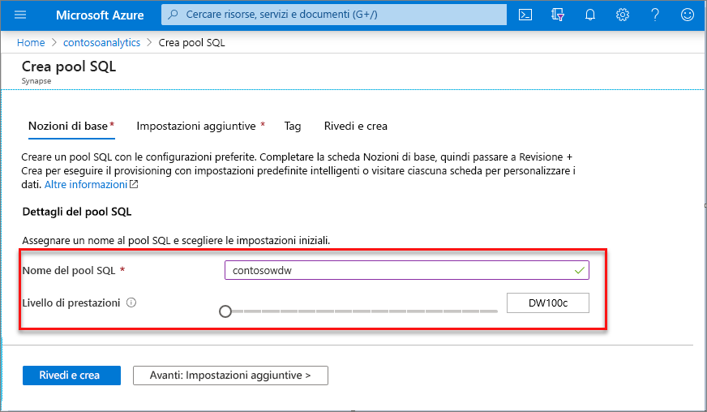
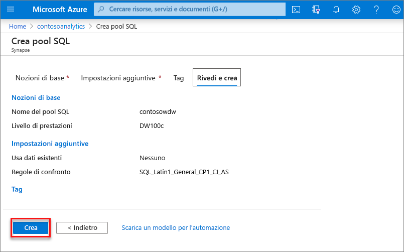
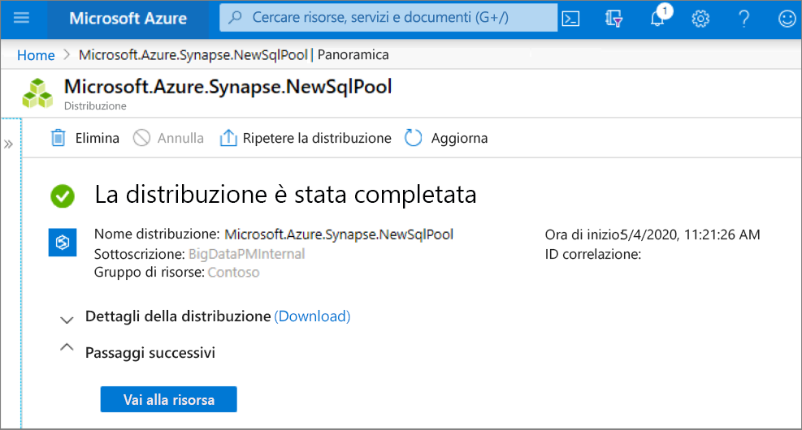

# Guida introduttiva: creare un pool Synapse SQL (anteprima) con il portale di Azure

Azure Synapse Analytics offre vari motori di analisi che consentono di inserire, trasformare, modellare e analizzare i dati. Un pool SQL offre funzionalità di calcolo e archiviazione basate su T-SQL. Dopo aver creato un pool SQL nell'area di lavoro di Synapse, è possibile caricare, modellare, elaborare e consegnare i dati per ottenere dati analitici in modo più rapido.

In questa guida di avvio rapido viene illustrato come creare un pool SQL in un'area di lavoro di Synapse con il portale di Azure.

Se non si ha una sottoscrizione di Azure, creare un [account gratuito prima di iniziare](https://azure.microsoft.com/free/).

## Prerequisiti

- Sottoscrizione di Azure: [creare un account gratuito](https://azure.microsoft.com/free/)
- [Area di lavoro Synapse](./quickstart-create-workspace.md)

## Accedere al portale di Azure

Accedere al [portale di Azure](https://portal.azure.com/)

## Accedere all'area di lavoro Synapse

1. Passare all'area di lavoro Synapse in cui verrà creato il pool SQL digitando il nome del servizio (o direttamente il nome della risorsa) nella barra di ricerca.
. 
1. Dall'elenco delle aree di lavoro, digitare il nome (o parte del nome) dell'area di lavoro da aprire. Per questo esempio verrà usata un'area di lavoro denominata **contosoanalytics**.

## Creare il nuovo pool SQL

1. Nell'area di lavoro di Synapse in cui si vuole creare il pool SQL selezionare il comando **Nuovo pool SQL** nella barra in alto.

2. Immettere i dettagli seguenti nella scheda **Informazioni di base**:

    | Impostazione | Valore consigliato | Descrizione |
    | :------ | :-------------- | :---------- |
    | **Nome del pool SQL** | Qualsiasi nome valido | Nome del pool SQL. |
    | **Livello di prestazioni** | DW100c | Per questa guida di avvio rapido, impostare questa opzione sulle dimensioni minime per ridurre i costi |

  
    
    > [!IMPORTANT]
    > Si noti che esistono limitazioni specifiche per i nomi che è possibile usare per i pool SQL. I nomi non possono contenere caratteri speciali, devono essere costituiti da un massimo di 15 caratteri, non possono contenere parole riservate e devono essere univoci nell'area di lavoro.

3. Selezionare **Avanti: Impostazioni aggiuntive**.
4. Selezionare **Nessuno** per effettuare il provisioning del pool SQL senza dati. Lasciare selezionate le regole di confronto predefinite.

5. Selezionare **Rivedi e crea**.
6. Verificare che i dettagli siano corretti in base a quanto specificato in precedenza. Selezionare **Create** (Crea).

7. A questo punto, verrà avviato il flusso di provisioning delle risorse.
 

8. Al termine del provisioning, tornando all'area di lavoro viene visualizzata una nuova voce per il pool SQL appena creato.
 

Dopo la creazione, il pool SQL sarà disponibile nell'area di lavoro per il caricamento di dati, l'elaborazione di flussi, la lettura dal lake e così via.

## Pulire le risorse

Seguire questa procedura per eliminare il pool SQL dall'area di lavoro.
> [!WARNING]
> Se si elimina un pool SQL, il motore di analisi e i dati archiviati nel database del pool SQL eliminato verranno rimossi dall'area di lavoro. Non sarà più possibile connettersi al pool SQL e tutte le query, le pipeline e i notebook che eseguono operazioni di lettura o scrittura su questo pool non funzioneranno più.

Per eliminare il pool SQL, seguire questa procedura:

1. Passare al pannello dei pool SQL nel pannello dell'area di lavoro.
1. Selezionare il pool SQL da eliminare (in questo caso, **contosowdw**)
1. Una volta selezionato, premere **CANC**
1. Confermare l'eliminazione e premere il pulsante **Elimina** 
1. Quando il processo viene completato, il pool SQL non sarà più elencato nelle risorse dell'area di lavoro.

## Passaggi successivi

- Vedere [Avvio rapido: Creare un pool di Apache Spark in Synapse Studio con strumenti Web](quickstart-apache-spark-notebook.md).
- Vedere [Avvio rapido: Creare un pool di Apache Spark con il portale di Azure](quickstart-create-apache-spark-pool-portal.md).
