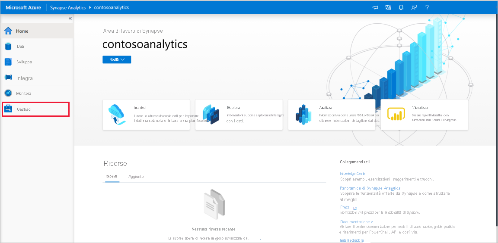
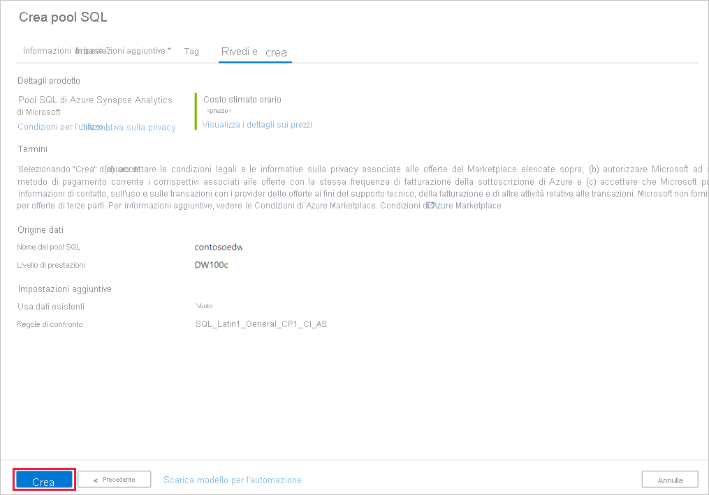
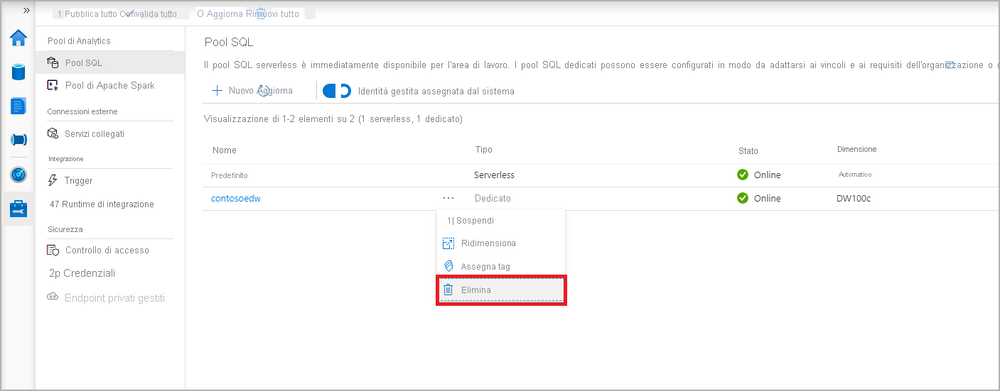
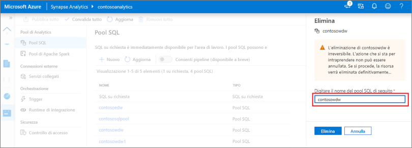

# Avvio rapido: Creare un pool Synapse SQL con Synapse Studio

Azure Synapse Analytics offre vari motori di analisi che consentono di inserire, trasformare, modellare e analizzare i dati. Un pool SQL offre funzionalità di calcolo e archiviazione basate su T-SQL. Dopo aver creato un pool SQL nell'area di lavoro di Synapse, è possibile caricare, modellare, elaborare e consegnare i dati per ottenere dati analitici in modo più rapido.

Questo argomento di avvio rapido descrive la procedura per creare un pool SQL in un’area di lavoro di Synapse con Synapse Studio.

Se non si ha una sottoscrizione di Azure, creare un [account gratuito prima di iniziare](https://azure.microsoft.com/free/).

## Prerequisiti

- Sottoscrizione di Azure: [creare un account gratuito](https://azure.microsoft.com/free/)
- [Area di lavoro Synapse](quickstart-create-workspace.md)

## Accedere al portale di Azure

Accedere al [portale di Azure](https://portal.azure.com/)

## Accedere all'area di lavoro Synapse

1. Passare all'area di lavoro Synapse in cui verrà creato il pool SQL digitando il nome del servizio (o direttamente il nome della risorsa) nella barra di ricerca.
.
1. Nell'elenco delle aree di lavoro digitare il nome (o parte del nome) dell'area di lavoro da aprire. Per questo esempio verrà usata un'area di lavoro denominata **contosoanalytics**.

## Avviare Synapse Studio

1. Nella panoramica dell'area di lavoro selezionare **Avvia Synapse Studio** per aprire il percorso in cui verrà creato il pool SQL. Digitare il nome del servizio o il nome della risorsa direttamente nella barra di ricerca.

## Creare un pool SQL in Synapse Studio

1. Nella home page di Synapse Studio passare all'**hub di gestione** nel pannello di navigazione a sinistra selezionando l'icona **Gestisci**.

1. All’interno dell'hub di gestione, passare alla sezione dei **pool SQL** per visualizzare l'elenco corrente dei pool SQL disponibili nell'area di lavoro.

1. Selezionare il comando **+Nuovo** e verrà visualizzata la nuova procedura guidata di creazione dei pool SQL. 

1. Immettere i dettagli seguenti nella scheda **Informazioni di base**:

    | Impostazione | Valore consigliato | Descrizione |
    | :------ | :-------------- | :---------- |
    | **Nome del pool SQL** | contosoedw | Si tratta del nome che avrà il pool SQL. |
    | **Livello di prestazioni** | DW100c | Per questa guida di avvio rapido, impostare questa opzione sulle dimensioni minime per ridurre i costi |

    
    > [!IMPORTANT]
    > Si noti che esistono limitazioni specifiche per i nomi che è possibile usare per i pool SQL. I nomi non possono contenere caratteri speciali, devono essere costituiti da un massimo di 15 caratteri, non possono contenere parole riservate e devono essere univoci nell'area di lavoro.

4. Nella scheda successiva **Impostazioni aggiuntive**, selezionare **nessuna** per eseguire il provisioning del pool SQL senza dati. Lasciare selezionate le regole di confronto predefinite.

1. Non verranno aggiunti tag per il momento, quindi selezionare **Avanti: Rivedi e crea**.

1. Nella scheda **Rivedi e crea**, verificare che i dettagli siano corretti in base a quanto specificato in precedenza, quindi premere **Crea**. 

1. A questo punto, verrà avviato il flusso di provisioning delle risorse.

1. Al termine del provisioning, tornando all'area di lavoro viene visualizzata una nuova voce per il pool SQL appena creato.
 

1. Una volta completata la creazione, il pool SQL sarà disponibile nell'area di lavoro per il caricamento di dati, l'elaborazione di flussi, la lettura dal lake e così via.

## Creare pool SQL con Synapse Studio    

Seguire questa procedura per eliminare il pool SQL dall'area di lavoro con Synapse Studio.
> [!WARNING]
> Con l'eliminazione di un pool SQL, viene rimosso anche il motore di analisi dall'area di lavoro. Non sarà più possibile connettersi al pool e tutte le query, le pipeline e gli script che lo usano non funzioneranno più.

Per eliminare il pool SQL, procedere come segue:

1. Passare ai pool SQL nell'hub di gestione in Synapse Studio.
1. Selezionare i puntini di sospensione nel pool SQL da eliminare (in questo caso, **contosoedw**) per visualizzare i comandi per il pool SQL: 
1. Premere **CANC**.
1. Confermare l'eliminazione e fare clic sul pulsante **Elimina**.
 
1. Quando il processo viene completato, il pool SQL non sarà più elencato nelle risorse dell'area di lavoro.

## Passaggi successivi 
- Vedere [Avvio rapido: Creare un notebook Apache Spark](quickstart-apache-spark-notebook.md).
- Vedere [Avvio rapido: Creare un pool Synapse SQL con il portale di Azure](quickstart-create-sql-pool-portal.md).
