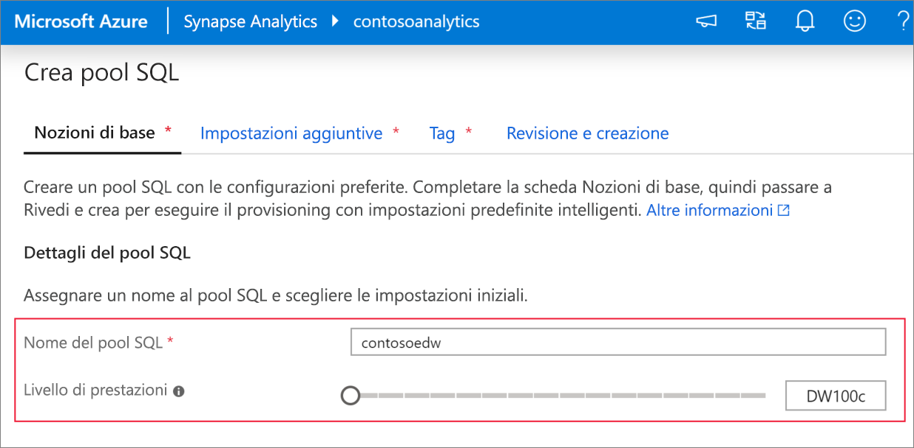
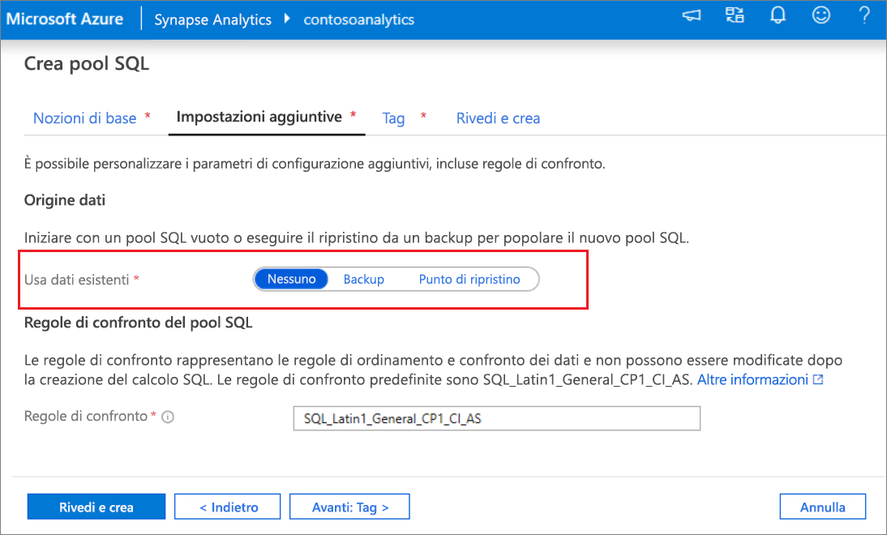

# Avvio rapido: Creare un pool SQL dedicato con Synapse Studio

Azure Synapse Analytics offre vari motori di analisi che consentono di inserire, trasformare, modellare e analizzare i dati. Un pool SQL dedicato offre funzionalità di calcolo e archiviazione basate su T-SQL. Dopo aver creato un pool SQL dedicato nell'area di lavoro di Synapse, è possibile caricare, modellare, elaborare e distribuire i dati per ottenere dati analitici in modo più rapido.

Questo argomento di avvio rapido descrive la procedura per creare un pool SQL dedicato in un’area di lavoro di Synapse con Synapse Studio.

Se non si ha una sottoscrizione di Azure, creare un [account gratuito prima di iniziare](https://azure.microsoft.com/free/).

## Prerequisiti

- Sottoscrizione di Azure: [creare un account gratuito](https://azure.microsoft.com/free/)
- [Area di lavoro Synapse](quickstart-create-workspace.md)

## Accedere al portale di Azure

Accedere al [portale di Azure](https://portal.azure.com/)

## Accedere all'area di lavoro Synapse

1. Passare all'area di lavoro Synapse in cui verrà creato il pool SQL dedicato digitando il nome del servizio (o direttamente il nome della risorsa) nella barra di ricerca.

    
1. Nell'elenco delle aree di lavoro digitare il nome (o parte del nome) dell'area di lavoro da aprire. Per questo esempio verrà usata un'area di lavoro denominata **contosoanalytics**.

    

## Avviare Synapse Studio

1. Nella pagina di panoramica dell'area di lavoro selezionare l'**URL Web dell'area di lavoro** per avviare Synapse Studio.

    

## Creare un pool SQL dedicato in Synapse Studio

1. Nella home page di Synapse Studio passare all'**hub di gestione** nel riquadro di navigazione a sinistra selezionando l'icona **Gestisci**.

    

1. All’interno dell'hub di gestione, passare alla sezione dei **pool SQL** per visualizzare l'elenco corrente dei pool SQL disponibili nell'area di lavoro.

    

1. Selezionare il comando **+Nuovo** e verrà visualizzata la nuova procedura guidata di creazione dei pool SQL. 

    

1. Immettere i dettagli seguenti nella scheda **Informazioni di base**:

    | Impostazione | Valore consigliato | Descrizione |
    | :------ | :-------------- | :---------- |
    | **Nome del pool SQL** | contosoedw | Nome assegnato al pool SQL dedicato. |
    | **Livello di prestazioni** | DW100c | Per questa guida di avvio rapido, impostare questa opzione sulle dimensioni minime per ridurre i costi |

    
    > [!IMPORTANT]
    > Si noti che esistono limitazioni specifiche per i nomi che è possibile usare per i pool SQL dedicati. I nomi non possono contenere caratteri speciali, devono essere costituiti da un massimo di 15 caratteri, non possono contenere parole riservate e devono essere univoci nell'area di lavoro.

4. Nella scheda successiva **Impostazioni aggiuntive**, selezionare **nessuna** per eseguire il provisioning del pool SQL senza dati. Lasciare selezionate le regole di confronto predefinite.

    Per ripristinare il pool SQL dedicato da un punto di ripristino, selezionare **Punto di ripristino**. Per altre informazioni su come eseguire un ripristino, vedere [Procedura: Ripristinare un pool SQL dedicato esistente](backuprestore/restore-sql-pool.md)

    

1. Per il momento non verranno aggiunti tag, quindi selezionare **Rivedi e crea**.

1. Nella scheda **Rivedi e crea**, verificare che i dettagli siano corretti in base a quanto specificato in precedenza, quindi premere **Crea**. 

    

1. A questo punto, verrà avviato il flusso di provisioning delle risorse.

1. Al termine del provisioning, tornando all'area di lavoro viene visualizzata una nuova voce per il pool SQL appena creato.

    

1. Una volta creato, il pool SQL dedicato sarà disponibile nell'area di lavoro per il caricamento di dati, l'elaborazione di flussi, la lettura dal data lake e così via.

## Pulire il pool SQL dedicato con Synapse Studio    

Seguire questa procedura per eliminare il pool SQL dedicato dall'area di lavoro con Synapse Studio.
> [!WARNING]
> Con l'eliminazione di un pool SQL dedicato, viene rimosso anche il motore di analisi dall'area di lavoro. Non sarà più possibile connettersi al pool SQL dedicato e tutte le query, le pipeline e gli script che lo usano non funzioneranno più.

Per eliminare il pool SQL dedicato, procedere come segue:

1. Passare ai pool SQL nell'hub di gestione in Synapse Studio.
1. Selezionare i puntini di sospensione nel pool SQL dedicato da eliminare (in questo caso, **contosoedw**) per visualizzare i comandi relativi al pool SQL dedicato:

    
1. Premere **CANC**.
1. Confermare l'eliminazione e fare clic sul pulsante **Elimina**.
1. Una volta completato il processo, il pool SQL dedicato non sarà più elencato nelle risorse dell'area di lavoro.

## Passaggi successivi
 
- Vedere [Avvio rapido: Creare un notebook Apache Spark](quickstart-apache-spark-notebook.md).
- Vedere [Avvio rapido: Creare un pool SQL dedicato con il portale di Azure](quickstart-create-sql-pool-portal.md).
