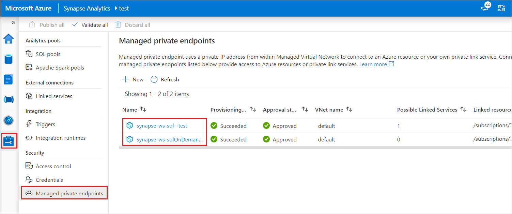

# Endpoint privati gestiti di Synapse

Questo articolo illustra gli endpoint privati gestiti in Azure Synapse Analytics.

## Endpoint privati gestiti

Gli endpoint privati gestiti sono endpoint privati creati in una rete virtuale gestita associata all'area di lavoro di Azure Synapse. Gli endpoint privati gestiti stabiliscono un collegamento privato con le risorse di Azure. Azure Synapse gestisce questi endpoint privati per conto dell'utente. È possibile creare endpoint privati gestiti nell'area di lavoro di Azure Synapse per accedere ai servizi di Azure, come Archiviazione di Azure o Azure Cosmos DB, e ai servizi di clienti/partner ospitati in Azure.

Quando si usano endpoint privati gestiti, il traffico tra l'area di lavoro di Azure sinapsi e altre risorse di Azure attraversa interamente la rete dorsale Microsoft. Gli endpoint privati gestiti proteggono dall'esfiltrazione di dati. Un endpoint privato gestito usa l'indirizzo IP privato della rete virtuale gestita per introdurre effettivamente il servizio di Azure comunicato dall'area di lavoro di Azure Synapse nella rete virtuale. Gli endpoint privati gestiti sono associati a una risorsa specifica in Azure e non all'intero servizio. I clienti possono limitare la connettività a una risorsa specifica approvata dall'organizzazione. 

Altre informazioni su [collegamenti ed endpoint privati](../../private-link/index.yml).

>[!IMPORTANT]
>Gli endpoint privati gestiti sono supportati solo nelle aree di lavoro di Azure Synapse con una rete virtuale dell'area di lavoro gestita.

>[!NOTE]
>Durante la creazione di un'area di lavoro di Azure Synapse, è possibile scegliere di associarvi una rete virtuale gestita. Se si sceglie di associare una rete virtuale gestita all'area di lavoro, è anche possibile scegliere di limitare il traffico in uscita dall'area di lavoro solo verso destinazioni approvate. È necessario creare endpoint privati gestiti in queste destinazioni. 

Quando si crea un endpoint privato gestito in Azure Synapse, viene creata una connessione all'endpoint privato con lo stato "In sospeso". Viene avviato un flusso di lavoro di approvazione. Il proprietario della risorsa del collegamento privato ha la responsabilità di approvare la connessione. Se il proprietario approva la connessione, il collegamento privato viene stabilito. Se tuttavia il proprietario non approva la connessione, il collegamento privato non verrà stabilito. In entrambi i casi, l'endpoint privato gestito verrà aggiornato con lo stato della connessione. Per inviare traffico alla risorsa di collegamento privato collegata all'endpoint privato gestito, è possibile usare solo un endpoint privato gestito con lo stato approvato.

## Endpoint privati gestiti per il pool SQL dedicato e il pool SQL serverless

Il pool SQL dedicato e il pool SQL serverless sono funzionalità analitiche disponibili nell'area di lavoro di Azure Synapse. Queste funzionalità usano l'infrastruttura multi-tenant che non viene distribuita nella [rete virtuale dell'area di lavoro gestita](./synapse-workspace-managed-vnet.md).

Quando si crea un'area di lavoro, Azure Synapse crea al suo interno due endpoint privati gestiti, uno per il pool SQL dedicato e l'altro per il pool SQL serverless. 

Questi due endpoint privati gestiti sono elencati in Synapse Studio. Selezionare **Gestisci** nel riquadro di spostamento sinistro, quindi selezionare **Managed private endpoints** (Endpoint privati gestiti) per visualizzarli in Studio.

L'endpoint privato gestito destinato al pool SQL è denominato *synapse-ws-sql--\<workspacename\>* , mentre quello destinato al pool SQL serverless è denominato *synapse-ws-sqlOnDemand--\<workspacename\>* .

Questi due endpoint privati gestiti vengono creati automaticamente quando si crea l'area di lavoro di Azure Synapse. I costi correlati a questi due endpoint privati gestiti non vengono addebitati.

## Passaggi successivi

Per altre informazioni, passare all'articolo [Creare endpoint privati gestiti per le origini dati](./how-to-create-managed-private-endpoints.md).