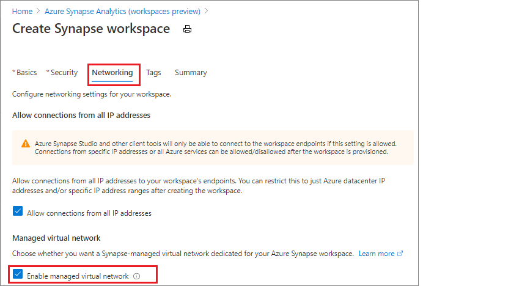

# Rete virtuale gestita di Azure Synapse Analytics

Questo articolo illustra la rete virtuale gestita in Azure Synapse Analytics.

## Rete virtuale dell'area di lavoro gestita

Durante la creazione dell'area di lavoro di Azure Synapse, è possibile scegliere di associarla a una rete virtuale di Microsoft Azure. La rete virtuale associata all'area di lavoro è gestita da Azure Synapse. Questa rete virtuale è definita *rete virtuale dell'area di lavoro gestita*.

La rete virtuale dell'area di lavoro gestita è utile per quattro motivi:

- Con una rete virtuale dell'area di lavoro gestita è possibile scaricare su Azure Synapse la gestione della rete virtuale.
- Non è necessario configurare regole NSG in ingresso sulle reti virtuali per consentire al traffico di gestione di Azure Synapse di entrare nella rete virtuale. Un'errata configurazione di queste regole NSG causa un'interruzione del servizio per i clienti.
- Non è necessario creare una subnet per i cluster Spark in base ai picchi del carico.
- La rete virtuale dell'area di lavoro gestita, insieme agli endpoint privati gestiti, protegge dall'esfiltrazione dei dati. È possibile creare endpoint privati gestiti solo in un'area di lavoro a cui è associata una rete virtuale dell'area di lavoro gestita.

La creazione di un'area di lavoro con una rete virtuale dell'area di lavoro gestita associata garantisce che l'area di lavoro sia isolata da altre aree di lavoro in rete. Azure Synapse fornisce varie funzionalità di analisi in un'area di lavoro: integrazione dei dati, pool di Apache Spark serverless, pool SQL dedicato e pool SQL serverless.

Se l'area di lavoro dispone di una rete virtuale dell'area di lavoro gestita, le risorse di integrazione dei dati e di Spark vengono distribuite in questa rete. Una rete virtuale dell'area di lavoro gestita fornisce anche l'isolamento a livello di utente per le attività di Spark, dal momento che ogni cluster Spark è isolato nella propria subnet.

Il pool SQL dedicato e il pool SQL serverless sono funzionalità multi-tenant e pertanto si trovano all'esterno della rete virtuale dell'area di lavoro gestita. Le comunicazioni all'interno dell'area di lavoro con il pool SQL dedicato e il pool SQL serverless usano collegamenti privati di Azure. Questi collegamenti privati vengono creati automaticamente quando si crea un'area di lavoro con una rete virtuale dell'area di lavoro gestita associata.

>[!IMPORTANT]
>Dopo aver creato l'area di lavoro, non è più possibile modificare questa configurazione dell'area di lavoro. Ad esempio, non è possibile riconfigurare un'area di lavoro a cui non è associata una rete virtuale dell'area di lavoro gestita e associarle una rete virtuale. Analogamente, non è possibile riconfigurare un'area di lavoro a cui è associata una rete virtuale dell'area di lavoro gestita e rimuovere l'associazione della rete virtuale.

## Creare un'area di lavoro di Azure Synapse con una rete virtuale dell'area di lavoro gestita

Se non è già stato fatto, registrare il provider di risorse di rete. La registrazione di un provider di risorse configura la sottoscrizione per l'utilizzo del provider di risorse. Scegliere *Microsoft.Network* dall'elenco dei provider di risorse quando si [esegue la registrazione](https://docs.microsoft.com/azure/azure-resource-manager/management/resource-providers-and-types).

Per creare un'area di lavoro di Azure Synapse con una rete virtuale dell'area di lavoro gestita associata, selezionare la scheda **Rete** nel portale di Azure e quindi la casella di controllo **Abilita rete virtuale gestita**.

Se si lascia deselezionata la casella di controllo, all'area di lavoro non verrà associata una rete virtuale.

>[!IMPORTANT]
>È possibile usare i collegamenti privati solo in un'area di lavoro con una rete virtuale dell'area di lavoro gestita.

È possibile verificare se l'area di lavoro di Azure Synapse è associata a una rete virtuale dell'area di lavoro gestita selezionando **Panoramica** nel portale di Azure.

## Passaggi successivi

Creare un'[area di lavoro di Azure Synapse](../quickstart-create-workspace.md)

Altre informazioni sugli [endpoint privati gestiti](./synapse-workspace-managed-private-endpoints.md)

[Creare endpoint privati gestiti per le origini dati](./how-to-create-managed-private-endpoints.md)
