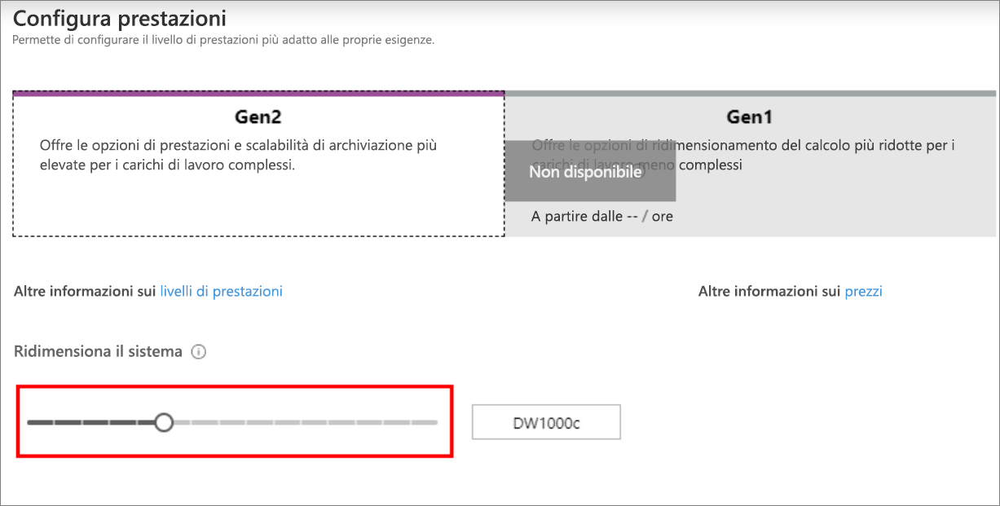
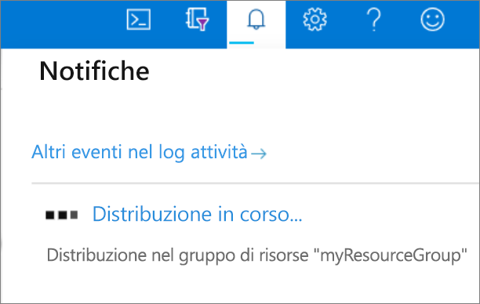
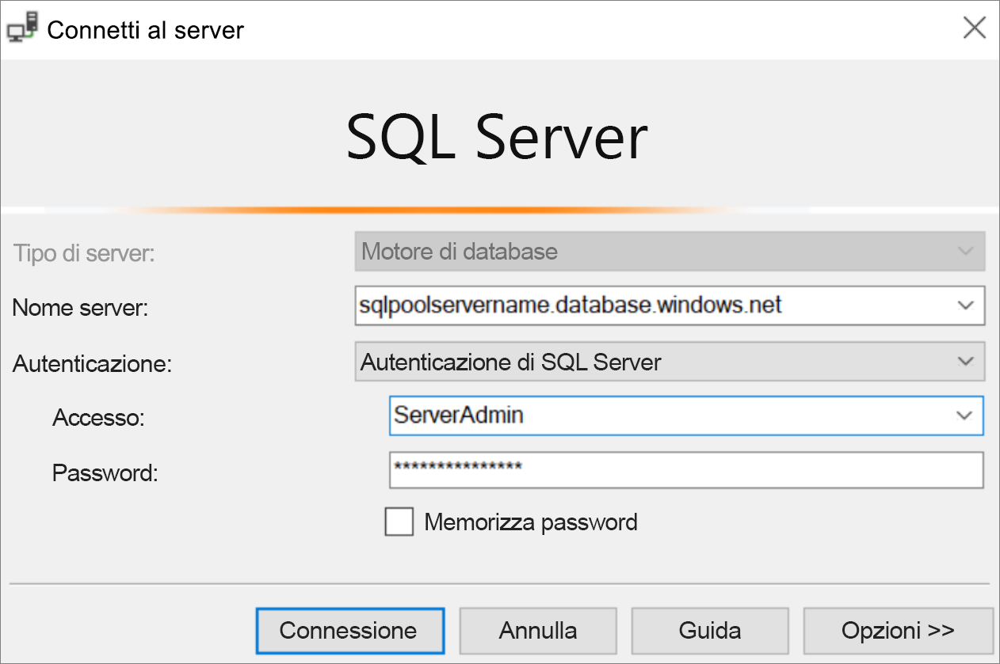

# <a name="quickstart-create-and-query-a-synapse-sql-pool-using-the-azure-portal"></a>Avvio rapido: Creare ed eseguire query su un pool SQL di Synapse con il portale di Azure

Creare rapidamente un pool SQL di Synapse (data warehouse) ed eseguirvi query in Azure Synapse Analytics (in precedenza SQL DW) con il portale di Azure.

## <a name="prerequisites"></a>Prerequisiti

1. Se non si ha una sottoscrizione di Azure, creare un account [gratuito](https://azure.microsoft.com/free/) prima di iniziare.

   > [!NOTE]
   > La creazione di un pool SQL in Azure Synapse può risultare in un nuovo servizio fatturabile. Per altre informazioni, vedere [Prezzi di Azure Synapse Analytics](https://azure.microsoft.com/pricing/details/synapse-analytics/).

2. Scaricare e installare la versione più recente di [SQL Server Management Studio](/sql/ssms/download-sql-server-management-studio-ssms?toc=/azure/synapse-analytics/sql-data-warehouse/toc.json&bc=/azure/synapse-analytics/sql-data-warehouse/breadcrumb/toc.json&view=azure-sqldw-latest) (SSMS).

## <a name="sign-in-to-the-azure-portal"></a>Accedere al portale di Azure

Accedere al [portale di Azure](https://portal.azure.com/).

## <a name="create-a-sql-pool"></a>Creare un pool SQL

I data warehouse vengono creati usando un pool SQL in Azure Synapse Analytics. Un pool SQL viene creato con un set definito di [risorse di calcolo](memory-concurrency-limits.md). Il database viene creato in un [gruppo di risorse di Azure](../../azure-resource-manager/management/overview.md?toc=/azure/synapse-analytics/sql-data-warehouse/toc.json&bc=/azure/synapse-analytics/sql-data-warehouse/breadcrumb/toc.json) e in un [server SQL logico](../../azure-sql/database/logical-servers.md?toc=/azure/synapse-analytics/sql-data-warehouse/toc.json&bc=/azure/synapse-analytics/sql-data-warehouse/breadcrumb/toc.json).

Seguire questa procedura per creare un pool SQL contenente i dati dell'esempio **AdventureWorksDW**.

1. Selezionare **Crea una risorsa** nell'angolo in alto a sinistra del portale di Azure.

   

2. Selezionare **Database** nella pagina **Nuovo**, quindi selezionare **Azure Synapse Analytics (in precedenza SQL DW)** nell'elenco **In primo piano**.

   

3. In **Informazioni di base** specificare la sottoscrizione, il gruppo di risorse, il nome del pool SQL e il nome del server:

   | Impostazione | Valore consigliato | Descrizione |
   | :------ | :-------------- | :---------- |
   | **Sottoscrizione** | Sottoscrizione in uso | Per informazioni dettagliate sulle sottoscrizioni, vedere [Sottoscrizioni](https://account.windowsazure.com/Subscriptions). |
   | **Gruppo di risorse** | myResourceGroup | Per i nomi di gruppi di risorse validi, vedere [Regole di denominazione e restrizioni](/azure/architecture/best-practices/resource-naming?toc=/azure/synapse-analytics/sql-data-warehouse/toc.json&bc=/azure/synapse-analytics/sql-data-warehouse/breadcrumb/toc.json). |
   | **Nome del pool SQL** | Qualsiasi nome univoco globale, ad esempio *mySampleDataWarehouse* | Per i nomi di database validi, vedere [Identificatori del database](/sql/relational-databases/databases/database-identifiers?toc=/azure/synapse-analytics/sql-data-warehouse/toc.json&bc=/azure/synapse-analytics/sql-data-warehouse/breadcrumb/toc.json&view=azure-sqldw-latest). Si noti che un pool SQL è un tipo di database. |
   | **Server** | Qualsiasi nome globalmente univoco | Selezionare un server esistente oppure selezionare **Crea nuovo** per crearne uno nuovo. Per i nomi di server validi, vedere [Regole di denominazione e restrizioni](/azure/architecture/best-practices/resource-naming?toc=/azure/synapse-analytics/sql-data-warehouse/toc.json&bc=/azure/synapse-analytics/sql-data-warehouse/breadcrumb/toc.json). |

   

4. In **Livello di prestazioni** scegliere **Selezionare il livello di prestazioni** se si vuole cambiare la configurazione con un dispositivo di scorrimento.

     

   Per altre informazioni sui livelli di prestazioni, vedere [Gestire le risorse di calcolo in Azure Synapse Analytics](sql-data-warehouse-manage-compute-overview.md).

5. Selezionare **Impostazioni aggiuntive**, in **Usa dati esistenti**, scegliere **Esempio** in modo che AdventureWorksDW venga creato come database di esempio.

     

6. Ora che è stata completata la scheda Informazioni di base del modulo Azure Synapse Analytics, selezionare **Rivedi e crea** e quindi **Crea** per creare il pool SQL. Il provisioning richiede alcuni minuti.

   

   

7. Per monitorare il processo di distribuzione, selezionare **Notifiche** sulla barra degli strumenti.

   

## <a name="create-a-server-level-firewall-rule"></a>Creare una regola del firewall a livello di server

Il servizio Azure Synapse crea un firewall a livello di server. Questo firewall impedisce ad applicazioni e strumenti esterni di connettersi al server o a qualsiasi database nel server. Per abilitare la connettività, è possibile aggiungere regole del firewall per aprire il firewall a indirizzi IP specifici. Seguire questa procedura per creare una [regola del firewall a livello di server](../../azure-sql/database/firewall-configure.md?toc=/azure/synapse-analytics/sql-data-warehouse/toc.json&bc=/azure/synapse-analytics/sql-data-warehouse/breadcrumb/toc.json) per l'indirizzo IP del client.

> [!NOTE]
> Azure Synapse comunica sulla porta 1433. Se si sta provando a connettersi da una rete aziendale, il traffico in uscita sulla porta 1433 potrebbe non essere consentito dal firewall della rete. In questo caso, non è possibile connettersi al server a meno che il reparto IT non apra la porta 1433.

1. Al termine della distribuzione, selezionare **Tutti i servizi** dal menu a sinistra. Selezionare **Database**, quindi selezionare la stella accanto ad **Azure Synapse Analytics** per aggiungere Azure Synapse Analytics ai Preferiti.

2. Scegliere **Azure Synapse Analytics** dal menu sinistro e quindi selezionare **mySampleDataWarehouse** nella pagina **Azure Synapse Analytics**. Verrà visualizzata la pagina di panoramica del database, che mostra il nome server completo, ad esempio **sqlpoolservername.database.windows.net**, e offre opzioni per operazioni di configurazione aggiuntive.

3. Copiare il nome completo del server da usare per connettersi al server e ai relativi database in questa e in altre guide di avvio rapido. Per aprire le impostazioni del server, fare clic sul relativo nome.

   

4. Selezionare **Mostra impostazioni firewall**.

   

5. Verrà visualizzata la pagina **Impostazioni del firewall** per il server.

   

6. Per aggiungere l'indirizzo IP corrente a una nuova regola del firewall, selezionare **Aggiungi IP client** sulla barra degli strumenti. Una regola del firewall può aprire la porta 1433 per un indirizzo IP singolo o un intervallo di indirizzi IP.

7. Selezionare **Salva**. Viene creata una regola del firewall a livello di server per l'indirizzo IP corrente, che apre la porta 1433 nel server.

8. Selezionare **OK** e quindi chiudere la pagina **Impostazioni firewall**.

È ora possibile connettersi al server e ai relativi pool SQL usando questo indirizzo IP. La connessione funziona da SQL Server Management Studio o un altro strumento di propria scelta. Quando ci si connette, usare l'account ServerAdmin creato in precedenza.

> [!IMPORTANT]
> Per impostazione predefinita, l'accesso attraverso il firewall del database SQL è abilitato per tutti i servizi di Azure. Selezionare **NO** in questa pagina e quindi selezionare **Salva** per disabilitare il firewall per tutti i servizi di Azure.

## <a name="get-the-fully-qualified-server-name"></a>Ottenere il nome completo del server

Ottenere il nome completo del server nel portale di Azure. Questo nome verrà usato nei passaggi successivi per la connessione al server.

1. Accedere al [portale di Azure](https://portal.azure.com/).

2. Scegliere **Azure Synapse Analytics** dal menu sinistro e quindi selezionare il pool SQL nella pagina **Azure Synapse Analytics**.

3. Nel riquadro **Informazioni di base** della pagina del portale di Azure per il database individuare e quindi copiare il **Nome server**. In questo esempio il nome completo è sqlpoolservername.database.windows.net.

    

## <a name="connect-to-the-server-as-server-admin"></a>Connettersi al server come amministratore del server

In questa sezione si usa [SQL Server Management Studio](/sql/ssms/download-sql-server-management-studio-ssms?toc=/azure/synapse-analytics/sql-data-warehouse/toc.json&bc=/azure/synapse-analytics/sql-data-warehouse/breadcrumb/toc.json&view=azure-sqldw-latest) (SSMS) per stabilire una connessione al server.

1. Aprire SQL Server Management Studio.

2. Immettere le informazioni seguenti nella finestra di dialogo **Connetti al server**:

   | Impostazione | Valore consigliato | Descrizione |
   | :------ | :-------------- | :---------- |
   | Tipo di server | Motore di database | Questo valore è obbligatorio |
   | Nome server | Nome completo del server | Ecco un esempio: **sqlpoolservername.database.windows.net**. |
   | Authentication | Autenticazione di SQL Server | L'autenticazione SQL è il solo tipo di autenticazione configurato in questa esercitazione. |
   | Login | Account amministratore del server | Account specificato quando è stato creato il server. |
   | Password | Password per l'account amministratore del server | Password specificata quando è stato creato il server. |
   ||||

   

3. Selezionare **Connetti**. In SSMS si apre la finestra Esplora oggetti.

4. In Esplora oggetti espandere **Database**. Espandere quindi **mySampleDatabase** per visualizzare gli oggetti nel nuovo database.

   

## <a name="run-some-queries"></a>Eseguire alcune query

Non è consigliabile eseguire query di grandi dimensioni quando si è effettuato l’accesso come amministratore del server, perché usa una [classe di risorse limitata](resource-classes-for-workload-management.md). Configurare invece [Isolamento dei carichi di lavoro](https://docs.microsoft.com/azure/synapse-analytics/sql-data-warehouse/quickstart-configure-workload-isolation-tsql) come [illustrato nelle esercitazioni](https://docs.microsoft.com/azure/synapse-analytics/sql-data-warehouse/load-data-wideworldimportersdw#create-a-user-for-loading-data).

Azure Synapse Analytics usa T-SQL come linguaggio di query. Per aprire una finestra di query ed eseguire alcune query T-SQL, seguire questa procedura:

1. Fare clic con il pulsante destro del mouse su **mySampleDataWarehouse** e scegliere **Nuova query**. Viene visualizzata una nuova finestra di query.

2. Nella finestra di query immettere il comando seguente per visualizzare un elenco di database.

    ```sql
    SELECT * FROM sys.databases
    ```

3. Selezionare **Esegui**. I risultati della query mostrano due database: **master** e **mySampleDataWarehouse**.

   

4. Per esaminare alcuni dati, usare il comando seguente per visualizzare il numero di clienti con il cognome Adams che hanno tre figli a casa. L'elenco dei risultati include sei clienti.

    ```sql
    SELECT LastName, FirstName FROM dbo.dimCustomer
    WHERE LastName = 'Adams' AND NumberChildrenAtHome = 3;
    ```

   

## <a name="clean-up-resources"></a>Pulire le risorse

Per le unità del data warehouse e i dati archiviati nel pool SQL vengono addebitati costi. Le risorse di calcolo e archiviazione vengono fatturate separatamente.

- Se si vogliono mantenere i dati nelle risorse di archiviazione, è possibile sospendere il calcolo quando il pool SQL non è in uso. In questo modo, vengono addebitati solo i costi per l'archiviazione dei dati. È possibile riprendere il calcolo ogni volta che si è pronti a lavorare con i dati.

- Per evitare di ricevere addebiti in futuro, è possibile eliminare il pool SQL.

Seguire questa procedura per pulire le risorse non più necessarie.

1. Accedere al [portale di Azure](https://portal.azure.com) e selezionare il pool SQL.

   

2. Per sospendere il calcolo, selezionare il pulsante **Pausa**. Quando si sospende il pool SQL, viene visualizzato il pulsante **Riprendi**. Per riprendere il calcolo, selezionare **Riprendi**.

3. Per rimuovere il pool SQL in modo da non ricevere addebiti per le risorse di calcolo o di archiviazione, selezionare **Elimina**.

4. Per rimuovere il server creato, selezionare **sqlpoolservername.database.windows.net** nell'immagine precedente e quindi selezionare **Elimina**. Fare attenzione quando si esegue questa operazione perché l'eliminazione del server comporta anche quella di tutti i database assegnati al server.

5. Per rimuovere il gruppo di risorse, selezionare **myResourceGroup** e quindi **Elimina gruppo di risorse**.

Si vuole ottimizzare e risparmiare sulla spesa per il cloud?

[!INCLUDE [cost-management-horizontal](../../../includes/cost-management-horizontal.md)]

## <a name="next-steps"></a>Passaggi successivi

Per altre informazioni sul caricamento di dati nel pool SQL, continuare con l'articolo [Caricare i dati in un pool SQL](load-data-from-azure-blob-storage-using-polybase.md).
