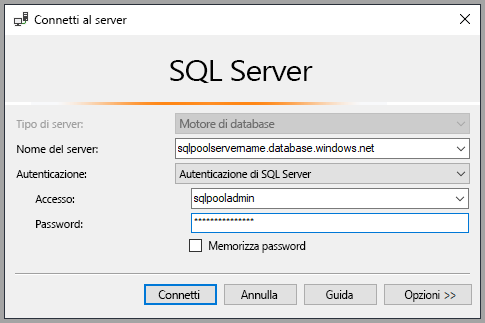
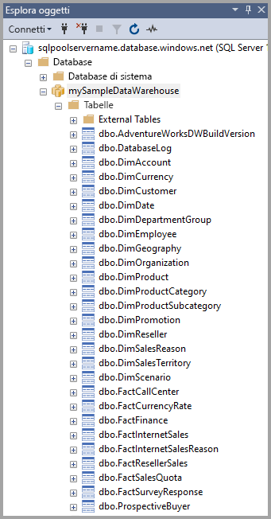
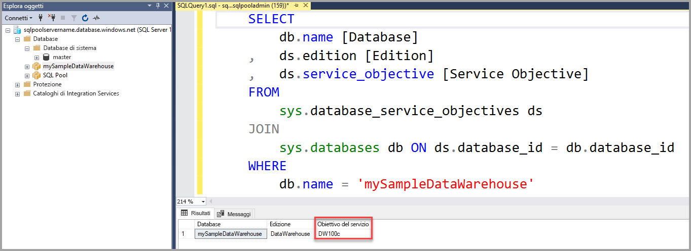

# <a name="quickstart-scale-compute-for-dedicated-sql-pool-formerly-sql-dw-in-azure-synapse-analytics-using-t-sql"></a>Avvio rapido: Dimensionare le risorse di calcolo per un pool SQL dedicato (in precedenza SQL Data Warehouse) in Azure Synapse Analytics con T-SQL

Dimensionare le risorse di calcolo in un pool SQL dedicato (in precedenza SQL Data Warehouse) tramite T-SQL e SQL Server Management Studio (SSMS), [aumentandone il numero](sql-data-warehouse-manage-compute-overview.md) per ottenere prestazioni migliori o riducendolo per diminuire i costi.

Se non si ha una sottoscrizione di Azure, creare un account [gratuito](https://azure.microsoft.com/free/) prima di iniziare.

## <a name="before-you-begin"></a>Prima di iniziare

Scaricare e installare la versione più recente di [SQL Server Management Studio](/sql/ssms/download-sql-server-management-studio-ssms?toc=/azure/synapse-analytics/sql-data-warehouse/toc.json&bc=/azure/synapse-analytics/sql-data-warehouse/breadcrumb/toc.json&view=azure-sqldw-latest&preserve-view=true) (SSMS).

## <a name="create-a-dedicated-sql-pool-formerly-sql-dw"></a>Creare un pool SQL dedicato (in precedenza SQL Data Warehouse)

Seguire la guida [Avvio rapido: Creare e connettere - Portale](create-data-warehouse-portal.md) per creare un pool SQL dedicato (in precedenza SQL Data Warehouse) denominato **mySampleDataWarehouse**. Completare la guida di avvio rapido per verificare di avere una regola del firewall e di essere in grado di connettersi al pool SQL dedicato (in precedenza SQL Data Warehouse) da SQL Server Management Studio.

## <a name="connect-to-the-server-as-server-admin"></a>Connettersi al server come amministratore del server

In questa sezione si usa [SQL Server Management Studio](/sql/ssms/download-sql-server-management-studio-ssms?toc=/azure/synapse-analytics/sql-data-warehouse/toc.json&bc=/azure/synapse-analytics/sql-data-warehouse/breadcrumb/toc.json&view=azure-sqldw-latest&preserve-view=true) (SSMS) per stabilire una connessione al server SQL di Azure.

1. Aprire SQL Server Management Studio.

2. Immettere le informazioni seguenti nella finestra di dialogo **Connetti al server**:

   | Impostazione       | Valore consigliato | Descrizione |
   | ------------ | ------------------ | ------------------------------------------------- |
   | Tipo di server | Motore di database | Questo valore è obbligatorio |
   | Nome server | Nome completo del server | Ecco un esempio: **mySampleDataWarehouseservername.database.windows.net**. |
   | Authentication | Autenticazione di SQL Server | L'autenticazione SQL è il solo tipo di autenticazione configurato in questa esercitazione. |
   | Login | Account amministratore del server | Account specificato quando è stato creato il server. |
   | Password | Password per l'account amministratore del server | La password specificata quando è stato creato il server. |

    

3. Fare clic su **Connetti**. In SSMS si apre la finestra Esplora oggetti.

4. In Esplora oggetti espandere **Database**. Espandere quindi **mySampleDataWarehouse** per visualizzare gli oggetti nel nuovo database.

    

## <a name="view-service-objective"></a>Visualizzare l'obiettivo di servizio

L'impostazione relativa all'obiettivo di servizio contiene il numero di unità Data Warehouse per il pool SQL dedicato (in precedenza SQL Data Warehouse).

Per visualizzare le unità Data Warehouse correnti per il pool SQL dedicato (in precedenza SQL Data Warehouse):

1. Nella connessione a **mySampleDataWarehouseservername.database.windows.net** espandere **Database di sistema**.
2. Fare clic con il pulsante destro del mouse su **Master** e selezionare **Nuova query**. Viene visualizzata una nuova finestra di query.
3. Eseguire la query seguente per effettuare una selezione nella vista a gestione dinamica sys.database_service_objectives.

    ```sql
    SELECT
        db.name [Database]
    ,    ds.edition [Edition]
    ,    ds.service_objective [Service Objective]
    FROM
         sys.database_service_objectives ds
    JOIN
        sys.databases db ON ds.database_id = db.database_id
    WHERE
        db.name = 'mySampleDataWarehouse'
    ```

4. I risultati seguenti mostrano che **mySampleDataWarehouse** ha un obiettivo di servizio di DW400.

    

## <a name="scale-compute"></a>Ridimensionare le risorse di calcolo

Nel pool SQL dedicato (in precedenza SQL Data Warehouse) è possibile aumentare o ridurre le risorse di calcolo modificando le unità Data Warehouse. Nella pagina [Creare e connettere - portale](create-data-warehouse-portal.md)**mySampleDataWarehouse** è stato creato e inizializzato con 400 unità Data Warehouse. La procedura seguente modifica le unità Data Warehouse per **mySampleDataWarehouse**.

Per modificare le unità Data Warehouse:

1. Fare clic con il pulsante destro del mouse su **Master** e selezionare **Nuova query**.
2. Usare l'istruzione T-SQL [ALTER DATABASE](/sql/t-sql/statements/alter-database-azure-sql-database?toc=/azure/synapse-analytics/sql-data-warehouse/toc.json&bc=/azure/synapse-analytics/sql-data-warehouse/breadcrumb/toc.json&view=azure-sqldw-latest&preserve-view=true) per modificare l'obiettivo di servizio. Eseguire la query seguente per modificare l'obiettivo di servizio impostandolo su DW300.

    ```Sql
    ALTER DATABASE mySampleDataWarehouse
    MODIFY (SERVICE_OBJECTIVE = 'DW300c');
    ```

## <a name="monitor-scale-change-request"></a>Monitorare la richiesta di ridimensionamento

Per visualizzare lo stato di avanzamento della richiesta di modifica precedente, è possibile usare la sintassi T-SQL `WAITFORDELAY` per eseguire il poll della DMV sys.dm_operation_status.

Per eseguire il poll dello stato di modifica dell'oggetto servizio:

1. Fare clic con il pulsante destro del mouse su **Master** e selezionare **Nuova query**.
2. Eseguire la query seguente per eseguire il poll del DMV sys.dm_operation_status.

    ```sql
    WHILE
    (
        SELECT TOP 1 state_desc
        FROM sys.dm_operation_status
        WHERE
            1=1
            AND resource_type_desc = 'Database'
            AND major_resource_id = 'mySampleDataWarehouse'
            AND operation = 'ALTER DATABASE'
        ORDER BY
            start_time DESC
    ) = 'IN_PROGRESS'
    BEGIN
        RAISERROR('Scale operation in progress',0,0) WITH NOWAIT;
        WAITFOR DELAY '00:00:05';
    END
    PRINT 'Complete';
    ```

3. L'output risultante mostra il log del polling dello stato.

    

## <a name="check-dedicated-sql-pool-formerly-sql-dw-state"></a>Verificare lo stato del pool SQL dedicato (in precedenza SQL Data Warehouse)

Quando un pool SQL dedicato (in precedenza SQL Data Warehouse) viene sospeso, non è possibile connettersi con T-SQL. Per visualizzare lo stato corrente del pool SQL dedicato (in precedenza SQL Data Warehouse), è possibile usare un cmdlet di PowerShell. Per un esempio, vedere [Verificare lo stato del pool SQL dedicato (in precedenza SQL Data Warehouse) - PowerShell](quickstart-scale-compute-powershell.md#check-data-warehouse-state).

## <a name="check-operation-status"></a>Controllare lo stato dell'operazione

Per restituire informazioni sulle varie operazioni di gestione del pool SQL dedicato (in precedenza SQL Data Warehouse), eseguire la query seguente nella vista DMV [sys.dm_operation_status](/sql/relational-databases/system-dynamic-management-views/sys-dm-operation-status-azure-sql-database?toc=/azure/synapse-analytics/sql-data-warehouse/toc.json&bc=/azure/synapse-analytics/sql-data-warehouse/breadcrumb/toc.json&view=azure-sqldw-latest&preserve-view=true). La query restituirà, ad esempio, l'operazione e lo stato dell'operazione, che sarà IN_PROGRESS o COMPLETED.

```sql
SELECT *
FROM
    sys.dm_operation_status
WHERE
    resource_type_desc = 'Database'
AND
    major_resource_id = 'mySampleDataWarehouse'
```

## <a name="next-steps"></a>Passaggi successivi

Si è appreso come dimensionare le risorse di calcolo per il pool SQL dedicato (in precedenza SQL Data Warehouse). Per altre informazioni su Azure Synapse Analytics, continuare con l'esercitazione sul caricamento dei dati.

> [!div class="nextstepaction"]
>[Caricare dati in un pool SQL dedicato](./load-data-from-azure-blob-storage-using-copy.md)