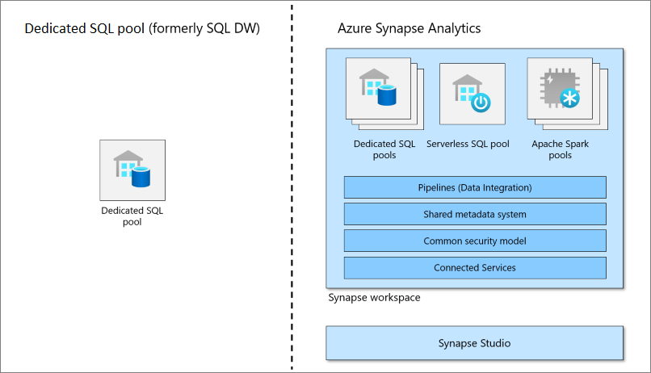

# Che cos'è il pool SQL dedicato (in precedenza SQL Data Warehouse) in Azure Synapse Analytics?

Azure Synapse Analytics è un servizio di analisi che riunisce funzionalità aziendali di data warehouse e analisi di Big Data. Per pool SQL dedicato (in precedenza SQL Data Warehouse) si intendono le funzionalità di data warehousing aziendali disponibili in Azure Synapse.

Il pool SQL dedicato (in precedenza SQL Data Warehouse) rappresenta una raccolta di risorse di analisi di cui viene effettuato il provisioning quando si usa Synapse SQL. Le dimensioni di un pool SQL dedicato (in precedenza SQL Data Warehouse) sono determinate da unità Data Warehouse (DWU).

Una volta creato un pool SQL dedicato, è possibile importare i Big Data con semplici query T-SQL [PolyBase](/sql/relational-databases/polybase/polybase-guide?toc=/azure/synapse-analytics/sql-data-warehouse/toc.json&bc=/azure/synapse-analytics/sql-data-warehouse/breadcrumb/toc.json&view=azure-sqldw-latest) e quindi sfruttare la potenza del motore di query distribuito per eseguire analisi a elevate prestazioni. Man mano che si procede con l'integrazione e l'analisi dei dati, il pool SQL dedicato (in precedenza SQL Data Warehouse) diventerà il punto di riferimento dell'azienda da cui ricavare più rapidamente informazioni dettagliate più affidabili.

> [!NOTE]
>Esplorare la [documentazione di Azure Synapse Analytics](../overview-what-is.md).
> 

## Componente chiave di una soluzione per Big Data

Il data warehouse è un componente chiave di una soluzione per Big Data end-to-end basata sul cloud.

In una soluzione cloud per i dati, i dati vengono inseriti in archivi di Big Data da numerose origini. Una volta inseriti i dati in un archivio di Big Data, Hadoop, Spark e gli algoritmi di apprendimento automatico preparano i dati e ne eseguono il training. Quando i dati sono pronti per essere sottoposti ad analisi complesse, il pool SQL dedicato usa PolyBase per eseguire query sugli archivi di Big Data. PolyBase usa query T-SQL standard per inserire i dati in tabelle del pool SQL dedicato (in precedenza SQL Data Warehouse).

Il pool SQL dedicato (in precedenza SQL Data Warehouse) archivia i dati in tabelle relazionali con archiviazione a colonne. Questo formato consente di ridurre notevolmente i costi di archiviazione dei dati e di migliorare le prestazioni delle query. Una volta archiviati i dati, è possibile eseguire analisi su larga scala. Rispetto ai sistemi di database tradizionali, le query di analisi vengono completate in secondi invece che in minuti oppure in ore invece che in giorni.

I risultati delle analisi possono essere passati ad applicazioni o database di report in tutto il mondo. Gli analisti aziendali possono quindi ottenere informazioni dettagliate per prendere decisioni ben informate.

## Passaggi successivi

- Esplorare l'[architettura di Azure Synapse](massively-parallel-processing-mpp-architecture.md)
- [Creare un pool SQL dedicato](create-data-warehouse-portal.md) in tempi rapidi
- [Caricare dati di esempio](load-data-from-azure-blob-storage-using-polybase.md).
- Esplorare i [video](https://azure.microsoft.com/documentation/videos/index/?services=sql-data-warehouse)

Oppure vedere alcune delle altre risorse disponibili per Azure Synapse.

- Eseguire ricerche nei [blog](https://azure.microsoft.com/blog/tag/azure-sql-data-warehouse/)
- Inviare [richieste di funzionalità](https://feedback.azure.com/forums/307516-sql-data-warehouse)
- [Creare un ticket di supporto](sql-data-warehouse-get-started-create-support-ticket.md)
- Eseguire ricerche nella [Pagina delle domande di Domande e risposte Microsoft](https://docs.microsoft.com/answers/topics/azure-synapse-analytics.html)
- Eseguire ricerche nel [forum di Stack Overflow](https://stackoverflow.com/questions/tagged/azure-sqldw)
