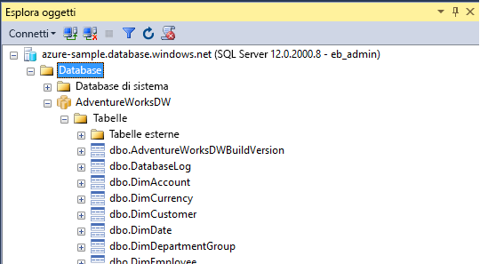

# <a name="connect-to-azure-synapse-analytics-with-sql-server-management-studio-ssms"></a>Connettersi ad Azure Synapse Analytics con SQL Server Management Studio (SSMS)Connect to Azure Synapse Analytics with SQL Server Management Studio (SSMS)
> [!div class="op_single_selector"]
> * [Power BI](sql-data-warehouse-get-started-visualize-with-power-bi.md)
> * [Azure Machine Learning](sql-data-warehouse-get-started-analyze-with-azure-machine-learning.md)
> * [Visual Studio](sql-data-warehouse-query-visual-studio.md)
> * [Sqlcmd](sql-data-warehouse-get-started-connect-sqlcmd.md)
> * [Ssms](sql-data-warehouse-query-ssms.md)
> 
> 

Usare SQL Server Management Studio (SSMS) per connettersi a un data warehouse all'interno di Azure Synapse.Use SQL Server Management Studio (SSMS) to connect to and query a data warehouse within Azure Synapse. 

## <a name="prerequisites"></a>Prerequisiti
Per eseguire questa esercitazione, è necessario:

* Un pool SQL esistente. Per crearne uno, vedere [Creare un pool SQL.](create-data-warehouse-portal.md)
* SQL Server Management Studio (SSMS) installato. [Installare SSMS](https://msdn.microsoft.com/library/hh213248.aspx) gratuitamente se non è già stato installato.
* Il nome completo dell'istanza di SQL Server. Per trovare queste informazioni, vedere [Connettersi al pool SQL](sql-data-warehouse-connect-overview.md).

## <a name="1-connect-to-your-sql-pool"></a>1. Connettersi al pool SQL
1. Aprire SSMS.
2. Aprire Esplora oggetti selezionando**Esplora oggetti**di **Connessione file** > .
   
    
3. Compilare i campi nella finestra Connetti al server.
   
    
   
   * **Nome server**. Immettere il **nome server** identificato in precedenza.
   * **Autenticazione**. Selezionare **Autenticazione di SQL Server** o **Autenticazione integrata di Active Directory**.
   * **Nome utente** e **password**. Se è stata selezionata l'autenticazione di SQL Server, immettere il nome utente e la password.
   * Fare clic su **Connetti**.
4. Per l'esplorazione, espandere il server SQL Azure. È possibile visualizzare i database associati al server. Espandere AdventureWorksDW per visualizzare le tabelle nel database di esempio.
   
    

## <a name="2-run-a-sample-query"></a>2. Eseguire una query di esempio
Ora che è stata stabilita una connessione al database, è possibile scrivere una query.

1. Fare clic con il pulsante destro del mouse sul database in Esplora oggetti di SQL Server.
2. Selezionare **Nuova query**. Viene visualizzata una nuova finestra di query.
   
    
3. Copiare la query T-SQL seguente nella finestra della query:
   
    ```sql
    SELECT COUNT(*) FROM dbo.FactInternetSales;
    ```
4. Eseguire la query `Execute` facendo clic o `F5`utilizzare il seguente collegamento: .
   
    
5. Osservare i risultati della query. In questo esempio la tabella FactInternetSales include 60398 righe.
   
    

## <a name="next-steps"></a>Passaggi successivi
Dopo aver eseguito la connessione e la query, provare a [visualizzare i dati con Power BI.](sql-data-warehouse-get-started-visualize-with-power-bi.md )
Per configurare l'ambiente per l'autenticazione di Azure Active Directory, vedere [Autenticazione nel pool SQL](sql-data-warehouse-authentication.md).
