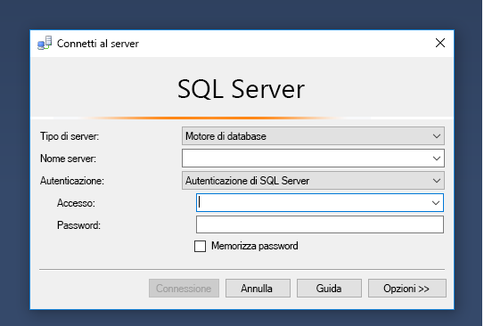

# <a name="connect-to-a-dedicated-sql-pool-formerly-sql-dw-in-azure-synapse-analytics-with-sql-server-management-studio-ssms"></a>Connettersi a un pool SQL dedicato (in precedenza SQL DW) in Azure sinapsi Analytics con SQL Server Management Studio (SSMS)

> [!div class="op_single_selector"]
>
> * [Power BI](/power-bi/connect-data/service-azure-sql-data-warehouse-with-direct-connect)
> * [Azure Machine Learning](sql-data-warehouse-get-started-analyze-with-azure-machine-learning.md)
> * [Visual Studio](sql-data-warehouse-query-visual-studio.md)
> * [sqlcmd](sql-data-warehouse-get-started-connect-sqlcmd.md)
> * [SSMS](sql-data-warehouse-query-ssms.md)

Usare SQL Server Management Studio (SSMS) per connettersi ed eseguire query in un pool SQL dedicato (in precedenza SQL DW).

## <a name="prerequisites"></a>Prerequisiti

Per eseguire questa esercitazione, è necessario:

* Un pool SQL dedicato esistente. Per crearne uno, vedere [creare un pool SQL dedicato (in precedenza SQL DW)](create-data-warehouse-portal.md).
* SQL Server Management Studio (SSMS) installato. [Scaricare SSMS](/sql/ssms/download-sql-server-management-studio-ssms?toc=/azure/synapse-analytics/sql-data-warehouse/toc.json&bc=/azure/synapse-analytics/sql-data-warehouse/breadcrumb/toc.json&view=azure-sqldw-latest&preserve-view=true) gratuitamente se non è già disponibile.
* Il nome completo dell'istanza di SQL Server. Per trovare queste informazioni, vedere [pool SQL dedicato (in precedenza SQL DW)](sql-data-warehouse-connect-overview.md).

## <a name="1-connect-to-your-dedicated-sql-pool-formerly-sql-dw"></a>1. connettersi al pool SQL dedicato (in precedenza SQL DW)

1. Aprire SSMS.
2. Aprire Esplora oggetti selezionando   >  **Esplora oggetti file Connetti**.

    
3. Compilare i campi nella finestra Connetti al server.

   

   * **Nome del server**. Immettere il **nome server** identificato in precedenza.
   * **Autenticazione**. Selezionare **Autenticazione di SQL Server** o **Autenticazione integrata di Active Directory**.
   * **Nome utente** e **password**. Se è stata selezionata l'autenticazione di SQL Server, immettere il nome utente e la password.
   * Fare clic su **Connetti**.
4. Per l'esplorazione, espandere il server SQL Azure. È possibile visualizzare i database associati al server. Espandere AdventureWorksDW per visualizzare le tabelle nel database di esempio.

   

## <a name="2-run-a-sample-query"></a>2. Eseguire una query di esempio

Ora che è stata stabilita una connessione al database, è possibile scrivere una query.

1. Fare clic con il pulsante destro del mouse sul database in Esplora oggetti di SQL Server.
2. Selezionare **Nuova query**. Viene visualizzata una nuova finestra di query.

   
3. Copiare la query T-SQL seguente nella finestra di query:

   ```sql
   SELECT COUNT(*) FROM dbo.FactInternetSales;
   ```

4. Eseguire la query facendo clic `Execute` o usare il collegamento seguente: `F5` .

   
5. Osservare i risultati della query. In questo esempio la tabella FactInternetSales include 60398 righe.

   

## <a name="next-steps"></a>Passaggi successivi

Ora che è possibile connettersi ed eseguire una query, provare a [visualizzare i dati con Power BI](/power-bi/connect-data/service-azure-sql-data-warehouse-with-direct-connect). Per configurare l'ambiente per l'autenticazione Azure Active Directory, vedere eseguire l'autenticazione [a un pool SQL dedicato](sql-data-warehouse-authentication.md).