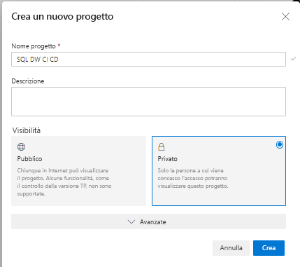
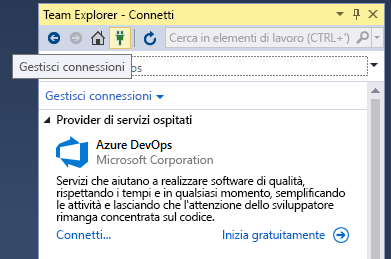
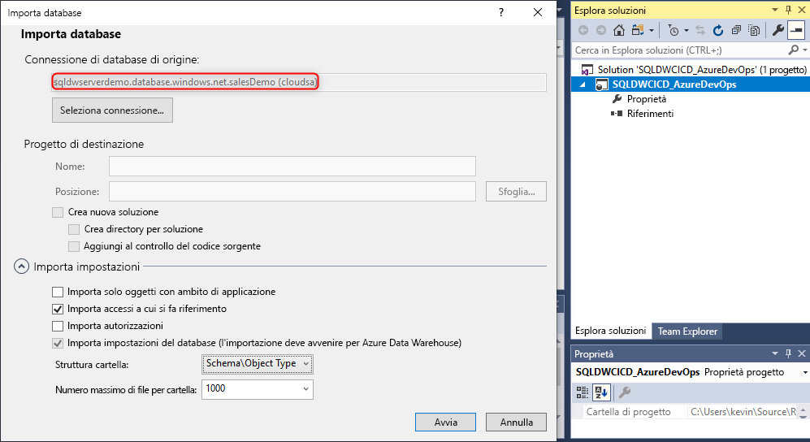
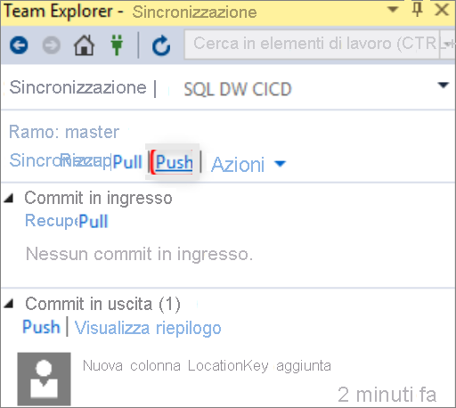
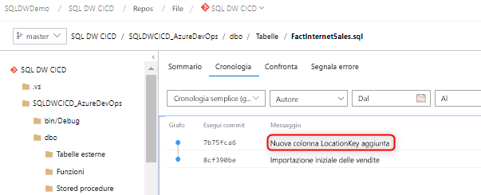

# Integrazione del controllo del codice sorgente per il pool SQL

Questa esercitazione illustra come integrare il progetto di database SQL Server Data Tools (SSDT) con il controllo del codice sorgente.  L'integrazione del controllo del codice sorgente è il primo passaggio per la creazione della pipeline di integrazione e distribuzione continue con la risorsa pool SQL in Azure Synapse Analytics.

## Prima di iniziare

- Iscriversi per ottenere un'[organizzazione di Azure DevOps](https://azure.microsoft.com/services/devops/)
- Completare l'esercitazione [Creare e connettere](create-data-warehouse-portal.md)
- [Installare Visual Studio 2019](https://visualstudio.microsoft.com/vs/older-downloads/)

## Configurare Azure DevOps e connettersi

1. Nell'organizzazione di Azure DevOps creare un progetto che ospiterà il progetto di database SSDT tramite un repository di Azure.

   

2. Aprire Visual Studio e connettersi all'organizzazione e al progetto di Azure DevOps del passaggio 1 selezionando **Gestisci connessione**.

   

3. Connettersi al progetto selezionando **Gestisci connessioni** e quindi **Connetti a un progetto**.
 

4. Individuare il progetto creato nel passaggio 1, quindi selezionare **Connetti**.

3. Clonare il repository di Azure DevOps del progetto nel computer locale.

   

Per altre informazioni sulla connessione ai progetti tramite Visual Studio, vedere [Connettersi ai progetti in Team Explorer](https://docs.microsoft.com/visualstudio/ide/connect-team-project?view=vs-2019). Per informazioni sulla clonazione di un repository con Visual Studio, vedere l'articolo [Clonare un repository Git esistente](https://docs.microsoft.com/azure/devops/repos/git/clone?view=azure-devops&tabs=visual-studio). 

## Creare il progetto e connettersi

1. In Visual Studio creare un nuovo progetto di database di SQL Server con una directory e un repository Git locale nel **repository clonato locale**.

     

2. Fare clic con il pulsante destro del mouse sul progetto sqlproject vuoto e importare il data warehouse nel progetto di database.

     

3. In Team Explorer in Visual Studio eseguire il commit delle modifiche apportate al repository Git locale.

     

4. A questo punto, dopo aver eseguito il commit delle modifiche in locale nel repository clonato, sincronizzare ed effettuare il push delle modifiche nel repository Azure Repos nel progetto Azure DevOps.

   

     

## Convalida

1. Verificare che sia stato eseguito il push delle modifiche nel repository di Azure aggiornando una colonna della tabella nel progetto di database da Visual Studio SQL Server Data Tools (SSDT).

   

2. Eseguire il commit e il push della modifica dal repository locale al repository di Azure.

   

3. Verificare che sia stato eseguito il push della modifica nel repository di Azure.

   

4. (**Facoltativo**) Usare Confronto schemi e aggiornare le modifiche apportate al data warehouse di destinazione tramite SSDT per assicurarsi che le definizioni degli oggetti nel repository di Azure e nel repository locale riflettano il data warehouse.

## Passaggi successivi

- [Sviluppo per il pool SQL](sql-data-warehouse-overview-develop.md)
