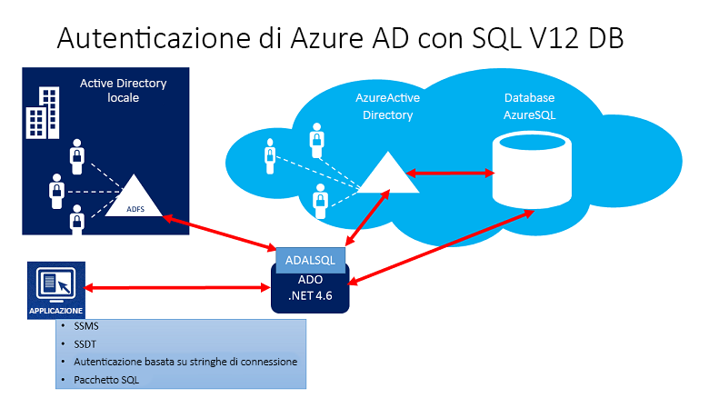
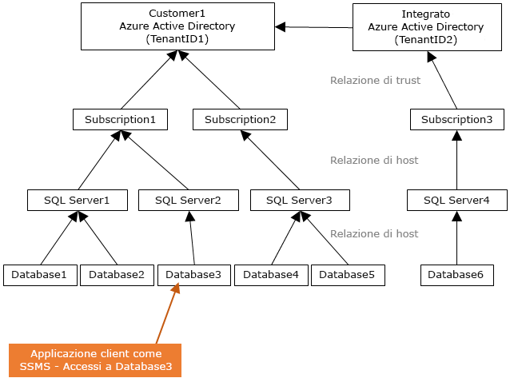
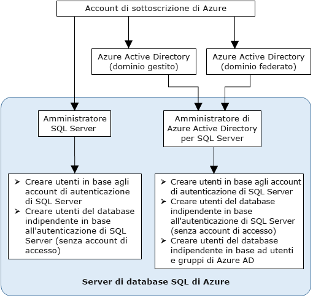

# Usare l'autenticazione di Azure Active Directory per l'autenticazione con Synapse SQL

L'autenticazione di Azure Active Directory è un meccanismo per la connessione ad [Azure Synapse Analytics](../overview-faq.md) tramite le identità di Azure Active Directory (Azure AD).

Con l'autenticazione di Azure AD, è possibile gestire centralmente le identità degli utenti che hanno accesso ad Azure Synapse per semplificare la gestione delle autorizzazioni. Ecco alcuni vantaggi:

- Offre un'alternativa alla normale autenticazione tramite nome utente e password.
- Contribuisce ad arrestare la proliferazione delle identità utente nei server.
- Consente la rotazione delle password in un'unica posizione.
- I clienti possono gestire le autorizzazioni usando gruppi (Azure AD) esterni.
- Può eliminare l'archiviazione delle password abilitando l'autenticazione integrata di Windows e altre forme di autenticazione supportate da Azure Active Directory.
- Azure AD supporta l'autenticazione basata su token per le applicazioni che si connettono ad Azure Synapse.
- L'autenticazione di Azure AD supporta la federazione dei domini di AD FS o l'autenticazione utente/password nativa per un'istanza locale di Azure Active Directory senza la sincronizzazione del dominio.
- Azure AD supporta le connessioni da SQL Server Management Studio che utilizzano l'autenticazione universale di Active Directory, che include l'MFA (Multi-Factor Authentication).  L'MFA include funzionalità avanzate di autenticazione con una serie di semplici opzioni di verifica, tra cui chiamata telefonica, SMS, smart card con pin o notifica tramite app per dispositivi mobili. Per altre informazioni, vedere [Supporto di SSMS per l'autenticazione MFA di Azure AD con Synapse SQL](mfa-authentication.md).
- Azure AD supporta connessioni analoghe da SQL Server Data Tools (SSDT) che usano l'autenticazione interattiva di Active Directory. Per altre informazioni, vedere [Supporto di Azure Active Directory in SQL Server Data Tools (SSDT)](/sql/ssdt/azure-active-directory?view=azure-sqldw-latest&preserve-view=true).

I passaggi di configurazione includono le procedure seguenti per configurare e usare l'autenticazione di Azure Active Directory.

1. Creare e popolare un'istanza di Azure AD.
2. Creare un'identità di Azure Active Directory
3. Assegnare un ruolo all'identità di Azure Active Directory creata nell'area di lavoro di Synapse
4. Connettersi a Synapse Studio usando le identità di Azure AD.

## Pass-through di Azure AD in Azure Synapse Analytics

Azure Synapse Analytics consente di accedere ai dati del data lake usando l'identità di Azure Active Directory.

La definizione di diritti di accesso per i file e i dati che vengono rispettati in diversi motori di dati consente di semplificare le soluzioni di data lake grazie alla possibilità di definire le autorizzazioni in una singola posizione.

## Architettura di attendibilità

Il diagramma generale seguente riepiloga l'architettura della soluzione relativa all'uso dell'autenticazione di Azure AD con Synapse SQL. Per supportare la password utente nativa di Azure AD, viene considerata solo la parte cloud e Azure AD o Synapse SQL. Per supportare l'autenticazione federata o l'autenticazione utente/password per le credenziali di Windows, è necessaria la comunicazione con il blocco AD FS. Le frecce indicano i percorsi di comunicazione.

Il diagramma seguente indica le relazioni federative, di trust e di hosting che consentono a un client di connettersi a un database inviando un token, che viene autenticato da Azure Active Directory e considerato attendibile dal database. Il cliente 1 può rappresentare un'istanza di Azure Active Directory con utenti nativi o con utenti federati. 

Il cliente 1 può rappresentare una Azure Active Directory con utenti nativi o una Azure AD con utenti federati. In questo esempio provengono da un'istanza federata di Azure Active Directory con AD FS sincronizzato con Azure Active Directory. 

È importante comprendere che l'accesso a un database con l'autenticazione di Azure AD richiede che la sottoscrizione di hosting sia associata ad Azure AD. La stessa sottoscrizione deve essere usata per creare l'istanza di SQL Server che ospita il database SQL di Azure o il pool SQL dedicato.

## Struttura dell'account amministratore

Se si usa l'autenticazione di Azure AD, sono disponibili due account amministratore per Synapse SQL, ovvero l'amministratore originale di SQL Server e l'amministratore di Azure AD. Solo l'amministratore basato su un account Azure AD può creare il primo utente di database indipendente di Azure AD in un database utente. 

L'account di accesso dell'amministratore di Azure AD può essere un utente o un gruppo di Azure AD. Se l'amministratore è un account di gruppo, può essere usato da qualsiasi membro del gruppo, abilitando quindi più amministratori di Azure AD per l'istanza di Synapse SQL. 

L'uso dell'account di gruppo come amministratore migliora la gestibilità, perché consente di aggiungere e rimuovere a livello centrale i membri del gruppo in Azure AD senza cambiare gli utenti o le autorizzazioni nell'area di lavoro di Azure Synapse Analytics. È possibile configurare un solo amministratore di Azure AD (utente o gruppo) alla volta.

## Autorizzazioni

Per creare nuovi utenti, è necessario avere l'autorizzazione `ALTER ANY USER` sul database. L'autorizzazione `ALTER ANY USER` può esser concessa a qualsiasi utente di database. L'autorizzazione `ALTER ANY USER` è assegnata anche agli account amministratore del server, agli utenti di database con l'autorizzazione `CONTROL ON DATABASE` o `ALTER ON DATABASE` per tale database e ai membri del ruolo del database `db_owner`.

Per creare un utente di database indipendente in Synapse SQL, è necessario connettersi al database o all'istanza usando un'identità di Azure AD. Per creare il primo utente di database indipendente, è necessario connettersi al database tramite un amministratore di Azure AD (che corrisponde al proprietario del database). 

L'autenticazione di Azure AD è possibile unicamente se l'amministratore di Azure AD è stato creato per Synapse SQL. Se l'amministratore di Azure Active Directory è stato rimosso dal server, gli utenti di Azure Active Directory esistenti creati in precedenza all'interno di Synapse SQL non possono più connettersi al database con le loro credenziali di Azure Active Directory.
 
## Funzionalità e limitazioni di Azure AD

- È possibile eseguire il provisioning dei seguenti membri di Azure AD in Synapse SQL:

  - Membri nativi: un membro creato in Azure AD nel dominio gestito o in un dominio del cliente. Per altre informazioni, vedere [Aggiungere un nome di dominio personalizzato ad Azure AD](../../active-directory/fundamentals/add-custom-domain.md).
  - Membri del dominio federato: un membro creato in Azure AD con un dominio federato. Per altre informazioni, vedere il post di blog relativo al [nuovo supporto per la federazione in Microsoft Azure con Active Directory di Windows Server](https://azure.microsoft.com/blog/20../../windows-azure-now-supports-federation-with-windows-server-active-directory/).
  - Membri importati da altre istanze di Azure AD che sono membri nativi o del dominio federato.
  - Gruppi di Active Directory creati come gruppi di sicurezza.

- Gli utenti di Azure AD che fanno parte di un gruppo con il ruolo del server `db_owner` non possono usare la sintassi **[CREATE DATABASE SCOPED CREDENTIAL](/sql/t-sql/statements/create-database-scoped-credential-transact-sql?view=azure-sqldw-latest&preserve-view=true)** in Synapse SQL. Verrà visualizzato l'errore seguente:

    `SQL Error [2760] [S0001]: The specified schema name 'user@mydomain.com' either does not exist or you do not have permission to use it.`

    Assegnare il ruolo `db_owner` direttamente all'utente di Azure AD per mitigare il problema **CREATE DATABASE SCOPED CREDENTIAL**.

- Queste funzioni di sistema restituiscono valori NULL quando vengono eseguite nell'ambito di entità di sicurezza di Azure AD:

  - `SUSER_ID()`
  - `SUSER_NAME(<admin ID>)`
  - `SUSER_SNAME(<admin SID>)`
  - `SUSER_ID(<admin name>)`
  - `SUSER_SID(<admin name>)`

## Connettersi usando le identità di Azure AD

L'autenticazione di Azure Active Directory supporta i metodi seguenti per la connessione a un database con le identità di Azure AD:

- Password di Azure Active Directory
- Autenticazione integrata di Azure Active Directory
- Autenticazione universale di Azure Active Directory con MFA
- Con l'autenticazione del token dell'applicazione

Per le entità server (account di accesso) di Azure AD sono supportati i metodi di autenticazione seguenti:

- Password di Azure Active Directory
- Autenticazione integrata di Azure Active Directory
- Autenticazione universale di Azure Active Directory con MFA

### Altre considerazioni

- Per migliorare la gestibilità, è consigliabile effettuare il provisioning di un gruppo di Azure AD dedicato come amministratore.
- È possibile configurare un solo amministratore di Azure AD (utente o gruppo) alla volta per ogni pool SQL Synapse.
  - L'aggiunta di entità server (account di accesso) di Azure AD per Synapse SQL offre la possibilità di creare più entità server (account di accesso) di Azure AD che possono essere aggiunte al ruolo `sysadmin`.
- Inizialmente solo un amministratore di Azure AD per Synapse SQL può connettersi a Synapse SQL con un account Azure Active Directory. L'amministratore di Active Directory può configurare gli utenti del database di Azure AD successivi.
- È consigliabile impostare il timeout di connessione su 30 secondi.
- SQL Server 2016 Management Studio e SQL Server Data Tools per Visual Studio 2015, versione 14.0.60311.1 di aprile 2016 o successiva, supportano l'autenticazione di Azure Active Directory. L'autenticazione di Azure AD è supportata dal **provider di dati .NET Framework per server SQL** a partire da .NET Framework versione 4.6. Pertanto, le versioni più recenti di questi strumenti e applicazioni del livello dati (DAC e BACPAC) possono usare l'autenticazione di Azure AD.
- A partire dalla versione 15.0.1, l'[utilità sqlcmd](/sql/tools/sqlcmd-utility?view=azure-sqldw-latest&preserve-view=true) e l'[utilità bcp](/sql/tools/bcp-utility?view=azure-sqldw-latest&preserve-view=true) supportano l'autenticazione interattiva di Active Directory con MFA.
- SQL Server Data Tools per Visual Studio 2015 richiede almeno la versione 14.0.60311.1 di aprile 2016. Gli utenti di Azure AD non sono attualmente visualizzati in Esplora oggetti di SSDT. Come soluzione alternativa è possibile visualizzare gli utenti in [sys.database_principals](/sql/relational-databases/system-catalog-views/sys-database-principals-transact-sql?view=azure-sqldw-latest&preserve-view=true).
- [Microsoft JDBC Driver 6.0 per server SQL](https://www.microsoft.com/download/details.aspx?id=11774) supporta l'autenticazione di Azure AD. Vedere anche l'argomento su come [impostare le proprietà della connessione](/sql/connect/jdbc/setting-the-connection-properties?view=azure-sqldw-latest&preserve-view=true).

## Passaggi successivi

- Per una panoramica dell'accesso e del controllo in Synapse SQL, vedere [Controllo di accesso in Synapse SQL](../security/synapse-workspace-access-control-overview.md).
- Per altre informazioni sulle entità di database, vedere [Entità](/sql/relational-databases/security/authentication-access/principals-database-engine?view=azure-sqldw-latest&preserve-view=true).
- Per altre informazioni sui ruoli del database, vedere [Ruoli a livello di database](/sql/relational-databases/security/authentication-access/database-level-roles?view=azure-sqldw-latest&preserve-view=true).

