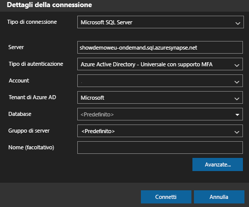
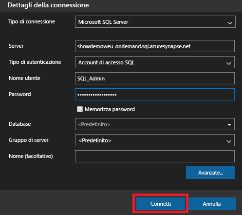
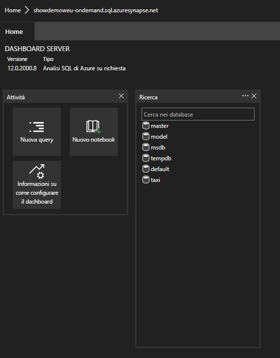
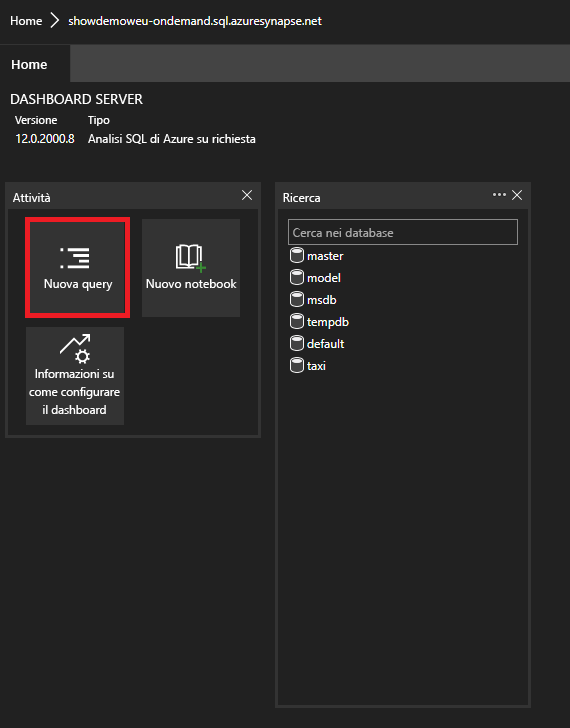

# <a name="connect-to-synapse-sql-with-azure-data-studio"></a>Connettersi a Synapse SQL con Azure Data Studio

> [!div class="op_single_selector"]
>
> * [Azure Data Studio](get-started-azure-data-studio.md)
> * [Power BI](get-started-power-bi-professional.md)
> * [Visual Studio](../sql-data-warehouse/sql-data-warehouse-query-visual-studio.md?toc=/azure/synapse-analytics/toc.json&bc=/azure/synapse-analytics/breadcrumb/toc.json)
> * [sqlcmd](get-started-connect-sqlcmd.md)
> * [SSMS](get-started-ssms.md)

È possibile [usare](/sql/azure-data-studio/download-azure-data-studio?view=azure-sqldw-latest&preserve-view=true) Azure Data Studio per connettersi ed eseguire query Synapse SQL in Azure Synapse Analytics. 

## <a name="connect"></a>Connessione

Per connettersi a Synapse SQL, aprire Azure Data Studio e selezionare **Nuova connessione**.


Scegliere **Microsoft SQL Server** per **Tipo di connessione**.

Per la connessione sono necessari i parametri seguenti:

* **Server:** server nel formato `<Azure Synapse workspace name>`-ondemand.sql.azuresynapse.net
* **Database:** Nome database

> [!NOTE]
> Se si preferisce usare il **pool SQL serverless**, l'URL sarà simile al seguente:
>
> - `<Azure Synapse workspace name>`-ondemand.sql.azuresynapse.net.
>
> Se si preferisce usare il **pool SQL dedicato**, l'URL sarà simile al seguente:
>
> - `<Azure Synapse workspace name>`.sql.azuresynapse.net

Scegliere **Autenticazione di Windows**, **Azure Active Directory** o **Account di accesso SQL** per **Tipo di autenticazione**.

Per usare **Account di accesso SQL** come tipo di autenticazione, aggiungere i parametri nome utente/password:

* **Utente:** utente del server nel formato `<User>`
* **Password:** password associata all'utente

Per usare Azure Active Directory, è necessario scegliere il tipo di autenticazione necessario.



Lo screenshot seguente mostra l'opzione **Dettagli connessione** per **Autenticazione di Windows**:


Lo screenshot seguente mostra l'opzione **Dettagli connessione** per **Account di accesso SQL**:



Dopo aver effettuato l'accesso, verrà visualizzato un dashboard simile a questo: 

## <a name="query"></a>Query

Dopo aver stabilito la connessione, è possibile eseguire possibile eseguire query su Synapse SQL usando le istruzioni [Transact-SQL](/sql/t-sql/language-reference?view=azure-sqldw-latest&preserve-view=true) (T-SQL) supportate nell'istanza. Per iniziare, selezionare **Nuova query** nella vista del dashboard.



È ad esempio possibile usare l'istruzione Transact-SQL seguente per [eseguire query su file Parquet](query-parquet-files.md) con il pool SQL serverless:

```sql
SELECT COUNT(*)
FROM  
OPENROWSET(
    BULK 'https://azureopendatastorage.blob.core.windows.net/censusdatacontainer/release/us_population_county/year=20*/*.parquet',
    FORMAT='PARQUET'
)
```
## <a name="next-steps"></a>Passaggi successivi 
Esplorare altri modi per connettersi a Synapse SQL: 

- [SSMS](get-started-ssms.md)
- [Power BI](get-started-power-bi-professional.md)
- [Visual Studio](../sql-data-warehouse/sql-data-warehouse-query-visual-studio.md?toc=/azure/synapse-analytics/toc.json&bc=/azure/synapse-analytics/breadcrumb/toc.json)
- [sqlcmd](get-started-connect-sqlcmd.md)

Per altre informazioni, vedere [Usare Azure Data Studio per connettersi ed eseguire una query sui dati con un pool SQL dedicato in Azure Synapse Analytics](/sql/azure-data-studio/quickstart-sql-dw).
