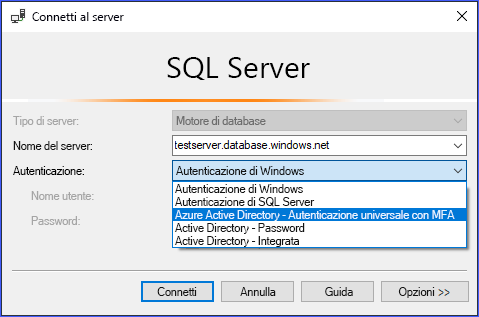
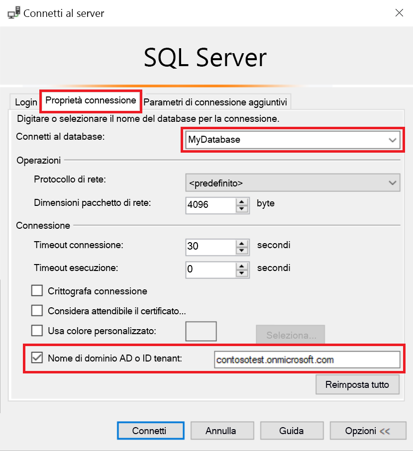
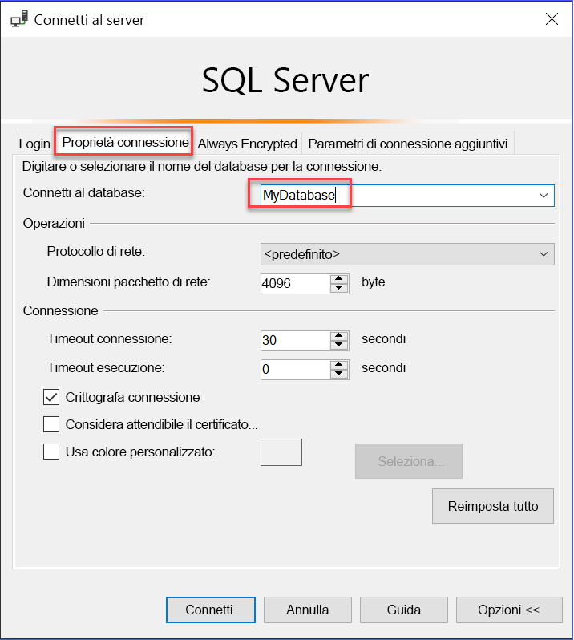

# Usare l'autenticazione di AAD a più fattori con Synapse SQL (supporto di SSMS per MFA)

Synapse SQL supporta le connessioni da SQL Server Management Studio (SSMS) tramite *autenticazione universale di Active Directory*. 

Questo articolo illustra le differenze tra le varie opzioni di autenticazione, oltre alle limitazioni associate all'uso dell'autenticazione universale. 

**Scaricare la versione più recente di SSMS**: nel computer client scaricare la versione più recente di SSMS da [Scaricare SQL Server Management Studio (SSMS)](/sql/ssms/download-sql-server-management-studio-ssms?view=azure-sqldw-latest&preserve-view=true).

Per tutte le funzionalità descritte in questo articolo, usare almeno la versione 17.2 di luglio 2017.  La finestra di dialogo di connessione più recente dovrebbe avere un aspetto simile al seguente:

  

## Le cinque opzioni di autenticazione  

L'autenticazione universale di Active Directory supporta due metodi di autenticazione non interattivi, ovvero
    - `Active Directory - Password` e
    - `Active Directory - Integrated` e

Sono disponibili anche due modelli di autenticazione non interattiva, che possono essere usati in molte applicazioni diverse (ADO.NET, JDCB, ODC e così via). Questi due metodi non aprono mai finestre di dialogo popup:

- `Active Directory - Password`
- `Active Directory - Integrated`

Il metodo interattivo è quello che supporta anche l'autenticazione a più fattori (MFA) di Azure AD:

- `Active Directory - Universal with MFA`

Azure AD MFA consente di proteggere l'accesso ai dati e alle applicazioni dell'utente, garantendo al tempo stesso agli utenti una procedura di accesso semplice. Offre funzionalità avanzate di autenticazione con una serie di semplici opzioni di verifica, tra cui telefonata, SMS, smart card con pin o notifica tramite app per dispositivi mobili, in modo che ogni utente possa scegliere il metodo che preferisce. La convalida di MFA interattiva con Azure AD può avvenire attraverso una finestra popup.

Per una descrizione di Multi-Factor Authentication (autenticazione a più fattori), consultare [Multi-Factor Authentication](../../active-directory/authentication//concept-mfa-howitworks.md).

### Parametro nome di dominio o ID tenant di Azure AD

A partire dalla [versione 17 di SSMS](/sql/ssms/download-sql-server-management-studio-ssms?view=azure-sqldw-latest&preserve-view=true), gli utenti che vengono importati come utenti guest nell'istanza corrente di Active Directory da altre istanze di Azure Active Directory possono specificare il nome di dominio o l'ID tenant di Azure AD al momento della connessione. 

Gli utenti guest includono quelli invitati da altre istanze di Azure AD, gli account Microsoft, ad esempio outlook.com, hotmail.com, live.com, o altri account come gmail.com. Queste informazioni consentono all'**autenticazione universale di Active Directory con MFA** di identificare l'autorità di autenticazione corretta. Questa opzione è necessaria anche per supportare gli account Microsoft (MSA), ad esempio outlook.com, hotmail.com e live.com, o altri account non MSA. 

Tutti gli utenti che desiderano essere autenticati usando l'autenticazione universale devono immettere il nome di dominio o l'ID tenant di AD Azure. Questo parametro rappresenta il nome di dominio/ID tenant di Azure AD a cui è collegato il server di Azure. 

Se ad esempio il server di Azure è associato al dominio di Azure AD `contosotest.onmicrosoft.com` in cui l'utente `joe@contosodev.onmicrosoft.com` è ospitato come utente importato dal dominio di Azure AD `contosodev.onmicrosoft.com`, il nome del dominio richiesto per l'autenticazione di questo utente è `contosotest.onmicrosoft.com`. 

Se l'utente è un utente nativo di Azure AD collegato al server di Azure e non è un account MSA, non è necessario usare l'ID tenant o il nome di dominio. 

Per specificare il parametro (a partire dalla versione 17.2 di SSMS), nella finestra di dialogo **Connetti al database** selezionare l'autenticazione **Active Directory - Universale con supporto MFA**, selezionare **Opzioni**, immettere un nome nella casella **Nome utente** e quindi selezionare la scheda **Proprietà connessione**. 

Selezionare la casella **ID tenant o nome di dominio AD** e specificare l'autorità di autenticazione, ad esempio il nome di dominio (**contosotest.onmicrosoft.com**) o il GUID dell'ID tenant.  

   

Se si esegue SSMS 18.x o versione successiva, il nome di dominio di AD o l'ID tenant non è più necessario per gli utenti guest, perché in queste versioni viene riconosciuto automaticamente.

   

### Supporto per Azure AD business-to-business   
Gli utenti di Azure AD supportati come guest per gli scenari di Azure AD B2B (vedere [Informazioni su Collaborazione B2B di Azure AD](../../active-directory/external-identities/what-is-b2b.md?bc=%2fazure%2fsynapse-analytics%2fbreadcrumb%2ftoc.json&toc=%2fazure%2fsynapse-analytics%2ftoc.json)) possono connettersi Synapse SQL solo come membri di un gruppo creato nell'istanza corrente di Azure AD e mappato manualmente tramite l'istruzione Transact-SQL `CREATE USER` in un determinato database. 

Se ad esempio `steve@gmail.com` viene invitato in `contosotest` di Azure AD (con dominio di Azure AD `contosotest.onmicrosoft.com`), è necessario creare un gruppo, ad esempio `usergroup`, nell'istanza di Azure AD che contiene il membro `steve@gmail.com`. Questo gruppo deve quindi essere creato per un database specifico, ovvero MyDatabase, dall'amministratore del database SQL o dal DBO di Azure AD tramite un'istruzione Transact-SQL `CREATE USER [usergroup] FROM EXTERNAL PROVIDER`. 

Dopo che è stato creato l'utente del database, l'utente `steve@gmail.com` può accedere a `MyDatabase` usando l'opzione di autenticazione `Active Directory – Universal with MFA support` di SSMS. 

Per impostazione predefinita, al gruppo di utenti è concessa solo l'autorizzazione di connessione. Per qualsiasi altro tipo di accesso ai dati l'autorizzazione deve essere concessa secondo la normale procedura. 

In qualità di utente guest, `steve@gmail.com` deve selezionare la casella e aggiungere il nome di dominio AD `contosotest.onmicrosoft.com` nella finestra di dialogo **Proprietà connessione** di SSMS. L'opzione **ID tenant o nome di dominio AD** è supportata solo per le opzioni di connessione Universale con supporto MFA. Negli altri casi non è disponibile.

## Limitazioni dell'autenticazione universale per Synapse SQL

- SSMS e SqlPackage.exe sono gli unici strumenti attualmente abilitati per MFA tramite l'autenticazione universale di Active Directory.
- La versione 17.2 di SSMS supporta l'accesso simultaneo di più utenti tramite l'autenticazione universale con supporto MFA. Nelle versioni 17.0 e 17.1 un solo account di Azure Active Directory può accedere a un'istanza di SSMS mediante l'autenticazione universale. Per accedere come un altro account di Azure AD, è necessario utilizzare un'altra istanza di SSMS. Questa restrizione è limitata all'autenticazione universale di Active Directory; è possibile accedere a server differenti tramite l'autenticazione con password di Active Directory, l'autenticazione integrata di Active Directory o autenticazione SQL Server.
- SSMS supporta l'autenticazione universale di Active Directory per la visualizzazione di Esplora oggetti, Editor di query e Archivio query.
- La versione 17.2 di SSMS fornisce il supporto di DacFx Wizard per le funzioni di esportazione, estrazione e distribuzione dei dati del database. Quando un utente ha eseguito l'autenticazione mediante la finestra di dialogo iniziale usando l'autenticazione universale, DacFx Wizard funziona esattamente come per tutti gli altri metodi di autenticazione.
- Progettazione tabelle di SSMS non supporta l'autenticazione universale.
- Non ci sono requisiti software aggiuntivi per l'autenticazione universale di Active Directory ad eccezione del fatto che si utilizzi una versione supportata di SSMS.  
- La versione di Active Directory Authentication Library (ADAL) per l'autenticazione universale è stata aggiornata alla versione rilasciata disponibile più recente, ovvero ADAL.dll 3.13.9. Vedere [Active Directory Authentication Library 3.14.1](https://www.nuget.org/packages/Microsoft.IdentityModel.Clients.ActiveDirectory/).  

## Passaggi successivi
Per altre informazioni, vedere l'articolo [Connettersi a Synapse SQL con SQL Server Management Studio](get-started-ssms.md).