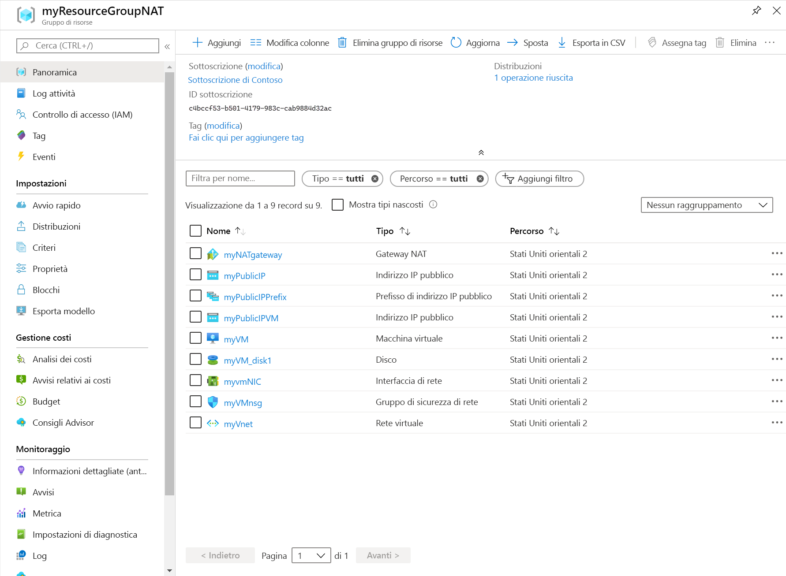

# <a name="quickstart-create-a-nat-gateway---arm-template"></a>Avvio rapido: Creare un gateway NAT - Modello di Azure Resource Manager

Introduzione a NAT di rete virtuale con l'uso di un modello di Azure Resource Manager (modello di Resource Manager). Questo modello distribuisce una rete virtuale, una risorsa gateway NAT e una macchina virtuale Ubuntu. La macchina virtuale Ubuntu viene distribuita in una subnet associata alla risorsa gateway NAT.

[!INCLUDE [About Azure Resource Manager](../../includes/resource-manager-quickstart-introduction.md)]

Se l'ambiente soddisfa i prerequisiti e si ha familiarità con l'uso dei modelli di Resource Manager, selezionare il pulsante **Distribuisci in Azure**. Il modello verrà aperto nel portale di Azure.

[](https://portal.azure.com/#create/Microsoft.Template/uri/https%3A%2F%2Fraw.githubusercontent.com%2FAzure%2Fazure-quickstart-templates%2Fmaster%2F101-nat-gateway-1-vm%2Fazuredeploy.json)

## <a name="prerequisites"></a>Prerequisiti

Se non si ha una sottoscrizione di Azure, creare un [account gratuito](https://azure.microsoft.com/free/?WT.mc_id=A261C142F) prima di iniziare.

## <a name="review-the-template"></a>Rivedere il modello

Il modello usato in questo avvio rapido proviene dai [modelli di avvio rapido di Azure](https://azure.microsoft.com/resources/templates/101-nat-gateway-1-vm).

Questo modello è configurato per la creazione di uno degli elementi seguenti:

* Rete virtuale
* Risorsa gateway NAT
* Macchina virtuale Ubuntu

La macchina virtuale Ubuntu viene distribuita in una subnet associata alla risorsa gateway NAT.

:::code language="json" source="~/quickstart-templates/101-nat-gateway-1-vm/azuredeploy.json":::

Nel modello sono definite nove risorse di Azure:

* **[Microsoft.Network/networkSecurityGroups](/azure/templates/microsoft.network/networksecuritygroups)** : Crea un gruppo di sicurezza di rete.
* **[Microsoft.Network/networkSecurityGroups/securityRules](/azure/templates/microsoft.network/networksecuritygroups/securityrules)** : crea una regola di sicurezza.
* **[Microsoft.Network/publicIPAddresses](/azure/templates/microsoft.network/publicipaddresses)** : Crea un indirizzo IP pubblico.
* **[Microsoft.Network/publicIPPrefixes](/azure/templates/microsoft.network/publicipprefixes)** : crea un prefisso IP pubblico.
* **[Microsoft.Compute/virtualMachines](/azure/templates/Microsoft.Compute/virtualMachines)** : Consente di creare una macchina virtuale.
* **[Microsoft.Network/virtualNetworks](/azure/templates/microsoft.network/virtualnetworks)** : Crea una rete virtuale.
* **[Microsoft.Network/natGateways](/azure/templates/microsoft.network/natgateways)** : creare una risorsa gateway NAT.
* **[Microsoft.Network/virtualNetworks/subnets](/azure/templates/microsoft.network/virtualnetworks/subnets)** : crea una subnet della rete virtuale.
* **[Microsoft.Network/networkinterfaces](/azure/templates/microsoft.network/networkinterfaces)** : Crea un'interfaccia di rete.

## <a name="deploy-the-template"></a>Distribuire il modello

**Interfaccia della riga di comando di Azure**

```azurecli-interactive
read -p "Enter the location (i.e. westcentralus): " location
resourceGroupName="myResourceGroupNAT"
templateUri="https://raw.githubusercontent.com/Azure/azure-quickstart-templates/master/101-nat-gateway-1-vm/azuredeploy.json"

az group create \
--name $resourceGroupName \
--location $location

az deployment group create \
--resource-group $resourceGroupName \
--template-uri  $templateUri
```

**Azure PowerShell**

```azurepowershell-interactive
$location = Read-Host -Prompt "Enter the location (i.e. westcentralus)"
$templateUri = "https://raw.githubusercontent.com/Azure/azure-quickstart-templates/master/101-nat-gateway-1-vm/azuredeploy.json"

$resourceGroupName = "myResourceGroupNAT"

New-AzResourceGroup -Name $resourceGroupName -Location $location
New-AzResourceGroupDeployment -ResourceGroupName $resourceGroupName -TemplateUri $templateUri
```

**Azure portal**

[](https://portal.azure.com/#create/Microsoft.Template/uri/https%3A%2F%2Fraw.githubusercontent.com%2FAzure%2Fazure-quickstart-templates%2Fmaster%2F101-nat-gateway-1-vm%2Fazuredeploy.json)

## <a name="review-deployed-resources"></a>Esaminare le risorse distribuite

1. Accedere al [portale di Azure](https://portal.azure.com).

1. Selezionare **Gruppi di risorse** nel riquadro sinistro.

1. Selezionare il gruppo di risorse creato nella sezione precedente. Il nome del gruppo di risorse predefinito è **myResourceGroupNAT**

1. Verificare che le risorse seguenti siano state create nel gruppo di risorse:

    

## <a name="clean-up-resources"></a>Pulire le risorse

**Interfaccia della riga di comando di Azure**

Quando il gruppo di risorse e tutte le risorse al suo interno non sono più necessari, usare il comando [az group delete](/cli/azure/group#az-group-delete) per rimuoverli.

```azurecli-interactive
  az group delete \
    --name myResourceGroupNAT
```

**Azure PowerShell**

Quando il gruppo di risorse e tutte le risorse al suo interno non sono più necessari, usare il comando [Remove-AzResourceGroup](/powershell/module/az.resources/remove-azresourcegroup) per rimuoverli.

```azurepowershell-interactive
Remove-AzResourceGroup -Name myResourceGroupNAT
```

**Azure portal**

Quando non sono più necessari, eliminare il gruppo di risorse, il gateway NAT e tutte le risorse correlate. Selezionare il gruppo di risorse **myResourceGroupNAT** che contiene il gateway NAT e quindi fare clic su **Elimina**.

## <a name="next-steps"></a>Passaggi successivi

In questo argomento di avvio rapido sono stati creati questi componenti:

* Risorsa gateway NAT
* Rete virtuale
* Macchina virtuale Ubuntu

La macchina virtuale viene distribuita in una subnet della rete virtuale associata al gateway NAT.

Per altre informazioni su NAT di rete virtuale e Azure Resource Manager, continuare con gli articoli seguenti.

* Vedere [Panoramica di NAT di rete virtuale](nat-overview.md)
* Vedere [Risorsa gateway NAT](nat-gateway-resource.md)
* Vedere altre informazioni su [Azure Resource Manager](../azure-resource-manager/management/overview.md)
