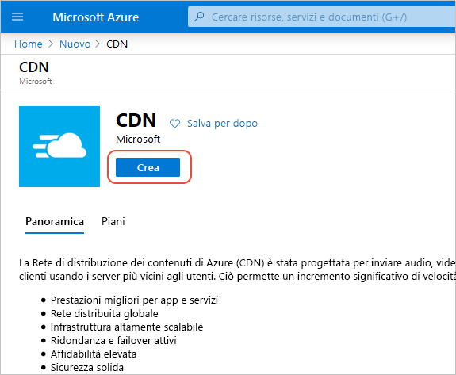

## Creare un nuovo profilo di rete CDN

Un profilo di rete CDN è un contenitore per endpoint della rete CDN e specifica un piano tariffario.

1. In alto a sinistra nel portale di Azure selezionare **Crea una risorsa**. Viene visualizzato il riquadro **Nuovo**.
   
1. Cercare e selezionare **Rete CDN**, quindi selezionare **Crea**:
   
    

    Viene visualizzato il riquadro **Profilo rete CDN**.

1. Immettere i valori seguenti:
   
    | Impostazione  | Valore |
    | -------- | ----- |
    | **Nome** | Immettere *cdn-profile-123* come nome del profilo. |
    | **Sottoscrizione** | Selezionare una sottoscrizione di Azure dall'elenco a discesa. |
    | **Gruppo di risorse** | Selezionare **Crea nuovo** e immettere *CDNQuickstart-rg* come nome del gruppo di risorse oppure selezionare **Usa esistente** e scegliere *CDNQuickstart-rg* se il gruppo è già disponibile. | 
    | **Località del gruppo di risorse** | Selezionare una località vicina nell'elenco a discesa. |
    | **Piano tariffario** | Selezionare l'opzione **Akamai standard** nell'elenco a discesa. Il tempo di distribuzione per il livello Akamai è di circa un minuto. Il livello Microsoft richiede circa 10 minuti e il livello Verizon circa 30 minuti. |
    | **Crea un nuovo endpoint rete CDN ora** | Non selezionare alcun elemento. |  
   
    

1. Selezionare **Crea** per creare il profilo.

