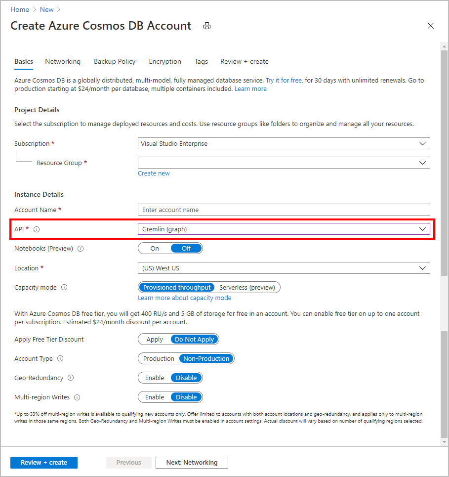

1. In una nuova finestra del browser accedere al [portale di Azure](https://portal.azure.com/).

2. Nel menu a sinistra selezionare **Crea una risorsa**.
   
   
   
3. Nella pagina **Nuovo** selezionare **Database** > **Azure Cosmos DB**.
   
   
   
   > [!TIP]
   > Se Azure Cosmos DB non è visibile nell'elenco, è sufficiente digitarlo nella casella di ricerca nella parte superiore della pagina e quindi premere _Invio_. 

3. Nella pagina **Crea account Azure Cosmos DB** immettere le impostazioni per il nuovo account Azure Cosmos DB. 
 
    Impostazione|Valore|Descrizione
    ---|---|---
    Subscription|Sottoscrizione in uso|Selezionare la sottoscrizione di Azure da usare per l'account Azure Cosmos DB. 
    Gruppo di risorse|Create new  Immettere quindi lo stesso nome specificato nome dell'account.|Selezionare **Crea nuovo**. Immettere quindi il nome di un nuovo gruppo di risorse per l'account. Per semplicità, usare lo stesso nome usato come nome dell'account Azure Cosmos DB. 
    Nome account|Immettere un nome univoco|Immettere un nome univoco per identificare l'account Azure Cosmos DB. L'URI dell'account sarà *gremlin.cosmos.azure.com* e verrà aggiunto al nome dell'account univoco.  Il nome dell'account può contenere solo lettere minuscole, numeri e trattini e deve avere una lunghezza compresa tra 3 e 31 caratteri.
    API|Gremlin (grafo)|L'API determina il tipo di account da creare. Azure Cosmos DB offre cinque API: Core (SQL) per i database di documenti, Gremlin per i database a grafo, MongoDB per i database di documenti, Tabella di Azure e Cassandra. È necessario creare un account separato per ogni API.   Selezionare **Gremlin (grafo)** perché in questa guida di avvio rapido si crea una tabella che funziona con l'API Gremlin.   [Altre informazioni sull'API Gremlin](../articles/cosmos-db/graph-introduction.md).|
    Location|Selezionare l'area più vicina agli utenti|Selezionare una posizione geografica in cui ospitare l'account Azure Cosmos DB. Usare la località più vicina agli utenti per offrire loro la massima velocità di accesso ai dati.
    Modalità di capacità|Provisioning velocità effettiva o Serverless|Selezionare **Provisioning velocità effettiva** per creare un account in modalità [Provisioning velocità effettiva](../articles/cosmos-db/set-throughput.md). Selezionare **Serverless** per creare un account in modalità [Serverless](../articles/cosmos-db/serverless.md).

    Selezionare **Rivedi+Crea**. È possibile ignorare le sezioni **Rete** e **Tag**. 

    

4. La creazione dell'account richiede alcuni minuti. Attendere che nel portale venga visualizzata la pagina **Complimenti, l'account Azure Cosmos DB è stato creato**.
   
   

