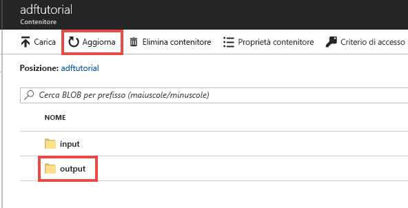

## <a name="review-deployed-resources"></a>Esaminare le risorse distribuite

La pipeline crea automaticamente la cartella di output nel contenitore BLOB adftutorial, quindi copia il file emp.txt dalla cartella di input a quella di output. 

1. Nella pagina del contenitore **adftutorial** del portale di Azure selezionare **Aggiorna** per visualizzare la cartella di output. 
    
    

2. Nell'elenco delle cartelle selezionare **output**. 

3. Verificare che **emp.txt** venga copiato nella cartella di output. 

    

## <a name="clean-up-resources"></a>Pulire le risorse

È possibile eseguire la pulizia delle risorse create nel corso della guida introduttiva in due modi. Si può eliminare il [gruppo di risorse di Azure](../articles/azure-resource-manager/management/overview.md), in modo da includere tutte le risorse del gruppo. Se invece si vogliono mantenere intatte le altre risorse, eliminare solo la data factory creata in questa esercitazione.

Se si elimina un gruppo di risorse, vengono eliminate tutte le risorse in esso contenute, incluse le data factory. Eseguire il comando seguente per eliminare l'intero gruppo di risorse: 

```powershell
Remove-AzResourceGroup -ResourceGroupName $resourcegroupname
```

> [!Note]
> L'eliminazione di un gruppo di risorse può richiedere tempo. Attendere il completamento del processo.

Per eliminare solo la data factory e non l'intero gruppo di risorse, eseguire il comando seguente: 

```powershell
Remove-AzDataFactoryV2 -Name $dataFactoryName -ResourceGroupName $resourceGroupName
```