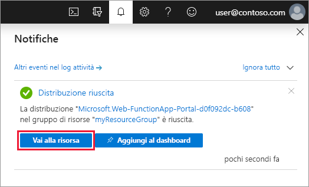

1. Nel menu del portale di Azure o dalla pagina **Home** selezionare **Crea una risorsa**.

1. Nella pagina **Nuovo**, selezionare **Calcolo** > **App per le funzioni**.

1. Nella pagina **Informazioni di base** usare le impostazioni dell'app per le funzioni specificate nella tabella seguente.

    | Impostazione      | Valore consigliato  | Descrizione |
    | ------------ | ---------------- | ----------- |
    | **Sottoscrizione** | Sottoscrizione in uso | Sottoscrizione in cui viene creata questa nuova app per le funzioni. |
    | **[Gruppo di risorse](../articles/azure-resource-manager/management/overview.md)** |  *myResourceGroup* | Nome del nuovo gruppo di risorse in cui creare l'app per le funzioni. |
    | **Nome dell'app per le funzioni** | Nome globalmente univoco | Nome che identifica la nuova app per le funzioni. I caratteri validi sono `a-z` (senza distinzione tra maiuscole e minuscole), `0-9` e `-`.  |
    |**Pubblica**| Codice | Opzione per la pubblicazione di file di codice o di un contenitore Docker. |
    | **Stack di runtime** | Lingua preferita | Scegliere un runtime che supporti il linguaggio di programmazione della funzione preferito. La modifica nel portale è disponibile solo per gli script JavaScript, PowerShell, TypeScript e C#. Le funzioni libreria di classi C#, Java e Python devono essere [sviluppate localmente](../articles/azure-functions/functions-develop-local.md#local-development-environments).  |
    |**Versione**| Numero di versione | Scegliere la versione del runtime installato. |
    |**Area**| Area preferita | Scegliere un'[area](https://azure.microsoft.com/regions/) nelle vicinanze o vicino ad altri servizi a cui accedono le funzioni. |

1. Selezionare **Avanti: Hosting**. Nella pagina **Hosting** immettere le impostazioni seguenti.

    | Impostazione      | Valore consigliato  | Descrizione |
    | ------------ | ---------------- | ----------- |
    | **[Account di archiviazione](../articles/storage/common/storage-account-create.md)** |  Nome globalmente univoco |  Creare un account di archiviazione usato dall'app per le funzioni. I nomi degli account di archiviazione devono avere una lunghezza compresa tra 3 e 24 caratteri e possono contenere solo numeri e lettere minuscole. È anche possibile usare un account esistente, che deve soddisfare i [requisiti dell'account di archiviazione](../articles/azure-functions/storage-considerations.md#storage-account-requirements). |
    |**Sistema operativo**| Windows | Viene preselezionato automaticamente un sistema operativo in base alla selezione dello stack di runtime, ma, se necessario, è possibile modificare l'impostazione. La modifica all'interno del portale è supportata solo in Windows. |
    | **[Piano](../articles/azure-functions/functions-scale.md)** | **Consumo (serverless)** | Piano di hosting che definisce come vengono allocate le risorse all'app per le funzioni. Nel **piano a consumo** predefinito le risorse vengono aggiunte dinamicamente in base alle esigenze delle funzioni. In questo hosting [serverless](https://azure.microsoft.com/overview/serverless-computing/) si paga solo per il periodo in cui le funzioni sono in esecuzione. In caso di esecuzione in un piano di servizio app, è necessario gestire il [ridimensionamento dell'app per le funzioni](../articles/azure-functions/functions-scale.md).  |

1. Selezionare **Avanti: Monitoraggio**. Nella pagina **Monitoraggio** immettere le impostazioni seguenti.

    | Impostazione      | Valore consigliato  | Descrizione |
    | ------------ | ---------------- | ----------- |
    | **[Application Insights](../articles/azure-functions/functions-monitoring.md)** | Predefinito | Crea una risorsa di Application Insights con lo stesso *nome di app* nell'area più vicina supportata. Espandendo questa impostazione o selezionando **Crea nuovo**, è possibile cambiare il nome Application Insights oppure scegliere una regione diversa in un'[area geografica di Azure](https://azure.microsoft.com/global-infrastructure/geographies/) in cui archiviare i dati. |

1. Selezionare **Rivedi e crea** per rivedere le selezioni effettuate per la configurazione dell'app.

1. Nella pagina **Rivedi e crea** esaminare le impostazioni e quindi selezionare **Crea** per effettuare il provisioning e distribuire l'app per le funzioni.

1. Selezionare l'icona **Notifiche** nell'angolo superiore destro del portale e attendere che venga visualizzato il messaggio **La distribuzione è riuscita**.

1. Selezionare **Vai alla risorsa** per visualizzare la nuova app per le funzioni. È anche possibile selezionare **Aggiungi al dashboard**. In questo modo è più facile tornare in questa risorsa di app per le funzioni dal dashboard.

    
