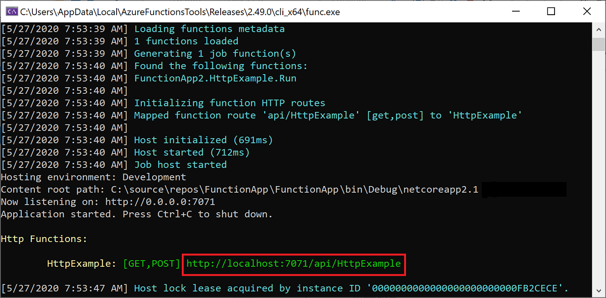

1. Per eseguire la funzione, premere <kbd>F5</kbd> in Visual Studio. Potrebbe essere necessario abilitare un'eccezione del firewall in modo che gli strumenti possano gestire le richieste HTTP. I livelli di autorizzazione non vengono mai applicati quando si esegue una funzione localmente.

2. Copiare l'URL della funzione dall'output di runtime di Funzioni di Azure.

    

3. Incollare l'URL per la richiesta HTTP nella barra degli indirizzi del browser. Aggiungere la stringa di query `?name=<YOUR_NAME>` a questo URL ed eseguire la richiesta. L'immagine seguente visualizza la risposta restituita dalla funzione nel browser alla richiesta GET locale: 

    

4. Per arrestare il debug, premere <kbd>MAIUSC</kbd> + <kbd>F5</kbd> in Visual Studio.
