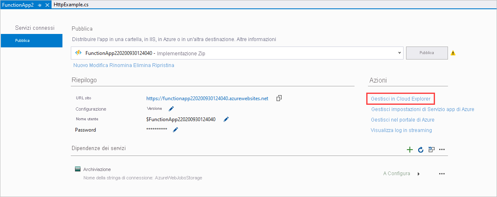

1. In **Esplora soluzioni** fare clic con il pulsante destro del mouse sul progetto e scegliere **Pubblica**.

2. In **Selezionare una destinazione di pubblicazione** usare le opzioni di pubblicazione specificate nella tabella seguente: 

    | Opzione      | Descrizione                                |
    | ------------ |  -------------------------------------------------- |
    | **App per le funzioni di Azure** | Consente di creare una app per le funzioni in un ambiente cloud di Azure. | 
    | **Crea nuovo** | Viene creata in Azure una nuova app per le funzioni, con le risorse correlate.  Se si sceglie **Seleziona esistente**, tutti i file nell'app per le funzioni esistente in Azure vengono sovrascritti da file del progetto locale. Usare questa opzione solo quando si ripubblicano gli aggiornamenti in un'app per le funzioni esistente. |
    | **Esegui da file di pacchetto** | L'app per le funzioni viene distribuita usando la [distribuzione ZIP](../articles/azure-functions/functions-deployment-technologies.md#zip-deploy) con la modalità [esecuzione da pacchetto](../articles/azure-functions/run-functions-from-deployment-package.md) abilitata. Questa distribuzione, che garantisce migliori prestazioni, è quella consigliata per eseguire le funzioni.  Se non si usa questa opzione, assicurarsi di arrestare l'esecuzione in locale del progetto di app per le funzioni prima della pubblicazione in Azure. |

    

3. Selezionare **Pubblica**. Se non è già stato effettuato l'accesso all'account Azure da Visual Studio, selezionare **Accedi**. È anche possibile creare un account Azure gratuito.

4. In **Servizio app di Azure: Crea nuovo** usare i valori specificati nella tabella seguente:

    | Impostazione      | valore  | Descrizione                                |
    | ------------ |  ------- | -------------------------------------------------- |
    | **Nome** | Nome globalmente univoco | Nome che identifica in modo univoco la nuova app per le funzioni. Accettare questo nome o immetterne uno nuovo. I caratteri validi sono `a-z`, `0-9` e `-`. |
    | **Sottoscrizione** | Sottoscrizione in uso | Sottoscrizione di Azure da usare. Accettare questa sottoscrizione o selezionarne una nuova dall'elenco a discesa. |
    | **[Gruppo di risorse](../articles/azure-resource-manager/management/overview.md)** | Nome del gruppo di risorse |  Gruppo di risorse in cui creare l'app per le funzioni. Selezionare un gruppo di risorse esistente dall'elenco a discesa oppure scegliere **Nuovo** per creare un nuovo gruppo di risorse.|
    | **[Piano di hosting](../articles/azure-functions/functions-scale.md)** | Nome del piano di hosting | Selezionare **Nuovo** per configurare un piano serverless. Assicurarsi di scegliere **A consumo** in **Dimensioni**. Quando si pubblica il progetto in un'app per le funzioni eseguita in un [piano a consumo](../articles/azure-functions/functions-scale.md#consumption-plan), vengono addebitati solo i costi relativi alle esecuzioni dell'app per le funzioni. Altri piani di hosting comportano costi più elevati. Se si esegue un piano diverso da **Consumo**, è necessario gestire il [ridimensionamento dell'app per le funzioni](../articles/azure-functions/functions-scale.md). Scegliere una **località** in un'[area](https://azure.microsoft.com/regions/) nelle vicinanze o vicino ad altri servizi a cui accedono le funzioni.  |
    | **[Archiviazione di Azure](../articles/storage/common/storage-account-create.md)** | Account di archiviazione per utilizzo generico | Per il runtime di Funzioni è richiesto un account di archiviazione di Azure. Selezionare **Nuovo** per configurare un account di archiviazione per utilizzo generico. È anche possibile scegliere un account esistente che soddisfi i [requisiti dell'account di archiviazione](../articles/azure-functions/functions-scale.md#storage-account-requirements).  |

    

5. Selezionare **Crea** per creare un'app per le funzioni e le relative risorse correlate in Azure con queste impostazioni e distribuire il codice del progetto per le funzioni. 

6. Selezionare Pubblica e al termine della distribuzione prendere nota del valore di **URL sito**, ovvero l'indirizzo dell'app per le funzioni in Azure.

    
