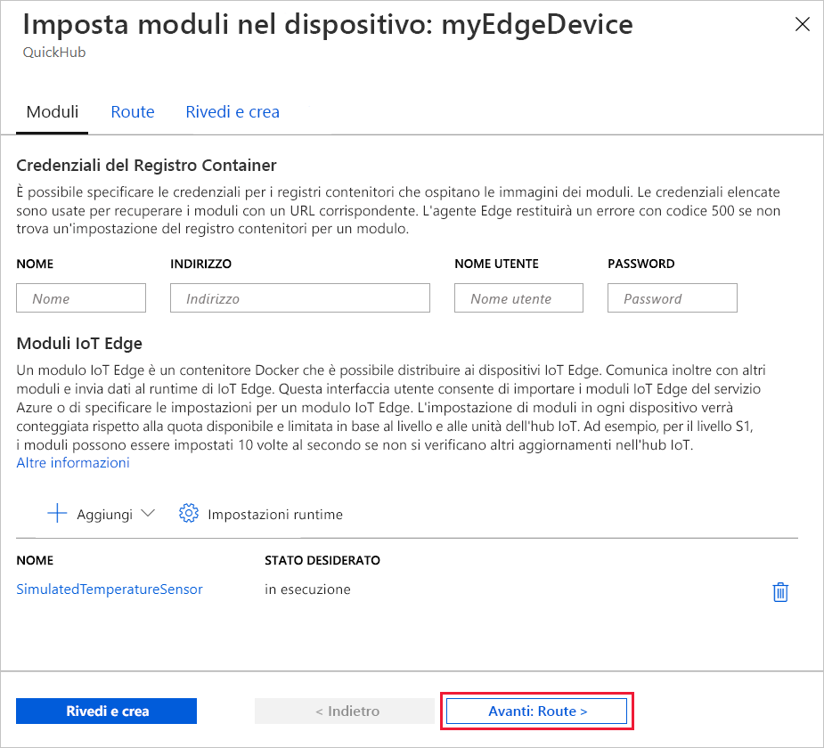
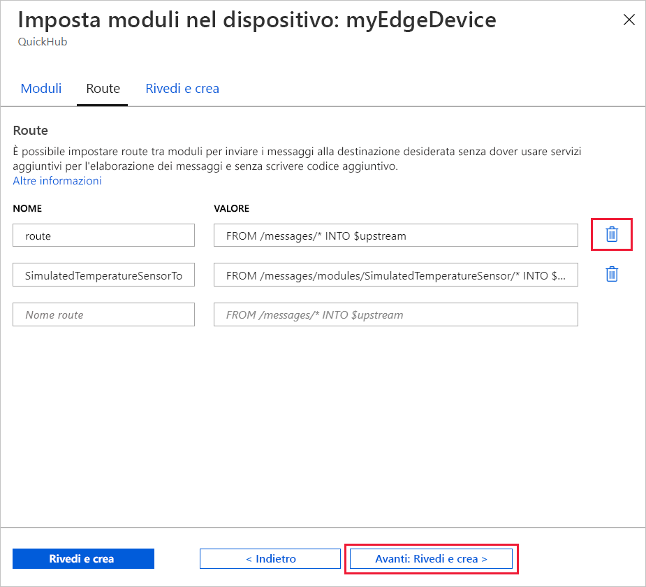

Una delle funzionalità principali di Azure IoT Edge consiste nel distribuire il codice nei dispositivi IoT Edge dal cloud. I *moduli IoT Edge* sono pacchetti eseguibili implementati come contenitori. In questa sezione verrà distribuito un modulo predefinito dalla [sezione moduli IOT Edge di Azure Marketplace](https://azuremarketplace.microsoft.com/marketplace/apps/category/internet-of-things?page=1&subcategories=iot-edge-modules) direttamente dall'hub Azure.

Questo modulo simula un sensore e invia i dati generati. Si tratta di un codice utile per iniziare a usare IoT Edge, perché è possibile usare i dati simulati per lo sviluppo e i test. Per informazioni specifiche sul funzionamento di questo modulo, è possibile visualizzare il [codice sorgente del sensore temperatura simulato](https://github.com/Azure/iotedge/blob/027a509549a248647ed41ca7fe1dc508771c8123/edge-modules/SimulatedTemperatureSensor/src/Program.cs).

Per distribuire il primo modulo da Azure Marketplace, seguire questa procedura.

1. Accedere al [portale di Azure](https://portal.azure.com) e passare all'hub Internet.

1. Dal menu a sinistra, in **gestione automatica dispositivi**, selezionare **IOT Edge**.

1. Selezionare l'ID dispositivo del dispositivo di destinazione dall'elenco di dispositivi.

1. Sulla barra superiore selezionare **Imposta moduli**.

   

1. In **moduli IOT Edge** aprire il menu a discesa **Aggiungi** , quindi selezionare **modulo Marketplace**.

   

1. In **IOT Edge Module Marketplace** cercare e selezionare il `Simulated Temperature Sensor` modulo.

   Il modulo viene aggiunto alla sezione moduli IoT Edge con lo stato **in esecuzione** desiderato.

1. Selezionare **Avanti: Route** per continuare con il passaggio successivo della procedura guidata.

   

1. Nella scheda **Route** rimuovere la route predefinita, **Route**, quindi selezionare **Next: Review + create** per passare al passaggio successivo della procedura guidata.

   >[!Note]
   >Le route vengono costruite mediante coppie di nome e valore. In questa pagina verranno visualizzate due route. La route predefinita, **Route**, invia tutti i messaggi all'hub Internet (denominato `$upstream` ). Una seconda route, **SimulatedTemperatureSensorToIoTHub**, è stata creata automaticamente quando è stato aggiunto il modulo da Azure Marketplace. Questa route invia tutti i messaggi dal modulo temperatura simulata all'hub Internet. È possibile eliminare la route predefinita perché in questo caso è ridondante.

   

1. Esaminare il file JSON e quindi selezionare **Crea**. Il file JSON definisce tutti i moduli distribuiti nel dispositivo IoT Edge. Verranno visualizzati il modulo **SimulatedTemperatureSensor** e i due moduli di runtime, **edgeAgent** e **edgeHub**.

   >[!Note]
   >Quando si invia una nuova distribuzione a un dispositivo IoT Edge, non viene eseguito il push di alcun elemento al dispositivo. Al contrario, il dispositivo richiede periodicamente eventuali nuove istruzioni all'hub IoT. Se il dispositivo trova un manifesto della distribuzione aggiornato, usa le informazioni sulla nuova distribuzione per eseguire il pull delle immagini dei moduli dal cloud, quindi avvia l'esecuzione dei moduli in locale. Questo processo può richiedere alcuni minuti.

1. Dopo aver creato i dettagli della distribuzione dei moduli, la procedura guidata torna nella pagina Dettagli dispositivo. Visualizzare lo stato della distribuzione nella scheda **moduli** .

   Verranno visualizzati tre moduli: **$edgeAgent**, **$edgeHub** e **SimulatedTemperatureSensor**. Se uno o più moduli hanno **Sì** IN **specificato nella distribuzione** , ma non sono **segnalati dal dispositivo**, il dispositivo IOT Edge li sta ancora avviando. Attendere alcuni minuti e quindi aggiornare la pagina.

   
