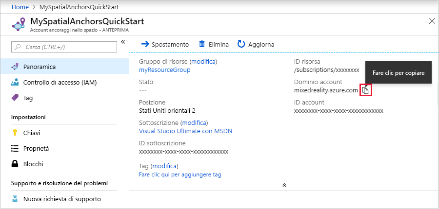

## <a name="create-a-spatial-anchors-resource"></a>Creare una risorsa di Ancoraggi nello spazio

### <a name="portal"></a>[Portale](#tab/azure-portal)

Accedere al <a href="https://portal.azure.com" target="_blank">portale di Azure</a>.

Nel riquadro sinistro selezionare **Crea una risorsa**.

Digitare **Ancoraggi nello spazio** nella casella di ricerca.


Selezionare **Ancoraggi nello spazio**, quindi selezionare **Crea**.

Nel riquadro **Account ancoraggi nello spazio** procedere come segue:

* Immettere un nome di risorsa univoco usando i normali caratteri alfanumerici.
* Selezionare la sottoscrizione a cui collegare la risorsa.
* Creare un gruppo di risorse selezionando **Crea nuovo**. Assegnare al gruppo il nome **myResourceGroup** e quindi selezionare **OK**.

  [!INCLUDE [resource group intro text](resource-group.md)]

* Selezionare un'area in cui inserire la risorsa.
* Selezionare **Nuovo** per iniziare a creare la risorsa.


Dopo aver creato la risorsa, il portale di Azure indica che la distribuzione è stata completata.


Selezionare **Vai alla risorsa**. È ora possibile visualizzare le proprietà della risorsa.

Copiare il valore di **ID account** della risorsa in un editor di testo per un uso successivo.


Copiare anche il valore di **Dominio account** della risorsa in un editor di testo per un uso successivo.



In **Impostazioni** selezionare **Chiave**. Copiare i valori di **Chiave primaria** e **Chiave dell'account** in un editor di testo per un uso successivo.


### <a name="azure-cli"></a>[Interfaccia della riga di comando di Azure](#tab/azure-cli)

Per iniziare, preparare l'ambiente per l'interfaccia della riga di comando di Azure:

[!INCLUDE [azure-cli-prepare-your-environment-no-header.md](azure-cli-prepare-your-environment-no-header.md)]

1. Dopo aver eseguito l'accesso, usare il comando [az account set](/cli/azure/account#az_account_set) per selezionare la sottoscrizione in cui configurare l'account di ancoraggi nello spazio:

   ```azurecli
   az account set --subscription 00000000-0000-0000-0000-000000000000
   ```

1. Eseguire il comando [az group create](/cli/azure/group#az_group_create) per creare un gruppo di risorse o usarne uno esistente:

   ```azurecli
   az group create --name myResourceGroup --location eastus2
   ```

   [!INCLUDE [resource group intro text](resource-group.md)]

   Per visualizzare gli attuali account di ancoraggi nello spazio per un gruppo di risorse, usare il comando [az spatial-anchors-account list](/cli/azure/ext/mixed-reality/spatial-anchors-account#ext_mixed_reality_az_spatial_anchors_account_list):

   ```azurecli
   az spatial-anchors-account list --resource-group myResourceGroup
   ```

   È anche possibile visualizzare gli account di ancoraggi nello spazio per la sottoscrizione:

   ```azurecli
   az spatial-anchors-account list
   ```

1. Eseguire il comando [az spatial-anchors-account create](/cli/azure/ext/mixed-reality/spatial-anchors-account#ext_mixed_reality_az_spatial_anchors_account_create) per creare l'account di ancoraggi nello spazio:

   ```azurecli
   az spatial-anchors-account create --resource-group myResourceGroup --name MySpatialAnchorsQuickStart --location eastus2
   ```

1. Per visualizzare le proprietà delle risorse, usare il comando [az spatial-anchors-account show](/cli/azure/ext/mixed-reality/spatial-anchors-account#ext_mixed_reality_az_spatial_anchors_account_show):

   ```azurecli
   az spatial-anchors-account show --resource-group myResourceGroup --name MySpatialAnchorsQuickStart
   ```

   Copiare i valori di **ID account** e di **Dominio account** della risorsa in un editor di testo per un uso successivo.

1. Eseguire il comando [az spatial-anchors-account key show](/cli/azure/ext/mixed-reality/spatial-anchors-account/key#ext_mixed_reality_az_spatial_anchors_account_key_show) per ottenere le chiavi primaria e secondaria:

   ```azurecli
   az spatial-anchors-account key show --resource-group myResourceGroup --name MySpatialAnchorsQuickStart
   ```

   Copiare i valori delle chiavi in un editor di testo per un uso successivo.

   Se è necessario rigenerare le chiavi, usare il comando [az spatial-anchors-account key renew](/cli/azure/ext/mixed-reality/spatial-anchors-account/key#ext_mixed_reality_az_spatial_anchors_account_key_renew):

   ```azurecli
   az spatial-anchors-account key renew --resource-group myResourceGroup --name example --key primary
   az spatial-anchors-account key renew --resource-group myResourceGroup --name example --key secondary
   ```

Per eliminare un account, usare il comando [az spatial-anchors-account delete](/cli/azure/ext/mixed-reality/spatial-anchors-account#ext_mixed_reality_az_spatial_anchors_account_delete):

```azurecli
az spatial-anchors-account delete --resource-group myResourceGroup --name MySpatialAnchorsQuickStart
```

### <a name="azure-powershell"></a>[Azure PowerShell](#tab/azure-powershell)

Per iniziare, preparare l'ambiente per Azure PowerShell:

[!INCLUDE [azure-powershell-requirements-no-header.md](azure-powershell-requirements-no-header.md)]

> [!IMPORTANT]
> Durante la fase di anteprima, è necessario installare il modulo **Az.MixedReality** di PowerShell separatamente usando il cmdlet `Install-Module`. Quando il modulo di PowerShell diventerà disponibile a livello generale, entrerà a far parte delle future versioni del modulo Az di PowerShell e sarà disponibile per impostazione predefinita all'interno di Azure Cloud Shell.

```azurepowershell-interactive
Install-Module -Name Az.MixedReality
```

1. Dopo aver eseguito l'accesso, usare il cmdlet [Set-AzContext](/powershell/module/az.accounts/set-azcontext) per selezionare la sottoscrizione in cui configurare l'account di ancoraggi nello spazio:

   ```azurepowershell-interactive
   Set-AzContext -SubscriptionId 00000000-0000-0000-0000-000000000000
   ```

1. Eseguire il cmdlet [New-AzResourceGroup](/powershell/module/az.resources/new-azresourcegroup) per creare un gruppo di risorse oppure usarne uno esistente:

   ```azurepowershell-interactive
   New-AzResourceGroup -Name myResourceGroup -Location eastus2
   ```

   [!INCLUDE [resource group intro text](resource-group.md)]

   Per visualizzare gli attuali account di ancoraggi nello spazio per un gruppo di risorse, usare il cmdlet [Get-AzSpatialAnchorsAccount](/powershell/module/az.mixedreality/get-azspatialanchorsaccount):

   ```azurepowershell-interactive
   Get-AzSpatialAnchorsAccount -ResourceGroup myResourceGroup
   ```

   È anche possibile visualizzare gli account di ancoraggi nello spazio per la sottoscrizione:

   ```azurepowershell-interactive
   Get-AzSpatialAnchorsAccount
   ```

1. Eseguire il cmdlet [New-AzSpatialAnchorsAccount](/powershell/module/az.mixedreality/new-azspatialanchorsaccount) per creare l'account di ancoraggi nello spazio:

   ```azurepowershell-interactive
   New-AzSpatialAnchorsAccount -ResourceGroup myResourceGroup -Name MySpatialAnchorsQuickStart -Location eastus2
   ```

1. Per visualizzare le proprietà della risorsa, usare il cmdlet [Get-AzSpatialAnchorsAccount](/powershell/module/az.mixedreality/get-azspatialanchorsaccount):

   ```azurepowershell-interactive
   Get-AzSpatialAnchorsAccount -ResourceGroup myResourceGroup -Name MySpatialAnchorsQuickStart
   ```

   Copiare i valori delle proprietà **accountId** e **accountDomain** in un editor di testo per un uso successivo.

1. Eseguire il cmdlet [Get-AzSpatialAnchorsAccountKey](/powershell/module/az.mixedreality/get-azspatialanchorsaccountkey) per ottenere le chiavi primaria e secondaria:

   ```azurepowershell-interactive
   Get-AzSpatialAnchorsAccountKey -ResourceGroup myResourceGroup -Name MySpatialAnchorsQuickStart
   ```

   Copiare i valori delle chiavi in un editor di testo per un uso successivo.

   Se è necessario rigenerare le chiavi, usare il cmdlet [New-AzSpatialAnchorsAccountKey](/powershell/module/az.mixedreality/new-azspatialanchorsaccountkey):

   ```azurepowershell-interactive
   New-AzSpatialAnchorsAccountKey -ResourceGroupName myResourceGroup -Name MySpatialAnchorsQuickStart -Primary
   New-AzSpatialAnchorsAccountKey -ResourceGroupName myResourceGroup -Name MySpatialAnchorsQuickStart -Secondary
   ```

Per eliminare un account, è possibile usare il cmdlet [Remove-AzSpatialAnchorsAccount](/powershell/module/az.mixedreality/remove-azspatialanchorsaccount):

```azurepowershell-interactive
Remove-AzSpatialAnchorsAccount -ResourceGroup myResourceGroup -Name MySpatialAnchorsQuickStart
```

---
