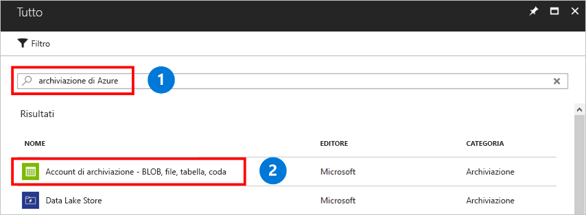

Un account di archiviazione è un pool condiviso di spazio di archiviazione in cui è possibile distribuire una condivisione file di Azure o altre risorse di archiviazione, ad esempio BLOB o code. Un account di archiviazione può contenere un numero illimitato di condivisioni. In una condivisione può essere archiviato un numero illimitato di file, fino ai limiti di capacità dell'account di archiviazione.

Per creare un account di archiviazione:

1. Nel menu a sinistra selezionare **+** per creare una risorsa.
1. Nella casella di ricerca immettere **account di archiviazione**, selezionare **Account di archiviazione: BLOB, File, Tabelle, Code** e quindi fare clic su **Crea**.
    

1. In **Nome** digitare *mystorageacct* seguito da alcuni numeri casuali fino a visualizzare un segno di spunta verde indicante che si tratta di un nome univoco. Un nome di account di archiviazione deve contenere solo caratteri minuscoli ed essere globalmente univoco. Prendere nota del nome dell'account di archiviazione perché sarà necessario più avanti. 
1. In **Modello di distribuzione** lasciare il valore predefinito **Resource Manager**. Per altre informazioni sulle differenze tra Azure Resource Manager e il modello di distribuzione classica, vedere [Comprensione dei modelli di implementazione e dello stato delle risorse](../articles/azure-resource-manager/management/deployment-models.md).
1. In **Prestazioni** mantenere il valore predefinito **Standard**.
    
    > [!NOTE]
    > Questo argomento di avvio rapido consente di creare una condivisione file standard, ma, se si vuole usare le condivisioni file Premium, selezionare invece **Premium**.

1. In **Tipologia account** selezionare **Archiviazione v2**. Per altre informazioni sulle diverse tipologie di account di archiviazione, vedere [Informazioni sugli account di archiviazione di Azure](../articles/storage/common/storage-account-overview.md?toc=%2fazure%2fstorage%2ffiles%2ftoc.json).

    > [!NOTE]
    > Questo argomento di avvio rapido consente di creare un account per utilizzo generico v2. Se si desidera usare le condivisioni file Premium, selezionare **FileStorage**.

1. In **Replica** selezionare **Archiviazione con ridondanza locale**. 
1. In **Trasferimento sicuro obbligatorio** è consigliabile selezionare sempre **Abilitato**. Per altre informazioni su questa opzione, vedere [Informazioni sulla crittografia dei dati in transito](../articles/storage/common/storage-require-secure-transfer.md?toc=%2fazure%2fstorage%2ffiles%2ftoc.json).
1. In **Sottoscrizione** selezionare la sottoscrizione usata per creare l'account di archiviazione. Se è presente una sola sottoscrizione, sarà quella predefinita.
1. Per **Gruppo di risorse** selezionare **Crea nuovo**. Per il nome immettere *myResourceGroup*.
1. In **Località** selezionare **Stati Uniti Orientali**.
1. In **Reti virtuali** lasciare l'opzione predefinita **disabilitata**. 
1. Selezionare **Aggiungi al dashboard** per trovare più facilmente l'account di archiviazione.
1. Al termine, fare clic su **Crea** per avviare la distribuzione.