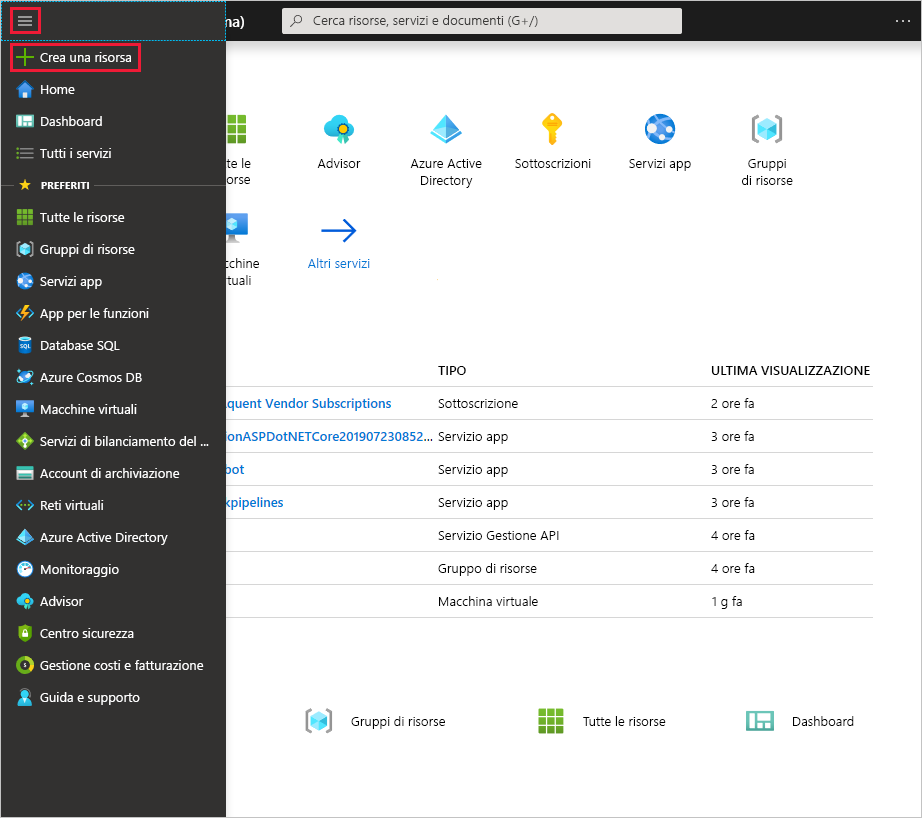

1. Nel menu del portale di [Azure](https://portal.azure.com) selezionare **Crea una risorsa.** 

   
2. Nel campo **Cerca nel Marketplace** digitare "Gateway di rete virtuale". Individuare **Gateway di rete virtuale** nella ricerca e selezionare la voce. Nella pagina **Gateway di rete virtuale** selezionare **Crea**. Verrà visualizzata la pagina **Crea gateway di rete virtuale**.
3. Nella scheda **Nozioni di base** immettere i valori per il gateway di rete virtuale.

   

   

   **Dettagli del progetto**

   - **Sottoscrizione**: selezionare dall'elenco a discesa l'abbonamento che si vuole usare.
   - **Gruppo di risorse:** questa impostazione viene compilata automaticamente quando si seleziona la rete virtuale in questa pagina.

   **Dettagli istanza**

   - **Nome**: assegnare un nome al gateway. Denominare il gateway non equivale a denominare una subnet del gateway. Si tratta del nome dell'oggetto gateway che verrà creato.
   - **Regione:** selezionare l'area in cui si desidera creare la risorsa. L'area per il gateway deve essere la stessa della rete virtuale.
   - **Tipo di gateway**: selezionare **VPN**. I gateway VPN usano il gateway di rete virtuale di tipo **VPN**.
   - **Tipo VPN**: selezionare il tipo di VPN specificato per la configurazione. La maggior parte delle configurazioni richiede un tipo di VPN basato su route.
   - **SKU**: selezionare lo SKU del gateway dall'elenco a discesa. Gli SKU disponibili nell'elenco a discesa dipendono dal tipo di VPN selezionato. Per informazioni sugli SKU del gateway, vedere [SKU del gateway](../articles/vpn-gateway/vpn-gateway-about-vpn-gateway-settings.md#gwsku).
   - **Generazione**: per informazioni sulla generazione di gateway VPN, vedere [SKU gateway](../articles/vpn-gateway/vpn-gateway-about-vpngateways.md#gwsku).
   - **Rete virtuale:** nell'elenco a discesa selezionare la rete virtuale a cui si desidera aggiungere il gateway.
   - **Intervallo di indirizzi subnet gateway:** questo campo viene visualizzato solo se la rete virtuale non dispone di una subnet gateway. Se possibile, rendere l'intervallo /27 o superiore (/26,/25 ecc.). Non è consigliabile creare un intervallo più piccolo di /28. Se si dispone già di una subnet gateway, è possibile visualizzare i dettagli di GatewaySubnet passando alla rete virtuale. Fare clic su **Subnet** per visualizzare l'intervallo. Se si desidera modificare l'intervallo, è possibile eliminare e ricreare GatewaySubnet.

   **Indirizzo IP pubblico**: questa impostazione specifica l'oggetto indirizzo IP pubblico che viene associato al gateway VPN. L'indirizzo IP pubblico viene assegnato dinamicamente a questo oggetto durante la creazione del gateway VPN. L'indirizzo IP pubblico viene modificato solo quando il gateway viene eliminato e ricreato. Non viene modificato in caso di ridimensionamento, reimpostazione o altre manutenzioni/aggiornamenti del gateway VPN.

     - **Indirizzo IP pubblico**: lasciare selezionata **l'opzione Crea nuovo.**
     - **Nome indirizzo IP pubblico**: nella casella di testo digitare un nome per l'istanza dell'indirizzo IP pubblico.
     - **Assegnazione**: Gateway VPN supporta solo Dinamico.

   **Modalità attivo-attivo**: Selezionare **Abilita modalità attivo-attivo** solo se si sta creando una configurazione gateway attivo-attivo. altrimenti lasciare l'impostazione non selezionata.

   Lasciare **Configura ASN BGP** deselezionata, a meno che la configurazione non richieda specificamente questa impostazione. Se è un'impostazione necessaria, il numero ASN predefinito è 65515, anche se può essere modificato.
4. Selezionare **Revisione : crea** per eseguire la convalida. Al superamento della convalida, selezionare **Crea** per distribuire il gateway VPN. La creazione e la distribuzione completa di un gateway possono richiedere fino a 45 minuti. È possibile visualizzare lo stato della distribuzione nella pagina Panoramica del gateway.

Dopo la creazione del gateway, è possibile visualizzare l'indirizzo IP assegnato esaminando la rete virtuale nel portale. Il gateway viene visualizzato come un dispositivo connesso.
