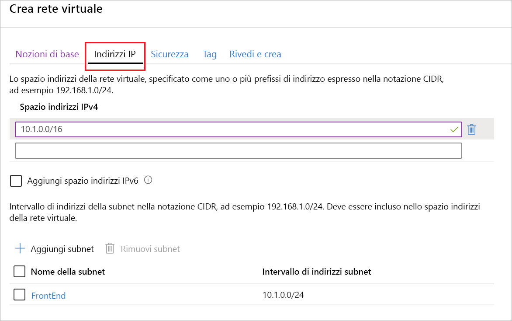

1. Accedere al [portale di Azure](https://portal.azure.com).
1. In **Cerca risorse, servizi e documentazione (G+/)** digitare *rete virtuale*.

   
1. Selezionare **Rete virtuale** nei risultati del **Marketplace**.

   
1. Nella pagina **Rete virtuale** selezionare **Crea**.

   
1. Dopo aver selezionato **Crea**, verrà aperta la pagina **Crea rete virtuale**.
1. Nella scheda **Informazioni di base** configurare le impostazioni della rete virtuale per **Dettagli del progetto** e **Dettagli istanza**.

    Durante la compilazione dei campi viene visualizzato un segno di spunta verde quando i caratteri immessi nel campo vengono convalidati. Alcuni valori vengono inseriti automaticamente e possono essere sostituiti con valori personalizzati.

   - **Sottoscrizione**: verificare che la sottoscrizione elencata sia corretta. È possibile cambiare sottoscrizione tramite l'elenco a discesa.
   - **Gruppo di risorse**: Selezionare un gruppo di risorse esistente oppure fare clic su **Crea nuovo** per crearne uno nuovo. Per altre informazioni sui gruppi di risorse, vedere [Panoramica di Azure Resource Manager](../articles/azure-resource-manager/management/overview.md#resource-groups).
   - **Name**: immettere un nome per la rete virtuale.
   - **Area**: selezionare la località della rete virtuale. La località determina la posizione in cui risiederanno le risorse distribuite nella rete virtuale.

1. Nella scheda **Indirizzi IP** configurare i valori. I valori illustrati negli esempi seguenti sono solo a scopo dimostrativo. Modificare tali valori in base alle impostazioni richieste.

     
   - **Spazio indirizzi IPv4**: per impostazione predefinita, viene creato automaticamente uno spazio indirizzi. È possibile fare clic sullo spazio indirizzi per modificarlo in modo che rispecchi i valori personali. È anche possibile aggiungere altri spazi indirizzi.
   - **Subnet**: Se si usa lo spazio indirizzi predefinito, viene creata automaticamente una subnet predefinita. Se si cambia lo spazio indirizzi, è necessario aggiungere una subnet. Selezionare **+ Aggiungi subnet** per aprire la finestra **Aggiungi subnet**. Configurare le impostazioni seguenti e quindi selezionare **Aggiungi** per aggiungere i valori:
      - **Nome della subnet**: in questo esempio alla subnet è stato assegnato il nome "FrontEnd".
      - **Intervallo di indirizzi subnet**: intervallo di indirizzi per questa subnet.

1. Nella scheda **Sicurezza** lasciare invariati i valori predefiniti per questa volta:

   - **Protezione DDoS**: Basic
   - **Firewall**: Disabled
1. Selezionare **Rivedi e crea** per convalidare le impostazioni della rete virtuale.
1. Dopo aver convalidato le impostazioni, selezionare **Crea**.
