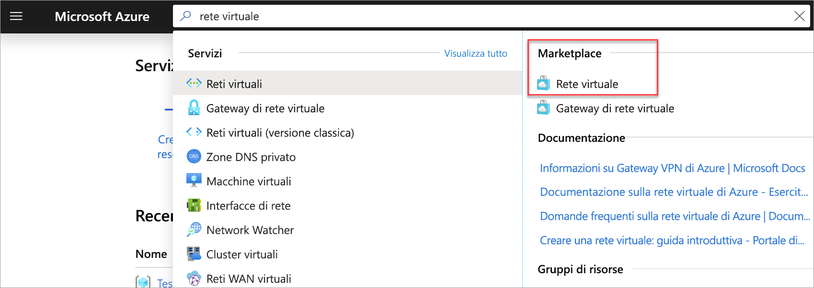
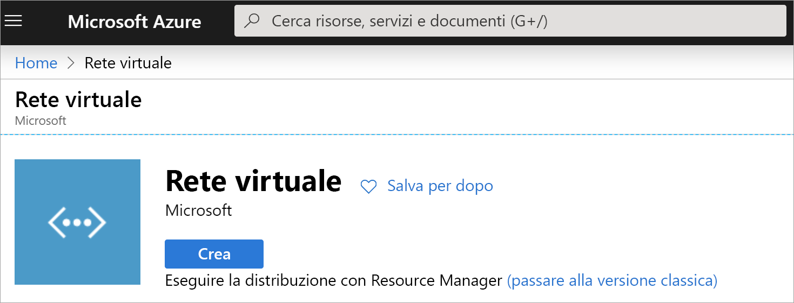

Seguendo questa procedura è possibile creare una rete virtuale con il modello di distribuzione Resource Manager e il portale di Azure. Per altre informazioni sulle reti virtuali, vedere la [panoramica di Rete virtuale](../articles/virtual-network/virtual-networks-overview.md).

>[!NOTE]
>Quando si usa una rete virtuale come parte di un'architettura cross-premise, assicurarsi di coordinarsi con l'amministratore di rete locale per ritagliare un intervallo di indirizzi IP che è possibile usare in modo specifico per questa rete virtuale. Se su entrambi i lati della connessione VPN è presente un intervallo di indirizzi duplicato, il traffico verrà indirizzato in modo imprevisto. Inoltre, se si desidera connettere questa rete virtuale a un'altra rete virtuale, lo spazio di indirizzi non può sovrapporsi all'altra rete virtuale. Pianificare la configurazione di rete di conseguenza.
>
>

1. Accedere al [portale](https://portal.azure.com)di Azure .
1. In **Risorse di ricerca, servizio e documenti (G/)** digitare *rete virtuale*.

   
1. Selezionare Rete virtuale dai risultati del **Marketplace.Select Virtual Network** from the **Marketplace** results.

   
1. Nella pagina **Rete virtuale** selezionare **Crea**.

   
1. Dopo aver selezionato **Crea**, viene visualizzata la pagina **Crea rete virtuale** .
1. Nella scheda **Nozioni di base** configurare **i dettagli del progetto** e le impostazioni della rete virtuale Dettagli **istanza.**

    Quando si compilano i campi, viene visualizzato un segno di spunta verde quando i caratteri immessi nel campo vengono convalidati. Alcuni valori vengono inseriti automaticamente e possono essere sostituiti con valori personalizzati.

   - **Sottoscrizione**: verificare che la sottoscrizione elencata sia corretta. È possibile cambiare sottoscrizione tramite l'elenco a discesa.
   - Gruppo di **risorse:** selezionare un gruppo di risorse esistente oppure fare clic su **Crea nuovo** per crearne uno nuovo. Per altre informazioni sui gruppi di risorse, vedere [Panoramica di Azure Resource Manager](../articles/azure-resource-manager/management/overview.md#resource-groups).
   - **Nome**: immettere il nome per la rete virtuale.
   - **Regione**: Selezionare la posizione della rete virtuale. La località determina la posizione in cui risiederanno le risorse distribuite nella rete virtuale.

1. Nella scheda **Indirizzi IP,** configurare i valori. I valori illustrati negli esempi seguenti sono a scopo dimostrativo. Regolare questi valori in base alle impostazioni desiderate.

     
   - **Spazio di indirizzi IPv4:** per impostazione predefinita, viene creato automaticamente uno spazio di indirizzi. È possibile fare clic sullo spazio degli indirizzi per modificarlo in modo da riflettere i propri valori. È inoltre possibile aggiungere ulteriori spazi di indirizzi.
   - **IPv6**: se la configurazione richiede uno spazio di indirizzi IPv6, selezionare la casella **Aggiungi spazio di indirizzi IPv6** per immettere tali informazioni.
   - **Subnet**: Se si utilizza lo spazio di indirizzi predefinito, viene creata automaticamente una subnet predefinita. Se si modifica lo spazio degli indirizzi, è necessario aggiungere una subnet. Selezionare **Aggiungi subnet** per aprire la finestra **Aggiungi subnet.** Configurare le impostazioni seguenti e quindi selezionare **Aggiungi** per aggiungere i valori:
      - **Nome subnet**: In questo esempio è stata denominata la subnet "FrontEnd".
      - **Subnet address range (Intervallo di indirizzi subnet):** l'intervallo di indirizzi per questa subnet.

1. Nella scheda **Protezione,** in questo momento, lasciare i valori predefiniti:

   - **Protezione DDos**: Di base
   - **Firewall**: Disabilitato
1. Selezionare **Revisione : crea** per convalidare le impostazioni della rete virtuale.
1. Dopo aver convalidato le impostazioni, selezionare **Crea**.
